# 第1章: 整数コア: 整数スーパハイウェイ

- 1.1 整数スーパーハイウェイ
- 1.2 3-wayスーパスカラCISCアーキテクチャ
- 1.3 命令の3種の階層: ダブルディスパッチ操作
- 1.4 128bit SSE(2)命令はDoublesに分解される
- 1.5 128bit SSE(2)命令にDoubleを使うことにより25%のレイテンシペナルティの発生を避けることができる
- 1.6 Doublesはいくつかの整数命令とx87命令を同時に利用する
- 1.7 Doubleは128bitのメモリアクセスを処理できる
- 1.8 スケジューリング前のアドレス加算
- 1.9 レジスタリネーミングとアウトオブオーダ処理
- 1.10 整数レジスタのリネーミング
- 1.11 IFFRF: Integer Future File and Register File
- 1.12 IFFRFの"Future File"セクション
- 1.13 例外および分岐予測ミス: リタイア値で投機実行結果を上書きする
- 1.14 リオーダバッファ
- 1.15 リタイア処理と例外処理
- 1.16 例外処理は、リタイア処理まで常に遅延される
- 1.17 ベクトルパスとダブルディスパッチ命令のリタイア処理
- 1.18 アウトオブオーダ処理: 命令ディスパッチ
- 1.19 スケジューラ / リザベーションステーション
- 1.20 各x86命令はALUとAGU操作を起動することができる
- 1.21 ALU操作のスケジューリング
- 1.22 メモリアクセスのためのAGU操作のスケジューリング
- 1.23 Opteronの整数コアのマイクロアーキテクチャの利点

# 第1章: 整数コア: 整数スーパハイウェイ

## 1.1 整数スーパーハイウェイ

整数コアのダイ写真を見ると、殆どの領域が64bitのデータバスであることが分かる。
データバスは北から南にかけて張られている。
いくつかの領域では、最大で20種類のバスが集積されている。
バスは、整数ユニットで利用される全てのソースオペランドと出力オペランドを転送している。
バスのレイアウトは*ビットインタリーブ*の形式で設計されており、各ビットはビットインデックスでグループ化されている。
全てのバスのビット0は集められ、隣同士に配置されている。
一方で、ビット63はもう片方の領域にまとめられている。
各バイトで分割されているのは、レイアウトからも分かりやすく確認できる。

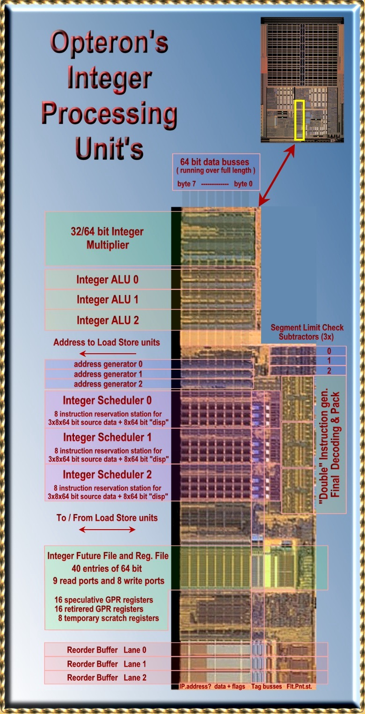

## 1.2 3-wayスーパスカラCISCアーキテクチャ

Opteronは3-wayスーパスカラプロセッサである。
このプロセッサは1サイクルあたり3つのx86命令をデコード、実行、リタイアすることができる。
これらの実行される命令は非常に複雑な命令(CISC)であり、複数(2以上)のソースオペランドを持っている。
Pentium 4はサイクルあたり3つのuOpsと呼ばれる操作を実行することができる。
単一のx86命令を実行するためには、複数のuOpsを実行する必要がある。
私達の調査により、Prescottではサイクルあたり最大で4つのuOpsを実行することができることが分かっている。

一般的に、x86命令は F(reg, reg)、F(reg, mem)、F(mem, reg)として表現される。
最初のオペランドは、ソースと出力の両方を取ることができる。
最初の2つの形式は整数命令、MMX、SSE(2)において標準的な形式である。
最後の形式は基本的に整数命令において見られる。
1つのソースオペランドがメモリから読み込まれ、結果は同じ領域に書き戻される。
整数パイプラインは、浮動小数点命令とマルチメディア命令を含む、全ての処理においてロードとストア処理を実行するのに利用される。

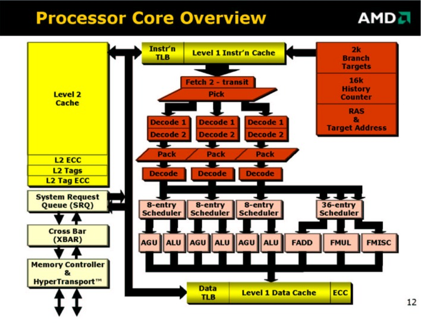

## 1.3 命令の3種の階層: ダブルディスパッチ操作

オリジナルのAthlon(Athlon 32とも呼ばれている)は命令をDirectPathとVectorPathに分類していた。
最初のクラスの命令は、複雑度の低い命令で、ハードウェアで単一の操作で実行できるような命令である。
より複雑な命令(VectorPath)では複数のマイクロシーケンサが起動され、マイクロコードプログラムが実行される。
命令はマイクロコードROMから読み込まれ、3-wayパイプラインに挿入される。

Opteronは3番目の命令クラスを導入した。
Double Dispatch命令、もしくは単に"Doubles"と呼ばれる。
Doublesはデコーディングパイプラインの最後の段で生成される。
DirectPathもしくはMicroCodeシーケンサにより生成された直後の命令は、2つの独立した命令に分割される。
従って3-wayパイプラインは、1サイクルあたり6つの命令を生成することになる。
これらの命令はPACKステージにより「再パッキング」され、3つの命令に戻される。
この追加されたパイプラインステージは、投機実行のために追加されたものであり、Opteronが2001年にMicro Processor Forumで紹介されたときからのものである。
6つの対照的な形をした"doubling stage"は、上記のダイ写真からもはっきりと確認できる。

## 1.4 128bit SSE(2)命令はDoublesに分解される

Opteronの最適化ガイドでは、全ての命令のどのクラスに分類されるかが記述されている。
ほとんどの128bitのSSE、SSE2命令はDouble Dispatch命令として実装されている。
独立した64bitの命令に分割することのできない命令のみ、VectorPath(マイクロコード)命令として処理される。
これらのSSE2命令で、128bitレジスタの半分しか使わない命令はSingle(Direct Path)命令として実装される。

Double Dispatch命令には、性能面においてトレードオフが存在する。
欠点は、128bit SSE2命令のデコード率がサイクルあたり1.5に制限される点である。
しかし一般的には、最大スループットは128bitSSE Single命令においてFPユニットとリタイアのハードウェアに制限されるため、デコード率により性能の制約になることはない。
より重要なのはサイクルレイテンシが余分に必要な問題であり、Pentium4スタイルの実装により生じるレイテンシの問題を避けることができる。

## 1.5 128bit SSE(2)命令にDoubleを使うことにより25%のレイテンシペナルティの発生を避けることができる

Pentium 4では、SSE2命令は浮動小数点ユニットの後ろのステージで分割される。
浮動小数点ユニットは128ビットのソースデータを、最初のステージで受け入れることができる。
このデータを2つの操作に分割し、2つの結果をつなげて最後に128ビットの1つのデータとする。
この構成により、全体のレイテンシは効率的に1サイクルほど増加する。
例えば、x87のFADDとFMUL命令はそれぞれ5サイクルと7サイクルで実行されるが、128ビットのSSE命令では、それぞれ6サイクルと8サイクル必要である。

Opteronは、Athlon 32と似通っている。
OpteronはFADDとFMUL命令を4サイクルで実行する。
SSE2の命令は同一の4サイクルのレイテンシで実行される。
1サイクルの増加は、25％のレイテンシの増加につながり、重要な性能低下につながるため、
高度にパイプライン化されたFPユニットの動作を考えるならばこの選択は正しい。
そうでないと、パイプライン中に多くのバブルが挿入され、命令効率が低下するからだ。
他の命令の結果を待つ命令は、その命令が終了するのを待たなければならない。
レイテンシは、バンド幅にとって重要な問題なのだ。

次期Pentiumプロセッサ、コードネームPrescottでは、さらに浮動小数乗算帰途、浮動小数点加算器を追加することでこの問題を解消しようとしている。
この追加されたFPユニットはシングルポートだが、128ビットの演算ができるものと予想する。
これによりSSE2のレイテンシは元に戻り、加算と乗算は5サイクルと7サイクルで実行できるようになるだろう。
単一スレッドのプログラムでは性能が改善する可能性がある。
さらに、浮動小数点のバンド幅は、ハイパースレッディングの性能により倍増すると予想される。

## 1.6 Doublesはいくつかの整数命令とx87命令を同時に利用する

Double Dispatch命令はSSEとSSE2命令でのみ使われるわけではない。
Opteronの最適化ガイドのAppendix Cでは、POPやPUSH、いくつかの整数乗算及びLEAVE命令などのクラシックなx86命令もリストアップされている。
Athlon 32では、すべての命令はマイクロコードとして実行されるため、低速であった。
いくつかのx87命令は、現在はDouble命令として処理されている。
例えば、FP命令のうちでソースオペランドの一つが整数であるため、最初に浮動小数点に変換する必要がある命令が該当する。

## 1.7 Doubleは128bitのメモリアクセスを処理できる

SSEとSSE2で利用される128bitメモリアクセスを2つの独立した64ビットアクセスに分割し、整数コアで処理する。
データキャッシュから出力されるロードデータバス上の結果は浮動小数点コアにより取り込まれる。
整数レジスタを32bitから64bitに拡張し、128bitのSSE(2)命令を2つの64bitの結果に分割することは、すべての64bitマイクロアーキテクチャにおいてはエレガントな解決法である。

L1データキャッシュにおいて、128bitのロード、ストアを2つの独立した64bitのロード、ストアとして扱うことには、重大な利点がある。
2つの異なるアドレスからの64bitロードし、2つの移動処理により1つの128bitSSE2レジスタに格納するのは、1つの128bitデータをロードすることと同じくらいの速度である。
Appleは32ビットの浮動小数点データを128bitデータタイプとしてロードすことに対する適切な主張を行っている。
非常に鮮明なARGBカラーイメージデータを使う場合などである(xxx)。
(消費者が使う場合に、)2つの64bit浮動小数点数を1つの128bitのワードに格納するような、実用的な商用アプリケーションは存在しない。
(もしくは、あるいはコンパイラの開発が伴っていないだけなのか...)。
異なる64bitのロードとストアを1サイクルあたりに2つ出せたほうが、コンパイラは関係ない64bitの演算命令を128bitのメモリアクセスの中に挿入することができ、
より最適化を図れるようになる。

## 1.8 スケジューリング前のアドレス加算

一つのx86命令において、ソースオペランドにメモリアクセスが必要な場合は

addres = base + index < scale + displacement + segment

アドレスを計算するために最大で4つの引数が必要になる(ハードコーディングされた2ビットのscale-fieldは無視する)
これにより、典型的なx86命令のフォーマットF(reg, mem)では、少なくとも5つの入力オペランドが必要になることが分かる！
現在、そのパラメータの一つが命令自身によって与えられるパラメータ(displacement)である。
他のパラメータ(セグメント)は「準定数(semi-constant)」であり、セグメント化されていない、フラットなメモリ空間で利用される
現在のコードでは、典型的に0である。

Athlon 32では、3つのAGU(Address Generator Unit)のうち一つが、線形アドレスを計算した後に必要であれば、
セグメントをアドレスに加算する。
これには、データキャッシュアクセスが生じ、ロードレイテンシに余分なキャッシュサイクルが必要になる。
Opteronは、異なる実装を行っている。
displacementとsegmentは実際のアドレス計算が行われる前に加算が実行されるのである。

segmentの値はでコード中はdisplacementと同じく定数と考えることができる。
でコード・ディスパッチの間に加算が行われ、加算結果は、命令bitの残りの領域(命令の新しいdisplacement field)
とともに次のステージに渡される。

segmentの値が変わった場合はいつでも例外が生成される。
例外が発生した場合、命令が生成した結果はキャンセルされ、パイプラインは正しい場所から再スタートされる。

"Decode-Time"アドレス加算器は他のアドレス加算にも同様に使用される。
(64bitモードでは、ほとんどのセグメンテーションが除去される)

例えば、新しい相対アドレスモードにおいて、命令から64bitの命令ポインタ(RIP)と32ビットのdisplacementを
加算するのに使用される。
入力パラメータを可能な限り削減することにより、最終的なデコード時の最大入力パラメータが
分かるようになる。入力パラメータのうち3つはレジスタ値であり、4つ目は定数である。

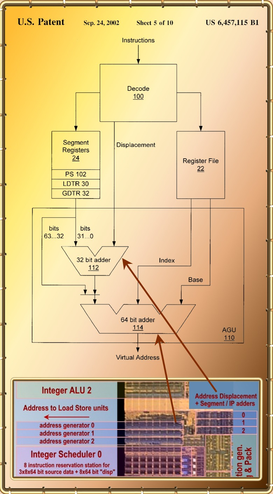

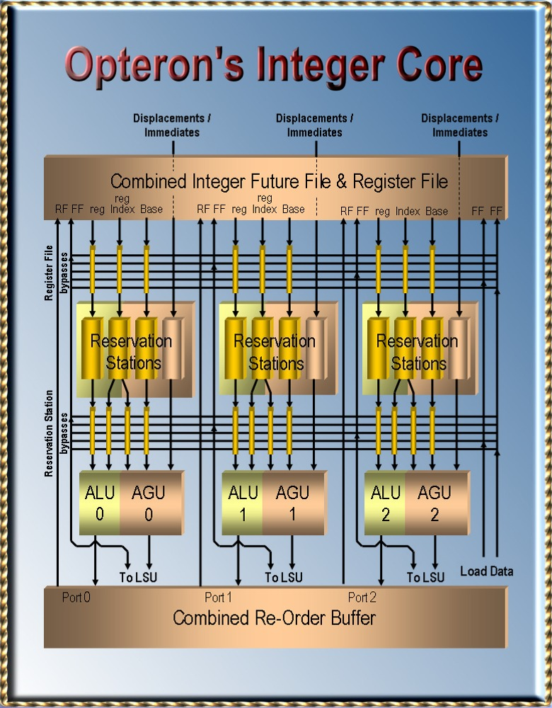

## 1.9 レジスタリネーミングとアウトオブオーダ処理

Athlon(とOpteron)は、レジスタリネーミングとアウトオブオーダ処理を処理するために賢い処理を追加しており、
25%の整数パイプラインを削減している。
これにより、キャッシュミスによるミススケジューリングを処理するための特殊なハードウェアが不要になり、デザインがよりシンプルで高速になる。

レジスタリネーミングは「負の依存関係」を除去するために使用させる。
この負の依存関係により、1サイクルあたりの命令数(Instruction Per Cycle: IPC)が制限される。
負の依存関係は、利用できるレジスタ数の制限によるものである。
すぐに利用できる結果を保持しているレジスタは、他の命令が利用したいときはすぐに利用できるようにする必要がある。
この値は上書きされ、使用できなくなる。
上書きをする命令は、過去の命令を利用するすべての命令が実行されるのを待つ必要がある。

これにより命令の実行が制限され、IPCが低下する。
x86のようなレジスタ数の少ないアーキテクチャにおいて、この症状は事実である。
以下の例では、レジスタリネーミングがこの問題をどのように解決するかを示している：
Register rCは3番目の命令により上書きされるため、3番目命令は2番目の命令を待つ必要がある。
これが負の依存関係である。
レジスタリネーミングによりアーキテクチャの持つレジスタ数よりも大きな量のレジスタ数を使えるようになる。
ここでrCを再利用する必要はなくなる。
他のレジスタを利用すればよいため、この場合はr7を利用している。
基本的なルールは、「実行中の」すべての命令は異なる書き込みレジスタを保持している、ということである(single assignment)。

## 1.10 整数レジスタのリネーミング

Opteronは16個の64bitアーキテクチャ整数レジスタを持っている。
複雑なx86命令を処理するために、さらに8つの64bitスクラッチレジスタ持っており、マイクロコードルーチンが使用する測地を格納するために利用している。
このスクラッチレジスタはプログラマから見えることはない。
Athlonファミリのプロセッサはレジスタリネーミングをもっとも単純な手法で実現している。
この手法は、どのようにして簡単な方法でレジスタリネーミングを実現するかを明らかに薄るのに、賢明な考えを多く含んでおり、称賛されるべきものである。
これを考え付く人はそうはいないだろう。

これまでに述べたように、実行中の各命令は異なる戻り値レジスタを持っている。
理ネーミングされたレジスタの合計数はすべての「実行中の命令」の合計と「アーキテクチャレジスタ」の合計である。
最大で実行できる命令数は72であり、「リネーミングされたレジスタ」の合計値は96になる。
これらのレジスタを管理するために、2つの異なる構造が使われている。
実行中の命令の結果は72エントリのリオーダバッファ(Re-Order Buffer:ROB)により管理されており、アーキテクチャレジスタは
「整数フューチャーファイルおよびレジスタファイル(Integer Future File and Register File: IFFRF)」により管理されている。

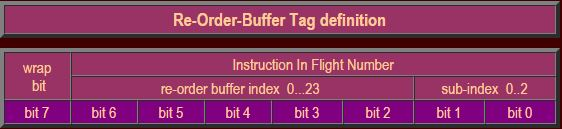

この構成により、非常に単純でレイテンシが0サイクルとなるリネーミング処理を実現できる。
各命令は3つのデコードレーンの1つよりディスパッチされ、「リオーダバッファタグ」もしくは「院フライト命令タグ」を取得する。

1. sub-index 0,1,2はどのレーンからディスパッチされた命令化を示している。
2. 0..23の値はディスパッチされた命令の「サイクル」を示している。「サイクルカウンタ」は0から23まででラップされている。
3. wrap bit。2つの命令が異なるwrap bitを持っていたならば、サイクルカウンタは2つのディスパッチの間でラップされる。

## 1.11 IFFRF: Integer Future File and Register File

レジスタファイルは、16個のアーキテクチャレジスタと8つのテンポラリスクラッチレジスタを管理するために利用されている。
レジスタファイルは2つのエントリを持っており、それぞれ16個のアーキテクチャレジスタを管理するために利用される。
2つのエントリのうち1つは、プログラマから見える実際のレジスタとしてみることができる。
子のレジスタは、命令が「リタイア」したときの値を格納している。
命令が完了し、例外及び分岐予測ミスが発生しないことが分かり、その命令よりも前の命令がすべてリタイアしている場合にリタイアされる。
レジスタの値は「非投機的」である。

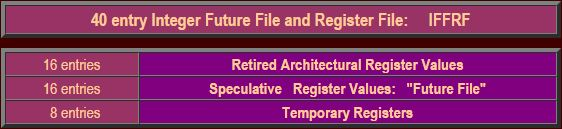

実行中の命令は、その命令がリタイアされるまでその結果はキャンセルされるか破棄される可能性がある。
キャンセルは、その命令より前の命令が例外を発生させたり、分岐予測ミスが発生した場合に起きる。
実行中の命令は基本的に投機的である。
命令の実行結果は、その命令が完了するまでは投機的な結果である。
その結果はリタイアされると初めて非投機的になり、リタイアの論理は、その命令が例外を発生させないことを決定するものである。

## 1.12 IFFRFの"Future File"セクション

アーキテクチャレジスタの2つ目のエントリには「未来の」値が格納されている。
これらのレジスタのうち16個はまとめてフューチャーファイル(Future File)と呼ばれている。
これらのエントリには、任意の命令により特定のアーキテクチャレジスタに格納された細心の値が格納されている。
Future Fileには、リタイアされた結果も、リタイア前の結果も含まれている。
フューチャーファイルの値はリタイアされていない命令も含んだ投機的なものである。
命令が正しく終了しリタイアすると、その値は非投機的になる。

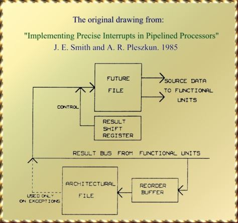

実行中の命令の計算結果が生成されると、その値はすぐにフューチャーファイルに格納される。
しかしフューチャーファイルは特定のレジスタにおいて最新の値でないと受け入れない。
もし後続の命令が前の命令よりも前に結果を生成しフューチャーファイルに書き込んだならば、前の命令が完了してもその値はフューチャーファイルには書き込まれない。
終了した命令は、フューチャーファイルと命令コードのレジスタ番号(0から15のアーキテクチャレジスタ番号)との対応をとる。
結果が上書きされるかどうかは、「リオーダバッファタグ」を利用して決定される。
各フューチャーファイルのエントリは該当するタグに相当する。
ある命令はタグがマッチし、エントリを保持しているならば書き込みを行う。

## 1.13 例外および分岐予測ミス: リタイア値で投機実行結果を上書きする

投機実行結果をキャンセルしたいとき、IFFRF内のフューチャーファイルの値をリタイアした値で書き戻す。

ある命令の前に存在する命令で例外を検出すると、どのような理由であってもすべての投機実行結果はキャンセルされる。
例外にはさまざまな種類があり、メモリアクセスでのページミスであったり、アクセス許可のない領域へのアクセスがあげられる。
0除算も例外の一つとして有名である。
(浮動小数点における演算はこれには該当しない。なぜならば+/-無限大はIEEE浮動小数点の値として完全に定義されているものだからである)。

私たちが「投機実行結果」と呼ぶものは、「制御フローの投機的実行」と呼ばれるエラーによりキャンセルする必要が生じる可能性があるからである。
制御フローのエラーにより、プログラムは予期した方向とは異なる方向に進んでいく。ここで、

- 分岐予測ミスは基本的に他の例外と同様に処理される、ただし...
- すべての例外は分岐予測ミスと同様に処理される。

例外の発生により、条件分岐のようにプログラムのフローが切り替わる。
従って例外を発生しうるすべての命令は条件分岐フローを持つ命令ということができる。
ただし、例外についてはすべて発生しないという予測のもとで、分岐予測ハードウェアからは無視される。

## 1.14 リオーダバッファ

これまでに、リタイア処理について何度も述べてきた。
リタイア処理はリオーダバッファの支援により実現される。
このユニットは、その名前が示している通り、命令をりおーだリングする。
オリジナルのプログラムのフローに命令の順番を並び替えるのである。
スケジューラはアウトオブオーダで実行する責任を持ち、とある命令のすべてのオペランドがそろっており、
実行ユニットが空いていればすぐに命令を発行する。
リオーダバッファは、その命令を再び元の順番に戻す役割を持っている。

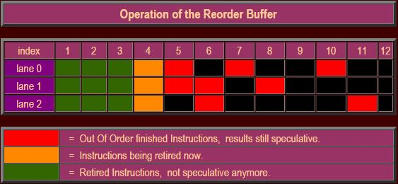

リオーダバッファ自身は、3つのレーンに分かれており、各レーンは24個のエントリを持っている。
このレーンとエントリがリオーダバッファに相当している。
各命令はタグが割り当てられる。
終了した命令は、タグをアドレスとしてその結果をリオーダバッファに書き込む。
そのほかにも、命令実行中に発生したイベントについての情報を書き込み、場合によっては例外を発生させる。
特に、条件分岐命令は、計算した分岐アドレスが、予測したものと同一であったかどうかについて通知する。

リオーダバッファには、命令の更なる情報も登録される。
例えば、命令の種類や、書き込み先のアーキテクチャレジスタアドレス(0..15)など、さらに命令の配置されているアドレス情報などである。
いくつかの情報は、その命令がリオーダバッファタグを受け取る前にはすでに焼失されている。

リオーダバッファは、浮動小数点命令、SSE(2)、MMXなどのすべての命令で共有されている。
しかしこれらの命令は演算結果自身をリオーダバッファに書き込んだりはしない。
これらの命令は120エントリの浮動小数点用リネームレジスタに結果を書き込む。
しかしリオーダバッファを使わないわけではなく、命令コードやアドレス、例外フラグ、Ready状態情報、リタイア情報などを記録するために使用される。
すべての命令はリオーダバッファの支援によりリタイア処理が行われる。

## 1.15 リタイア処理と例外処理

上記の画像は、ある命令が、それより前の命令がすべて完了した段階でどのようにリタイアするかを示している。
1サイクルあたり3つの命令が同時にリタイアすることができる。
命令制御ユニット(ICU)がリオーダバッファの3つの命令にアクセスする。
例外フラグが設定されていなければ、その命令はリタイアする。
演算結果はIFFRFのリオーダエントリに書き込まれる。
後者は基本的には書き込みだけの処理である。
これらの値は例外時に利用され、フューチャーファイル上にある投機実行中の値を上書きするために利用される。

ICUは分岐予測ミスをけしゅつすると、新しい命令フェッチアドレスを命令フェッチユニットに転送し、パイプラインを再開する。
分岐命令は再度実行され、新しい分岐先が予測される。
他の例外では例外ルーチンの呼び出しが行われる。
例えばICUはいくつかの関連するデータをIFFRFの一時的なレジスタに書き込み、例外を呼び出すか、マイクロコードを実行する。

## 1.16 例外処理は、リタイア処理まで常に遅延される

ある命令で例外が発生した場合、例外処理はその命令の投機状態が終了するまで開始されない。
例えば、ある領域から外れた場所へのメモリアクセスした場合の例外である。
プログラムはインデックスが領域外になっているかをテストする。
分岐予測ハードウェアは、領域外になっているかを予測するが、その予想は領域内と予想するであろう。
なぜならば、メモリアクセスの大半が領域内だからである。
プロセッサは、したがって領域外へのアクセスを投機的に実行し、残念ながらメモリアクセス例外を起こしてしまう。
例外処理は、当該命令がリタイアするまで遅延されるが、その命令は分岐予測ミスにより例外フラグと一緒に破棄される。

メモリストア処理も同様の理由で、命令がリタイアするまでLSU(Load Store Unit)により保持される。

## 1.17 ベクトルパスとダブルディスパッチ命令のリタイア処理

一つのベクトルパス命令は、複数の命令を生成する。
マイクロシーケンサは、生成した命令を1サイクルに3命令ずつ3-wayパイプラインに挿入する。
デコード中とリタイア処理中は、ダイレクトパス命令と混在されることはない。
実際のリタイア処理は、最後の3命令が終了すると開始される。
リタイアハードウェアは最初の3つのマイクロコードから、最後の3つのマイクロコードまでをスキャンしており、すべての発生しうる例外を蓄積している。
例外が発生しない場合、リタイア処理が開始される。
そうでなければ、適切な例外処理コールが生成される。

Doubleにより生成された命令は、デコード中とリタイア処理中に他の(ダイレクトパス)命令と混在することができる。
Doubleにより2つの命令が平成されるが、これらの命令は同時にリタイアする必要がある。
PUSH命令を想像してほしい。メモリストア処理がリタイアしても、スタックの更新がリタイアしない場合、
Doubleにより生成された2つの命令は、リタイア中は同一ライン内の3命令に入っていなければならないという制約が発生する。

## 1.19 スケジューラ / リザベーションステーション

同時にディスパッチされる命令は最大で3命令だが、これらの命令はスケジューラ内でリザベーションステーションに割り当てられる。
各スケジューラは8つのリザベーションステーションを持っており、初期のAthlonの5つ、Athlon 32の6つよりも増強されている。
リザベーションステーションは、命令を発行するために必要な残りのすべてのデータを集めるためのユニットである。
リザベーションステーションはバスの流れるデータのタグを監視し、そのタグのデータが必要であれば、当該命令にそのデータを渡す(レジスタファイルバイパス)。

タグは、バスがデータを流れる1サイクル前にバスに現れる。
リザベーションステーションはバスのすべてを監視する必要はない。
タグのサブインデックスにより、3つのALUのうち、どれが結果を生成するかをチェックすることができる。
また、タグによりデータが2つのキャッシュリードポートのどちらから現れるかを知ることができる。
これにより、すべてのタグをチェックする必要なく、タグバスを選択することができる。

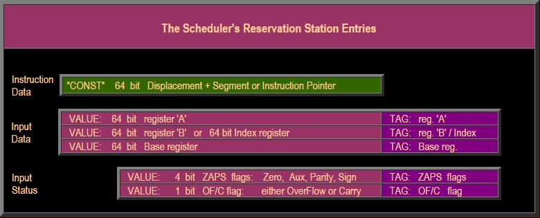

ここまで、私たちはx86の状態フラグのことを考えずに来た。
多くのx86命令はx86の6つの状態フラグのうち1つ以上のもの入力値として利用する。
x86命令例には、フラグを更新する命令とそうでないものが存在する。
また命令によっては複数の、あるいはすべての状態フラグを変更するものもある。
つまり、異なるフラグが異なる命令により生成される可能性があるということである。
幸運なことに、スケジューラの構造を簡単化するために、2つのルールが存在する。

ルール1: 任意のZAPSフラグ(Zero, Aux, Parity, Sign)は、別々に更新されることは無い。
つまり、これらのフラグはリザベーションステーション内で単一の4ビットのエントリとして考えることができる。
ルール2: オーバフローフラグを扱う命令(符号付整数用)はキャリーフラグを使用しない(符号なし整数用)。
これらのフラグも、リザベーションステーション内では単一のビットとして扱うことができる。

## 1.20 各x86命令はALUとAGU操作を起動することができる

あるスケジューラ内リザベーションステーションで待機中のx86命令は、命令1つにつき最大で2つの演算を起動することができる。
1つはその命令に関する整数演算で、これはALUで実行される。もうひ保津はメモリ捜査に関する操作で、これはAGU(Address Generator Unit)
で生成される。
もっとも単純な整数命令のタイプF(reg,reg)ではメモリアクセスは発生しないのでALU演算のみである。
整数命令のF(reg,mem)タイプはメモリロード処理とそれに続いてALU命令が実行される。

整数命令のタイプF(mem,reg)は同様の方オフで実装される。ロード処理は、そのままLoad/Store操作である。
Load/Store処理がLSU(Load Store Unit)を保持している。
ALUの演算を待ち合わせており、その結果をメモリにストアする。
浮動小数点演算や、MMX命令のような、メモリアクセスを生じるが非整数演算命令の場合は、AGUの命令を起動するだけである。
浮動小数点/MMX命令自身は浮動小数点ユニット地震で処理される。

各スケジューラは、ALUとAGUを1サイクルで1つずつ起動することができる。
ALU演算はx86命令から来ているが、AGU命令はそれ以外から来るものである。

## 1.21 ALU操作のスケジューリング

ALUでの演算には、通常2つのレジスタオペランドとオプションでいくつかの状態ビットを必要とする。
x86でメモリアクセスが必要な命令はレジスタBの値がロード結果の値であるとする。
命令はすべての必要な入力オペランド(データおよび状態ビット)が揃うまでリザベーションステーション内で待ち合せる。
スケジューラは全ての8つのリザベーションステーションを監視しており、最も古い命令で実行可能になったものを取り出して起動する。
スケジューラは全てのオペランドと命令情報を関連するALUに転送する。

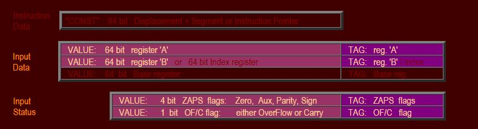

リザベーションステーション自身は、実際には最新のオペランドを受け取る必要はなく、バイパスすることができる。
ALUはオペランド自身の代わりに「バス番号」を受け取り、バスを監視して最新の値を取得する。
ダイ写真を見ると、全ての3つのALUがそれぞれ隣り合わせに配置されており、自分自身のスケジューラからしか演算を受け取らないようになっている。
バイパス構造によりデータを直接交換し、スケジューラに再フォワードする必要性を無くしている。

## 1.22 メモリアクセスのためのAGU操作のスケジューリング

あるx86命令がメモリアドレスの計算のために4つの引数が必要な場合について見ていく(命令にハードコードされた2ビットのスケールフィールドについては無視する)。
この引数には2つのレジスタ値(baseとindex)が含まれている。
命令デコーディングの中に、displacementとsegmentも含まれていることを見た。
Segmentは準定数と考え、その値が変化したときにはリストアすることのできる構造も用意されている。

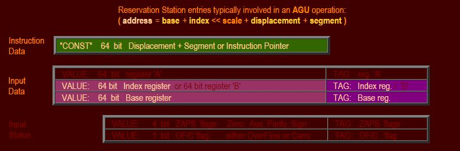

リザベーションステーションは全ての入力オペランドが揃うまで待つ。
スケジューラは全ての8つのリザベーションステーションを監視し、最も古い、
実行可能になったAGU演算を実行する。
スケジューラは全てのオペランドと、命令情報を関連するAGUに転送する。
リザベーションステーションは同様に、AGUの演算をバイパスすることができる。
AGUはバス番号を取得し、演算結果のオペランドそのものをバスから取得することができる。

## 1.23 Opteronの整数コアのマイクロアーキテクチャの利点

### 極度に高速なスケジュール-実行のループによりキャッシュのヒット/ミスの投機ハードウェアを削減することができる

Opteron整数コアの最もエレガントな機能の一つに、他のアーキテクチャと比較して極度に高速なスケジュール-実行ループが上げられる。
このループにより、命令は1サイクルでスケジュールと実行をこなすことができ、非常に高周波数で動作することができる。
この効率的な動作により、L1データキャッシュミスの修正に必要な、無駄な論理の必要性を除去することができる。

スケジューラは、結果バスのタグをチェックすることにより、データがL1データキャッシュがら到着する1サイクル前にデータの到着を知ることができる。
これの情報はそのロードデータを使う命令のスケジューリングに利用される。
スケジュールサイクルの最後の方で、ヒット/ミスの信号を受けとる。
ミスが発生すると、命令は次のサイクルでスケジューラから除去される。
実行ユニット(ALUとAGU)に発行された命令は、ミスフラグによりインバリデートされる。
他の命令はスケジューラを通常通り通過し、メモリ階層のどこかで待ち合わせているデータを取得することになる。

対照的に、Pentium 4はロードミスが発生すると、全ての依存する命令を再実行するのに、最大7サイクル必要である。
依存しない命令は再実行する必要はない。
大量のDoubleポンプのALUの能力は、全ての再実行される命令を受け取るために利用されている。
Alpha Ev6はロードミスが発生すると、非常に低速な動作周波数の短い7ステージパイプラインを利用しているにも関わらず、
2サイクルで全ての命令を「後退」させ、インバリデートする。

後者の2つのアーキテクチャはOpteronではサポートしていない、他の投機データのメカニズムを利用している:
投機的ロード/ストアのリオーダリングである。
しかしこれらのメカニズムはOpteronの後続のアーキテクチャでサポートされるであろうし、
これらがサポートされるようになれば、スケジュール-実行の極めて短いループの影響で、予測ミスのペナルティも最小化できるであろう。

### スケジューラと実行ユニットの間の巨大なマルチポートのレジスタを避ける

スケジュール-実行の短いループを実現するためのマイクロアーキテクチャとして、古典的な、大きなリネームレジスタファイルを
機能的に2つのサブ構造に分割したことが上げられる。
1つは小さくて、低レイテンシなIFFRFである。
これは非常に小さく、アウトオブオーダ実行に飛鳥なものである。
もう一つのサブセットは72エントリのリオーダバッファである。
これは例外や分岐予測ミスに対処するためのインオーダリタイアに必要な機能である。

IFFRFは小さく、1サイクルのレイテンシを持っている。
このレジスタファイルは広いスーパスカラ実行を実現するために、多くの読み出し、書き込みポートを持っている(9読み込み、8書き込み)。
72エントリのリオーダバッファは大きいが、より単純な構造をしている。
リオーダバッファは3つの単純で独立した24エントリのサブアレイに分割されている。
各アレイは基本的に1つの読み込みポートと1つの書き込みポートしか必要ない。
4つ(1+3)により、単一の大きなリネームレジスタよりも単純な構造になり、IFFRFよりも小さくなる。
このような大きなリネームレジスタファイルは、おそらくスケジュール-実行ループを回すのに2サイクルは余分な時間が必要になるである。
