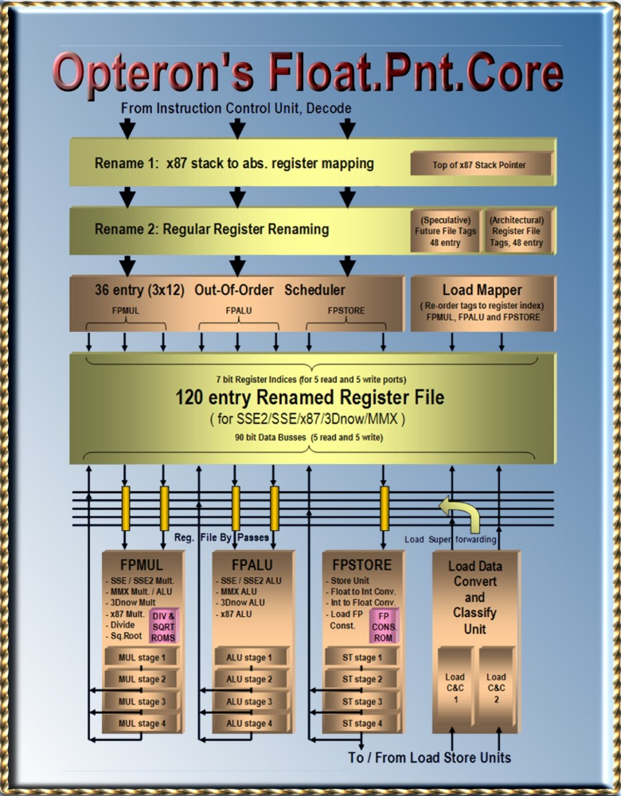
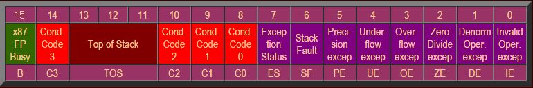
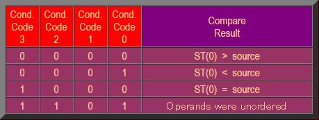

# 第2章 Opteronの浮動小数点ユニット

- 2.1 浮動小数点のリネームレジスタファイル
- 2.2 浮動小数点リネームステージ1 : x87のスタックから絶対FPレジスタファイルへのマッピング
- 2.3 浮動小数点リネームステージ2 : 通常のレジスタリネーミング
- 2.4 浮動小数点命令スケジューラ
- 2.5 5ポート読み込みと5ポート書き込みの浮動小数点リネームレジスタファイル
- 2.6 浮動小数点演算ユニット
- 2.7 変換と分類ユニット
- 2.8 x87状態処理 : FCOMI/FCMOV と FCOM/FSTSWペア

## 2.1 浮動小数点のリネームレジスタファイル

Opteronの浮動小数点リネームレジスタファイルは、88から120エントリに増加している。
このリネームレジスタファイルは言葉通りの意味のレジスタファイルである。
単一のエンティティを持っており、すべてのアーキテクチャ的な(非投機的な)値と、命令セットにより定義されたレジスタの投機的な値を保持している。

Opteronは再度72個の投機的な命令を格納することができる。
AthlonXPコアにより、投機的な命令のサポートは72命令から56命令に削減された。
AthlonXPではSSEのための128個のXMMレジスタファイルも含まれているが、88個のリネームレジスタファイルの数が増えることはなかった。

128bitのXMMレジスタはリネームレジスタファイル内の2つのエントリを使用する。
したがってOpteronは16個のXMMアーキテクチャ(リタイアした)レジスタを保持するために32エントリを利用する。
これにより、88+32エントリで120エントリとなる。

120エントリのうち40エントリはアーキテクチャの(非投機的な)レジスタの状態を保持するために使用される。
32エントリは16個のXMMレジスタ用である。残りの8つは8つのx87/MMXレジスタ用である。

さらに8つのレジスタエントリを、マイクロコードのスクラッチレジスタとして使用する。
これは時々マイクロアーキテクチャレジスタと呼ばれる。
これらのレジスタは命令セットとしては定義されておらず、プログラマからは直接見ることはできない。
これらのレジスタはマイクロコードが、三角関数や対数関数などの複雑な計算を行うために利用される。

48(40+8)エントリにより定義されるプロセッサのアーキテクチャ的な状態は、「アーキテクチャタグアレイ(Architectural Tag Array)」
として定義されている。
このエントリは、48個のアーキテクチャ的なレジスタエントリの最新の「投機的な」値を保持しており、「フューチャーファイルタグアレイ
(Future File Tag Array)」と呼ばれる。

プロセッサの投機的な状態は、分岐予測や例外の発生により解放されることがある。
これはフューチャーファイルの48個エントリをアーキテクチャタグアレイで上書きすることで実現される。

リネームレジスタファイルは90bit幅である。
浮動小数点のデータは全体で90bitまで拡張される(68bitと仮数部、18ビットの指数部、1ビットの符号ビット、3ビットの分類ビットである)。
3つの分類ビット委は、浮動小数点数の情報が付加される。
この分類ビットは、非浮動小数点数(整数)など、リネームレジスタファイルに書き込む際に拡張する必要のない値を識別するときなどに利用される。

|    | The 120 registers                  |   |    | The 90 bit registers              |   |   | Definition of the 3bit Class Code  |
|----|------------------------------------|---|----|-----------------------------------|---|---|------------------------------------|
|    | non speculative registers:         |   |    | subdivision of the 90 bits for FP |   | 0 | Zero                               |
| 8  | FP/MMX registers(arch.)            |   | 68 | Mantisse bits                     |   | 1 | Inifinity                          |
| 32 | SSE/SSE2 registers(arch.)          |   | 18 | Exponent bits                     |   | 2 | Quit NAN (Not A Number)            |
| 8  | Micro Code Scratch Registers(arch) |   | 1  | Sign bit                          |   | 3 | Signaling NAN (Not A Number)       |
|    | speculative registers              |   | 3  | Class Code bits                   |   | 4 | Denormal (very small FP number)    |
| 8  | FP/MMX registers(latest)           |   |    |                                   |   | 5 | MMX/MMX (non FP contents)          |
| 32 | SSE/SSE2 registers(lates)          |   |    |                                   |   | 6 | Normal (FP number, not very small) |
| 8  | Micro Code Scratch reg.(latest)    |   |    |                                   |   | 7 | Unsupported                        |
| 24 | Renaming speculative               |   |    |                                   |   |   |                                    |

## 2.2 浮動小数点リネームステージ1 : x87のスタックから絶対FPレジスタファイルへのマッピング

レガシーなx87命令の「スタック機能」は、浮動小数点パイプラインのステージ1では機能していない。
x87命令は8つの80ビットのアーキテクチャレジスタに対して、3ビットのTop of Stack(TOS)ポインタ経由でアクセスする。
命令セットは、TOSをソースオペランドにも、書き込みオペランドにも利用する。
2番目の引数は、TOSレジスタからの相対値とするか、メモリオペランドとするかを選択できる。
3ビットのTOSポインタは16bitのx87 FP状態レジスタによって管理されている。

x87 TOSレジスタへの相対アクセスは、演算にもとづくx87レジスタの絶対アドレスに変換される。
TOSレジスタの投機的バージョンは、この変換のために利用されている。
3ビットのポインタは、1サイクルあたり最大で3命令分アップデートすることができる。
命令は投機的に実行されるが、まだこのステージではインオーダでらう。
これらの命令はまだ浮動小数点のアウトオブオーダースケジューラでスケジューリングはされていない。

もし例外や分岐予測ミスが発生すると、投機的なTOSポインタは、否投機的な、リタイアしたTOSポインタから書き戻される。
これはリオーダバッファから書き戻されることになる。
リタイアした値はTOSのに関連する値が、全て例外か、分岐予測ミスの発生前のものであるという前提のもと構成されている。

## 2.3 浮動小数点リネームステージ2 : 通常のレジスタリネーミング

実際のレジスタリネーミングはこのステージで実行される。
このステージで、書き込み先レジスタが必要な命令は、リネームされたレジスタ割り当てを取得する。
書き込みレジスタは実行中の他のどのような命令とも違っていなければならない。
ドの命令も同一のレジスタに書き込むことはないのである。
フリーリストからは、最大で3つのレジスタエントリを取得することができる。
全体では120個のレジスタが使用可能である。
フリーリストは、最大で72個のフリーエントリを保持することができ、最大で同時に実行中にすることができる命令の数に等しい。

リネーミングしている48エントリは、アーキテクチャ的な(非投機的な)レジスタの値を保持している:8つのx87/MMXレジスタである。
8つのスクラッチレジスタ(マイクロコードでのみアクセス可能)とSSEとSSE２で利用される128bitのXMMレジスタは、それぞれ2エントリ使用する。
これらのレジスタは場所が固定されているわけではないが、120エントリのうちどこかを利用することになる。
これにより、フリーリストが必要になるわけである。
48エントリは、上記に述べたように、48個の「アーキテクチャタグアレイ」によって識別するためのアーキテクチャレジスタによって利用される。
アーキテクチャタグアレイは、120個のリネームレジスタから、各アーキテクチャレジスタが度のエントリにマッピングされているかを示すためのアレイである。

1サイクルあたり最大で3命令をリネーミングすることができる。
データ依存は、「フューチャーファイルタグアレイ」という他の機構を用いて処理される。
このアレイは、投機的なあた値を保持している48個のリネームレジスタへのポインタを保持している。
命令はリネーミングされたレジスタアクセスを行うために、このアレイにアクセスすることによりソースオペランドを取得することができる。
命令はフューチャータグアレイに、リネームされた情報を配置し、これにより後続の命令はその命令の結果が格納される場所を知ることができる。

例: ある命令がアーキテクチャレジスタの3と5を入力オペランドとして利用し、レジスタ3を書き込み先として使用する。
最初にエントリ3と5を読み、レジスタ3とレジスタ5の投機的な値が格納されているリネームレジスタのポインタを取得する。
このリネームレジスタの場所を93と12であるとする。
この命令は入力オペランドの場所を取得したので、フューチャータグアレイのレジスタ番号3の位置に結果が格納されるリネームレジスタのエントリ番号を書き込む。
これを例えば97とする。
後続の命令で、レジスタ防ン号3が必要な命令は、リネームレジスタ97を利用してアクセスすることになる。

例外や分岐予測ミスが発生したときは、フューチャータグアレイの48エントリを、アーキテクチャタグアレイの48エントリで上書きする。
これですべての投機的に実行された命令は破棄される。
アーキテクチャタグアレイのポインタはリタイア処理の論理によって書き込まれる。
リタイア処理は1サイクルあたり3つの値を書き込むことができる。
これらの値はリオーダバッファから供給される。
リオーダバッファはすべての命令が共有している。

浮動小数点命令は、命令が終了したときに例外情報のようないくつかの情報を保持しており、TOSなどが、リオーダバッファに格納する。
この情報には、この命令が変更した書き込み先のレジスタ情報などが含まれている。
リオーダバッファにはアーキテクチャレジスタの番号とリネームレジスタの番号が含まれている。
これらのうち2つが、リタイア処理の際にアーキテクチャタグアレイの更新に利用される。
1つはデータであり、もう一つはアーキテクチャタグアレイのエントリ番号である。

## 2.4 浮動小数点命令スケジューラ

浮動小数点命令のスケジューラは、(FPMUL,FPADD, FPMISC)に関連する命令が実行パイプラインにディスパッチされるときに、以下の要因を使用する。
1) 命令のソースレジスタとメモリオペランド
2) どの命令パイプラインに命令が割り当てられるか
3) 命令が完了するクロックサイクルで入手可能になるリザルトバス

3つのパイプラインで、スケジューラの仕事は、準備の整った命令の中で最も古いものをディスパッチすることである。
例えば、現在のサイクルから2サイクル後にオペランドが入手可能であるとする。
この場合、命令が実行されるのは2サイクル後である。1サイクル後にスケジュールを行い、もう1サイクルで120エントリのリネームレジスタファイルの読み込みを行う。
命令はソースレジスタが入手可能かチェックを行い、スケジューラに配置する。
スケジューラに到達した後もタグバスを監視し続け、すべてのソースデータが入手できるまで待つ。

タグバスは、リザルトバスにデータが載る2サイクル前に出力されて喰う。
したがってスケジューラは結果のデータが入手できる2サイクル前にタグを入手する。
発行された命令は2サイクルで選択したリザルトバスからリザルトデータを入手する。
実行パイプアインは4ステージの深さである。
2か3サイクルで結果が出力される命令レイテンシの短い、パイプラインから早く出てくる命令も存在するが、
最短でも2サイクルを必要とする。

メモリからのロードデータが必要な命令については、データがL1きゃしゅもしくはメモリ階層のいずれかから入手されるまで待っている。
スケジューラはデータが到着するまで2サイクル必要であることを知っており、
これは整数ロードよりも1サイクル多い。残りの1サイクルは「データの変換と分類ユニット」で消費され、浮動小数点の値を変換するのに利用される。

ロードミスは、ロードデータが必要な命令がスケジューラから消えてしまうのを防いでいる。
スケジューラ中のロード命令は、ロードデータがロードヒットとして帰ってこない限り消えることはない。
ロード処理に依存する命令でミスもしくはインバリデートが発生したものはレジスタファイルに書き込まれることはない。

## 2.5 5ポート読み込みと5ポート書き込みの浮動小数点リネームレジスタファイル

リネームレジスタファイルは、命令がスケジューラからアウトオブオーダでディスパッチされた後に、直接アクセスされる。
最大で3命令までが同時にアクセス可能である。
3つの機能ユニットから、1命令ずつである。
FPMULとFPADD命令は3つのソースオペランドをとるが、FPMISC命令は1オペランドである。

浮動小数点ユニットからレジスタファイルに書き戻しをするときに、3つの書き込みポートが使用可能である。
書き込みアドレス事前に流れており、リザルトデータがその後に到着する。
書き込みアドレスは、書き込みが行われる前に、デコード処理に利用される。
3ユニットは、メモリデータをソースオペランドとして利用することができる。
リオーダバッファはメモリからロードされるデータをタグ付けし、ロードまっぱーによりリネームレジスタのアドレスに変換する。
1サイクルで2つの64bitロードを処理することができる。

新しい120エントリのレジスタは、バイパス論理を両サイドに持っている。
バイパス路rンりは、ロードデータを後続の依存する命令に渡すために利用される。
したがって、ロードデータがレジスタファイルに書き込まれ、その値を読むための余分なサイクルを削減することができる。

## 2.6 浮動小数点演算ユニット

FPMUL, FPADD, FPMISCレジスタファイルポートには様々な演算ユニットが接続される。
これらのポートが3つの浮動小数点パイプラインのうち度の演算器に接続されるかを決定する。

x87とSSE2浮動小数点乗算期は64bitと80bitの拡張されたビット長の演算を処理する。
64bitと80bitの浮動小数点演算と64bitの整数乗算のためのWallace Treeはそれぞれ独立した演算器に分割することができ、
SSEと3Dnowのための2つの32ビットSIMD乗算器として利用することができる(US Patent 6,490,607)
このユニットは浮動小数点除算と平方根も自動的に扱うことができる。
これらの命令はマイクロコードとしては実装されえ取らず、演算ユニット全体で単一のパスとして実装されている。
このため、このユニットには2つのテーブルが含まれている(US Patent 6,256,653)。
これらのテーブルには逆数と平方根の逆数を計算するためのベースと差分の値が含まれており、除算命令と平方根の命令において最初に利用される。
このユニットはレジスタファイルのFPMULポートに接続されている。

x87とSSE浮動小数点加算器は64bitおよび拡張された加算と減算を処理する。
これらの演算器はレジスタファイルのFPADD用ポートに接続されている。

3Dnow!とSSE2デュアル32ビット浮動小数点演算ユニットは、AMDの3DNow!で導入された単精度長のSIMD浮動小数点命令とIntelのSSE
(後者はAthlon XPでは3DNow! Professionalと呼ばれている)を処理することができる。
このユニットはFPMULポートとFPADDポートに接続されており、1サイクルあたり1グループで64bit(2x32)の命令を実行することができる。
したがって、1サイクルあたり1つのMUL系の演算と1つのADD系の演算を実行することができる。
各演算系の128bit命令では、2サイクルに1命令のスループットを持つ。

2x64bitのMMX/SSE ALUユニットは、1サイクルあたりに128bitパックド整数を処理することができる。
このユニットはFPMULとFPADDポートに接続されている。
FPMULポートは命令が乗算系の時だけでなく、加算、減算、論理演算の際にも利用される。
これは、オペランドのサイズを倍増させてレジスタファイルから128bitを読めるようにするという考え方である。
それでも128bitのSSE命令は2つの64bit演算として処理される。
スループットは、FPMULとFPADDパイプラインにより実行されるため、1サイクルあたり1増える。

1x64bitのMMX/SSE乗算ユニットはMMXとSSEの整数乗算を処理する。
このユニットはレジスタファイルのFPMULポートに接続されている。
このユニットは1サイクルあたりに単一64bitの乗算か、128bitのSSE命令を2サイクルで処理することができ、スループットは1サイクルあたり64bitである。

FPストアユニット、現在ではFP　Miscellaneous Unitはストア命令を処理するだけでなく、
現在では整数から浮動小数点、浮動小数点から整数への変換など1オペランド命令に使用されている。
このユニットはマイクロコードによって生成されるx87演算を処理するためのVector Pathで使用される昨日も提供する。
また、このユニットは浮動小数点定数ROMを持っており、piやlog2などの浮動小数点の定数を格納している。

## 2.7 変換と分類ユニット

L1キャッシュもしくはそれより遠い場所のメモリからロードされたデータは、まず「変換と分類ユニット」に転送される。
ここでロードデータは必要に応じて内部87bit浮動小数点フォーマット(符号ビット1ビット、指数部18ビット、仮数部68bit)に変換される。
また浮動小数点値は3つのコードに分類される。
87+3=90bit分のデータが、90bitのレジスタファイルに格納されことになる。
分類コードは浮動小数点処理を高速化するために利用される。
例えば、1つのクラスでのみ、数値が仮数部と指数部の86bitを検査する代わりに、ビットが0であることを検査する必要が生じる。

以前浮動小数点スケジューラは、実際の実行ユニットに転送される2サイクル前に実行されることについて述べた。
これは整数スケジューラよりも1サイクル多い。
タグバスをチェックして、2サイクル速く結果が到着することを検知し、リザルトバスにタイミングを合わせる。
タグバスはどのデータがメモリからやってくるか事前に示している。
しかし、メモリアクセスがヒットしたかミスしたかについては後で転送されてくるため、キャッシュミスによりデータエラーになる可能性もある。
少なくとも、変換と分類ユニットは余分なサイクルを追加することによってスケジューラがヒットとミスを考慮する時間を与えている。

SSEとSSE2の最適化についてのマニュアルの付録Eには、SSEレジスタのデータについて分類を行うための最適化ガイドが付属している。
別々のデータ型の演算を組み合わせるような命令は避けるべきっだる。
リビジョンC はこのような最適化は必要なくなっている。
リビジョンCでは、例外が発生した後にマイクロコードを使用することなく、直接フォーマットの変換を行うことができるようになっている。

## 2.8 x87状態処理 : FCOMI/FCMOV と FCOM/FSTSWペア

AMDは多くのx87のレガシーなオーバヘッドの問題を解決すべく努力し、いくつかの重要かつ解決の難しい問題について、速度改善を達成した。
より具体的には、x87の状態レジスタについてである。
初期のAthlonでは、16bitの浮動小数点状態レジスタを管理するために多くの面積を消費していた。
これらは過去のものになり、Athlon XPではそのいくつかが残っている。

x87における浮動小数点条件テストのプログラムコードは、アウトオブオーダの効力を無効化してしまう。
なぜならば、整数の分岐命令用パイプラインで利用するために浮動小数点状態レジスタのコードをシリアライズして渡すことになるからである。
Opteronはこのシリアル化の処理を回避するための特殊なハードウェアを用意しており、これによりアウトオブオーダ処理を継続することができる。

x87の浮動小数点状態レジスタのビットは、それぞれ別の方法によって管理される。
このレジスタはいくつかの意味の異なる内容を含んでいる情報の集まりであり、例えば3ビットのTOSはx87の現在のスタックのトップの場所を示したものである。
最初のリネームステージによってTOSポインタの投機的な値が保持される。
これはTOSの相対的なレジスタアドレスをx87の絶対的なアドレスに変換するために利用される。
すべての終了した命令はリオーダバッファにそのコピーが保持されている。
これらのコピーは、命令がリオーダバッファからリタイアしたときに、非投機的なTOSのポインタとなる。

リタイア処理の論理は分岐ミスや例外の発生を検知することができる。
その場合にはリネームステージに存在しているTOSの投機的なデータを除去し、最新のリタイアしたTOSの値、非投機的な値を上書きする。
投機的なTOSの3ビットの値は命令ががアウトオブオーダでスケジューリングされているときのみ利用される。
この値が後で利用される理由は、再びインオーダとなるリタイア処理中のためである。
これはつまり、TOSのための特殊なアウトオブオーダハードウェアが必要になり、これは除去される。

浮動小数点命令の実行中は例外が発生する可能性がある。
x87のほとんどの状態レジスタは例外を検出するために利用されるレジスタである。
リオーダ時には、例外はインオーダで処理される。
例これはつまり、子のレジスタのために特殊なアウトオブオーダハードウェアが必要になり、これは除去される。

CCビット(Condition Code)のためのトリッキーな部分は、これらのビットにはほとんどの時間に例外データが入っているが、
ときどき浮動小数点の比較結果などの情報が格納されている。
これらの情報は完全なアウトオブオーダの形式で処理されなければならない。
Opteronは特殊な新しいハードウェアを利用している。
このハードウェアは、特殊な処理が必要な命令の組を検出する。

最初の命令の組み合わせは、FCOMIとFCMOVである。
最初の命令は、値を比較し結果に従ってCCビットを設定する。
つぎに比較した結果を整数レジスタに移動する。
FCMOV命令は整数状態レジスタの値に従って浮動小数点レジスタの値を移動する命令である。
OpteronのハードウェアはFCMOVが実際の整数状態フラグの結果を待たなくても良いように、アウトオブオーダのバイパス回路を利用して実行している。

2番目の組み合わせはFCOMとFSTSWのペアである。
最初の命令はFCOMI命令と比較して例外の処理とCCビットを整数レジスタにコピーしない点が異なる。
FSTSW(Floating Point Store Status Word)命令は16bitの浮動小数点状態ビットをAEXレジスタか、メモリに格納し後続の条件分岐処理に活用することのできる命令である。
すべての浮動小数点は、16個の状態フラグの値が決定してから完了する必要があるため、命令はシリアル化される。
Opteronは特殊なハードウェアを持っており、アウトオブオーダの最大処理能力を、シリアル化される欠点を除去することで達成している。
また、同様の機構により(たまに発生する)予測ミスを回復する機能を持っている。

AMDのx87の最適化の結果は、x87命令を処理するときは文字通りPentium 4の周りをぐるぐる回るようなものであった。
特殊で巨大な回路によって、状態処理レジスタの問題は解消されされ、上記の問題を解消するための小さないくつかの新しい回路が設計された。
SSE2浮動小数点への移行が続いていくだろうが、速度向上のためには上記のテクニックで除去した回路面積のオーバヘッドがきっと役に立つことであろう。
