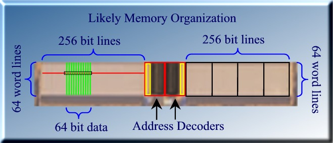
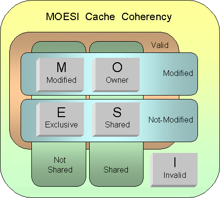

# 第3章 Opteronのデータキャッシュとロードストアユニット

- 3.1 データキャッシュ: 64kBのデータ容量、データロードに3サイクルレイテンシ
- 3.2 1サイクルあたり2つの読み込みまたは書き込み発行: 8-wayバンクインターリーブ、2-wayセットアソシアティブ
- 3.3 データキャッシュヒット/ミス検出: キャッシュタグとprimairy TLB
- 3.4 512エントリのセカンドレベルTLB
- 3.5 エラーコードと訂正
- 3.6 ロードストアユニット: LS1とLS2
- 3.7 「プリキャッシュド」ロードストアユニット: LS1
- 3.8 LS2へのロード: キャッシュプローブレスポンス
- 3.9 「ポストキャッシュド」ロードストアユニット: LS2
- 3.10 ロードーストアユニット内での命令リタイアと例外処理
- 3.11 ストアフォワーディングとロードフォワーディング、依存リンクファイル
- 3.12 自己変更コードチェック: L1 DcacheとL1 Icacheの相互排他処理
- 3.13 マルチプロセッサにおけるデッドロックの処理: Exponential back-off
- 3.14 マルチプロセッシングとマルチスレッドにおける改善
- 3.15 アドレススペースナンバ(ASN)とグローバルフラグ
- 3.16 TLBフラッシュフィルタ: CAM
- 3.17 データキャッシュスヌープインタフェース
- 3.18 キャッシュコヒーレンシのためのデータキャッシュ: MOESIプロトコル
- 3.19 キャッシュコヒーレンシのためのデータキャッシュ: スヌープタグRAM
- 3.20 L1データキャッシュのスヌーピングとLS2のアウトスタンディングストア
- 3.21 共有メモリにおける厳密なメモリオーダリングのためのLS2スヌーピング
- 3.22 TLBフラッシュフィルタCAMでのスヌーピング


## 3.1 データキャッシュ: 64kBのデータ容量、3サイクルレイテンシのデータロード

Opteronは比較的大きめのL1データキャッシュサイズを持っており、「ロードユースレイテンシ」は3クロックサイクルである。
実際には、キャッシュメモリ事態にアクセスするのには2~3サイクルしか必要ない。
最初のサイクルはx86メモリアドレスを計算するために、3つのAGUのうち一つを利用してアドレス計算が行われる。
AGUにより計算されたアドレスは2サイクル目でメモリアレイに転送され、「デコードされる」。
これにより2サイクル目の最後にデータが存在する場所の「ワードライン」が検出される。



3サイクル目に、正しいワードが有効化される。
メモリアレイ中でメモリアクセスが発生し、整数パイプライン化浮動小数点パイプラインにデータが転送される。
以下は典型的な整数x86命令であるF(reg,mem)におけるタイミングの詳細である。
このタイプの命令は最初にデータをメモリからロードし、そのデータを利用して演算を行う。

命令がスケジューラに対してディスパッチされるときに、「プリキャッシュドロードストアユニット(LS1)」に対してもディスパッチされることを見る。
このユニットに命令が挿入されると、LS2と争ってキャッシュアクセスを行う。
LS1中の命令は有効なメモリアドレスが得られるまで待つ必要があるため、AGUのリザルトバスを監視する。
LS1中の命令は、どのAGUがアドレスを供給するかを知っている。
一般的に命令は1サイクル前に供給されるリオーダバッファタグをチェックする。
一般的に、LS1中の命令はアドレスをフェッチし、キャッシュがプローブされるのを待つ。


命令は、他の命令が待っていない限り、アドレスを計算するとその値をすぐにキャッシュ転送する。
上記の例には、2つのケースが存在する。
どのようなケースにおいても、各命令は以降のアクションに備えてアドレスを保持する。
アドレスはAGUのリザルトバスからデータキャッシュのアドレスデコーダに直接転送される。
データはメモリから1サイクルで返され整数パイプラインに渡される。
LS1はデータキャッシュのリザルトタグバスを、データが到着する1サイクル前にリオーダバッファに置く。
したがって、整数ALUスケジューラはロードデータに依存する任意の命令をスケジューリングすることができるようになる。

## 3.2 1サイクルあたり2つの読み込みまたは書き込み発行: 8-wayバンクインターリーブ、2-wayセットアソシアティブ

Opteronのキャッシュは64bitのポートを2つもっているため、1サイクルで2つのアクセスを発行できる。
どのような読み込みと書き込みのペアも実行可能だ。
デュアルポートの機構は、バンク機構を利用して実装されている: キャッシュは8つの独立したバンクを持っており、それぞれ単一のポート持っている。
2つのメモリアクセスは異なるバンクであれば同時に処理可能である。


64バイトのキャッシュラインは、8つの独立した64bitのバンクに分割される。
2つのアドレスが異なるバンクフィールドを示していれば、異なるバンクに対して発行される。
このバンクフィールドは3ビット目から5ビット目である。
「データ局所性」の原理により、この構成で問題なく動作するようになっている。

64kByteのキャッシュは2-wayセットアソシアティブの構成である。
キャッシュは2つの32kByteのウェイに分割されており、これらは仮想アドレスビット[14: 0]により選択される。
物理アドレスタグ[39:12]が2つのウェイのうちどちらかにヒットしたかを検出する。
キャッシュラインに付属しているビット[39:12]の領域は物理アドレスの[39:12]と同一である。
仮想アドレスから物理アドレスの変換はTLB(Translation Look aside Buffers)の力を借りて行われる。
2-wayでのポートアクセスおよび2つのタグの比較は変換したアドレスを使って行われる。
各ポートはアドレス変換を行うための個々のTLBを持っている。

メモリ階層においてキャッシュラインの交換時には2つの64bitポートが利用される。
つまり統合L2キャッシュからL1データキャッシュへのメモリバスは128bit幅である。
新しいキャッシュラインが必要な時は、まず最初の4サイクルを利用してキャッシュラインの掃き出しが行われ、さらに4サイクルで新しいキャッシュラインがロードされてくる。

## 3.3 データキャッシュヒット/ミス検出: キャッシュタグとprimairy TLB

L1データキャッシュは、40ビットの物理アドレス空間、つまり17,179,869,184キャッシュラインのうち、1024キャッシュラインを格納するだけの能力を持つ。
キャッシュはアクセスしたい場所が、キャッシュライン中に存在しているかどうかを確認する必要がある。
このために物理アドレスの上位側を保持するための、各キャッシュラインに付属するTagRAMを使う。
2つの同時アクセスを実現するため、TagRAMは同じものを2つ保持している。

TagRAMは仮想アドレスの[14:6]ビットフィールドを用いてアクセスされる。
各TagRAMは2-wayセットアソシアティブキャッシュのうち、ヒットしたwayの番号を返す。
欲しいキャッシュラインはそのどちらかに入っている。
TagRAMは物理アドレスを保持している。
物理アドレスは、全体の分散システムメモリの中でユニークなメモリの場所を指定するのに利用される。

しかしプログラムはキャッシュに対して仮想アドレスを用いてアクセスが発生する。
仮想アドレスはプロセスのコンテキスト内でしか意味を持たない。
つまり、物理アドレスのタグをチェックするためには、「仮想アドレスから物理アドレスへの変換」が必要になる。
この変換は4つのメモリ中に存在する4つのテーブルを探索する処理が必要になる。
仮想アドレスフィールド[47:12]は4つの同じ長さのフィールドに分割され、各フィールドは4つのテーブルのインデックスとなる。
各テーブルは、次のテーブルへのポインタを保持している。
最後のテーブルがページテーブルであり、最終的な変換アドレスを保持している。


通称テーブルウォークと呼ばれるこの処理は非常に長い時間を必要とする。
したがってOpteronはTranslation Look aside Buffers(TLB)を利用して、最近変換した40個の変換記録を保持している。
このうち32エントリが上記の機構を利用した「4kページ」の変換である。
残りの8つは、「2M/4Mページ」の変換のために利用され、最後のテーブル参照をスキップすることで2MBの大きなページを参照するために利用される。
(4MBページは過去のプロセッサと互換性を持つために利用される)。

仮想アドレス[47:12]はTLBの40エントリのすべてと比較され、これには3クロックサイクル必要である。
2サイクル目の最後には、すべてのエントリのうちどれか一つでマッチしたかどうかが分かる。
各エントリは仮想アドレスに結び付く物理アドレス[39:12]を保持している。
キャッシュヒットしたならば、これらのアドレスを3サイクル目で取得し、物理タグと比較する。

## 3.4 512エントリのセカンドレベルTLB

プライマリTLBの40エントリのうち度のラインにもヒットしなかった場合、ポートで共有しているレベル‐2 TLBにヒットする可能性がある。
テーブルには512個のアドレス変換を格納することができる。
この大きなテーブルはプライマリTLBをわずかな時間でアップデートすることができる。
このテーブルは異なる方法で構成されている。
512エントリの4-wayセットアソシアティブである。

これはつまり、4つの変換を128個保持していることと同じである。
仮想アドレスビット[18:12]は128セットのうちどのエントリを参照するかを決定する。
1つのエントリから4つの変換候補を取得することになる。
各変換には仮想アドレスの残りの領域である[47:19]が含まれる。
このアドレスとテーブル中のアドレスを比較して該当する変換が存在するかチェックする。
マッチングしたならば、所望する物理アドレスフィールド[39:12]が得られる。

## 3.5 エラーコードと訂正

L1データキャッシュはECC(Error Coding and Correction)により保護されている。
64bit枚に8ビットの訂正コードが付属しており、1ビットエラーであれば修正することができ、2ビットエラーならば発見することができる。
これには64bitのハミングSED/DED(Single Error Detection/Double Error Detection)の構成を利用している。
エラービットの位置を特定するためには、6ビットのパリティビットが必要である。


6ビットのパリティビットは上図の左側に示されている。
1はエラーが検出されたことを示している。
6ビットは32個の紫のビットのパリティを示している。
パリティエラーはエラー箇所を示す6ビットのインデックスとなっている。
さらに、パリティビットは2ビットエラーの訂正と、パリティビット自身のエラー訂正も行うことができる。

## 3.6 ロードストアユニット: LS1とLS2

ロードストアユニットはデータキャッシュへのアクセスを管理する。
このタイプのユニット禿内のアウトオブオーダプロセッサにおいて重要な役割を持つようになっている。
この領域は、新しいアーキテクチャになるにつれて、より複雑な機能を持ち、面積も急激に増加していくと予想される。
Opteronのロードストアユニットを調査するのには、もう一つの理由がある。
LS1とLS2ユニットは、しばしばLS1はL1データキャッシュであり、LS2はL2キャッシュであると説明されることが多い。
しかし、これは正確ではないどころか、実際には誤りである。
これらのユニットについてより詳細に見ていく。


## 3.7 「プリキャッシュド」ロードストアユニット: LS1

プリキャッシュドなロードストアユニット(LS1)はAGU(Address Generator Unit)により生成されたアドレスを待つために発行された命令によりアクセスされる。
LS1は12エントリを持ち、メモリアクセスは整数スケジューラからディスパッチされるが、LS1のエントリにもディスパッチされる。
AGUに所属しているリオーダタグバスは必要なアドレスがAGUバスの次のサイクルで入手可能であることを示すためのものである。

ある命令のアドレスがすでに入手されているならば、そのデータはキャッシュを探索する。
2つのアクセスポートが存在する。
LS1には2つのアクセスポートが存在する。
LS1に対する最も古い2つのアクセスは、キャッシュを検査することが許可される。
ロードとストア命令のどちらもキャッシュを調査する。
ロードは実際にはロードデータを取得するためにキャッシュにアクセスする。
ストアはアドレスを取得できても、その時点ではLS1に書き込みを起こさない。
ストア命令はストアするデータを取得し、その命令がリタイアしてから初めて書き込みを実施する。

ストア命令は、ストア命令自身が投機的であり、のちに破棄される可能性を考慮して、まず最初にリタイアする必要がある。
例えば、Microsoftがバッファオーバフローの弱点を修正するためにバッファオーバフローのテストをするパッチを当てたとしよう。
このテストはオーバフローが発生したときにバッファへの書き込みを防ぐための条件分岐が入っているはずだ。
オーバフローは基本的に発生しないので、分岐予測期は分岐しない方向へ常に予測する。
これはオーバフローが発生したときにも同じ状況である。バッファへの書き込みは投機的に実行されるのである。

したがって、実際のキャッシュへの書き込みは、ストア命令がリタイアし、分岐予測が正しく、そのストア命令が正しく実行されることが分かってから実行される。
しかしこれらの遅延したストア処理は、実際の遅延を発生させない。
キャッシュへアクセスする‐ロード命令はLS1とLS2をチェックし、ロードしたい場所への書き込みがペンディングされているかどうかをチェックする。
もしペンディングを発見したならば、ロード命令はLS1かLS2から直接データを読み込み、ロードの遅延が発生するのを防ぐ。

LS1へのストアには、実際にはキャッシュのヒット・ミスの検出論理が必要になる。
キャッシュラインが存在しないことが分かれば、すぐにL2キャッシュもしくはシステムメモリからデータをロードする。
これは、後続のロードが同一のキャッシュラインを要求することが多いことから、重要なチャンスである。
ストアはメモリに書き込みたいデータを受信し、LS1はデータが到着するまで待つ。そうでなければ、LS2に移動しデータを受信する。

## 3.8 LS2へのロード: キャッシュプローブレスポンス

LS1内でキャッシュのチェックをしたすべてのアクセスは、ポストキャッシュロードストアユニット(Post-Cache Load/Store Unit(LS2))に移動する。

すべてのメモリアクセスは、ロード、ストア、ロードストア(最初にロードし、同じ場所に結果をストアする)のいずれかである。
LS1から到着したすべてのアクセスは、まずキャッシュチェックの結果を待つ。これはヒットかミスのどちらかである。
キャッシュのパリティエラーが発生する可能性もある。
次にTLBにより仮想アドレスから返還した物理アドレスが得られる。
物理アドレスには、ページをキャッシング可能かどうかを示すページの属性の情報も付加されてくる。

キャッシュミスが発生すると、命令は次のサイクルでMABタグ(Missed Address Buffer Tag)と呼ばれるタグを受け取る。
このタグは後にL2もしくはシステムメモリからミスしたキャッシュラインが到着したときに利用される。
MABタグは一般的に使用されるリオーダバッファタグの代わりに利用される。
複数のロードとストアが同一のキャッシュラインに依存していると、同一のMABタグとなる。
すべてのこのようなアクセスはミス判定となり、同一のMABタグを受け取ることになる。

バスインタフェースユニット(Bus Interface Unit: BUI)はL2キャッシュもしくはシステムメモリからミスしたキャッシュラインをロードし、データキャッシュを埋める。
この時、FillタグというタグがLS2から渡される。
Fillタグはすべてのミス判定されたメモリアクセスのMABタグと比較される。
FillタグとマッチしたMABタグは、ミス判定からヒット判定へと変更される。

## 3.9 「ポストキャッシュド」ロードストアユニット: LS2

LS2はいわゆる「ポストキャッシュロードストアユニット」と呼ばれ、32エントリを持っている。
このユニットはシフトレジスタで構成され、最古のアウトスタンディングアクセスはエントリ0に到達して消去される。
各32エントリはいくつかのフィールドを持っている。
これらのフィールドの多くは、特定の条件にマッチするかをチェックするための比較器と他の論理が付属している。
すべてのアクセスはリタイアするまでLS2に滞在する。
キャッシュミスが発生した場合にはそのアクセスはLS2情でキャッシュラインがメモリ階層から到着するの待つ。
LS2で待っているすべてのストアアクセスは、リタイア処理を待っており、リタイアが完了するとメモリに書き込みを行う。


LS2情のストア命令がリタイアすると、ヒット・ミスフラグがヒットにセットされ、LS1のストアの調査と「同時」にキャッシュポートが使用される。
LS2のリタイアしたストア処理はデータキャッシュ自身に書き込まれるが、ヒット・ミス論理は使用しない。
LS1からのストアの調査ではヒット・ミス論理を使用するだけだがデータキャッシュ自身にはアクセスしない。
この共用により重要な性能向上が達成できる。こうしなければ、1つのストアによりキャッシュのポートを2つ使用することになるからである。
一つ目はLS1によるチェックであり、2つ目はLS2によるリタイア後の書き込みである。
これによりL1データキャッシュのバンド幅が半分に抑えられてしまう。

## 3.10 ロードーストアユニット内での命令リタイアと例外処理

すべてのメモリアクセス命令、ロードとストア命令は、その命令がリタイアするまでLS2に滞在する。
ロード命令はリタイアすると、新しい命令のためにすぐにLS2から除去される。
ストア命令はデータがメモリに書き込まれるまで滞在しておく必要がある。
ストア命令はその命令が例外を発生しないか、分岐予測ミスが発生しないことが分かるまではリタイアしない。
メモリにデータがコミットされたのちに、ストア命令はLS2から除去される。

LS2はリオーダバッファとのリタイア処理用のインタフェースを持っている。
リオーダバッファはLS2からリタイアされる命令のタグを含むラインを保持している。
ライン中に存在する3つの命令のうちタグは一つしか必要ない。
なぜならば、タグはレーン0,1,2を識別するサブインデックス以外は同一のタグを利用してるからである。
LS2は全てのリタイア用タグと、命令タグを比較し一致したものに対して「リタイアフラグ」を立てる。
リタイアしたロード命令はすぐさまLS2から削除される。

リオーダバッファ中のリタイア処理回路が分岐予測ミスもしくは例外を検出すると、
該当するリタイアタグを持つ命令と、後続の命令がLS2から除去される。
この時にLS2の中で除去されないのは、データがメモリにコミットされるのを待っている命令のみである。

## 3.11 ストアフォワーディングとロードフォワーディング、依存リンクファイル

データキャッシュ中のロードぷろーびんぐでは、ロードストアユニットも調査を行い、アウトスタンディングストアバッファ中に同一アドレスのストアが存在していないかをチェックする。
そのようなストア処理を発見した場合には(さらに、プログラムの順序としてストアよりもロードの方が後であれば)、ここでは2つの可能性がある。
もしストア処理の書き込みデータがリザルトバスからすでに入手されて入れば、ロードに直接フォワーディングすることができる。
一方で、ストア処理が書き込みデータをリザルトバスから取得していなければ、ロードミスとなりLS2に移動する。

「依存関係リンクファイル」と呼ばれるユニットにエントリが作成される。
このユニットは書き込みデータのタグ(次のサイクルで書き込まれるストアデータのタグと、次のロード命令の次にロードした値を使用するタグ)を格納する。
依存関係リンクファイルは書き込みデータのタグを監視し続け、そのタグを発見するとキャッシュロードタグバスにロード命令のタグを流す。

これは後続の実際のデータがより早く到着したことと等しい。
下記の例では、命令1のリザルトデータは、それを消費する命令４に直接転送されることになる。
この場合、ストア命令とロード命令はバイパスされる。

```
1)   F( regA,regD );      // register A is a function of register A and register D
2)   store ( mem, regA ); // store register A to memory
3)   load  ( regB, mem ); // load register B from the same memory location
4)   F( regD, regB );     // uses register B and register D to calculate new value of register D
```

ストアとロードのミスマッチ：ロードデータの一部のみ変更するストアはサポートされない。
ロードはストアがリタイアし、メモリにストアされるまで待たなければならない。
ロード命令はその後キャッシュにアクセスし、ストアデータとキャッシュのオリジナルデータが組み合わされた、実際のデータをロードする。
これは深刻な性能ペナルティを発生させるため、最適化マニュアルでは、すべての可能性のあるミスマッチのケースを説明している。

同一アドレスへの複数のストア処理は一般的にはLIBフラグ(Last In Buffer)として処理される。
このフラグは特定のアドレスに対する最も最近のストアを識別する。
同一のワードに対する複数の部分的なストアによる、ワードの一部分を更新する処理はLIBではサポートされない。
これははロードストアバッファとマージされる。
これらはキャッシュ中で、すべてのストア処理がリタイアされ、書き込まれた後にマージされる。

## 3.12 自己変更コードチェック: L1 DcacheとL1 Icacheの相互排他処理

事故書き換えコード(Self Modifying Code: SMC)チェックは、実際の書き込みが発生する前にチェックしなければならない。
もしストア処理は命令キャッシュ中のデータを書き換えない、もしくは後続の実行中の任意のステージに存在しているインフライトの命令に該当する部分を書き換えないことをチェックしなければならない。
このときに、L1データキャッシュとL1命令キャッシュを「排他的に」存在させるというのは重要な簡単化の方法である。
キャッシュラインはL1のどちらかにのみ存在する。
キャッシュ欄がL1データキャッシュに読み込まれたときには、L1データキャッシュから同じキャッシュラインは除去される。

この方法の1つ目の利点は、命令キャッシュがSMCのテストをする必要がなくなることである。
2番目の利点は、SMCのチェックがデータキャッシュミス時にのみ限定される。
アンキャッシュなメモリ領域へのストア処理のみSMCを考慮することになる(これらは常にミスとなる)。
ストアの書き込みアドレスはLS2から転送され、命令キャッシュの近くに存在するSMCテストユニットへ送られる。
このユニットはインフライト中のすべての命令のキャッシュラインのアドレスを保持している。
もし衝突が発生すると、ストア処理に衝突が発生するマークが付けられる。
このストア命令がリタイアすると、リオーダバッファ中のすべての後続の命令を破棄する。

## 3.13 マルチプロセッサにおけるデッドロックの処理: Exponential back-off

複数のプロセッサが同一のキャッシュラインを取得しようとしている場合、デッドロックが発生する可能性がある。
例えば、2つのプロセッサが同一のラインに書き込んだとする。
キャッシュラインは通常キャッシュミスが発生するとすぐにロードされる。
するとストア処理の場合にどちらかのプロセッサのキャッシュラインが無効化される。
2つのプロセッサは、ストアが完了する前に互いのキャッシュライン無効化しようとし続けると、デッドロックが発生する。

2つのプロセッサが、アンアラインなアドレスに向けてストアしようとする。
つまりストアするデータの一部がキャッシュラインA1に書き込まれ、別の一部分がキャッシュラインA2に書き込まれたとする。
アンアラインなストアは、一般的にハードウェアにより2つのストアに分割される。
「Exponential Back-off」の機構によりこのようなデッドロックの状態を解決することができる。
Back-off時間はメモリアクセスに失敗し、再度キャッシュラインを再取得するまでの時間である。
この時間が、1つのプロセッサが最終的に成功するまで指数関数的に増加するという構造である。

## 3.14 マルチプロセッシングとマルチスレッドにおける改善

Opteronマイクロアーキテクチャはマルチプロセッシングとマルチスレッディングについて、非常に多くの改善がなされている。
これらの改善は、デスクトップマーケットにおいて非常に重要である。
オンチップマルチプロセッサのソリューションはハイパースレッディングにおいて角を曲がったところであり、近い将来IntelのPrescottにより本格的に重要なものになるであろう。

マルチプロセッシング及びマルチスレッドアプリケーションは、効率的に性能を向上できる。
コンテキストスイッチングなどプロセスとスレッドの最初と最後に切り替えるように、プロセス間通信とスレッド間通信は伝統的に大きなオーバヘッドであった。
これらのオーバヘッドを最小化することで、大きな性能向上が図られている。


## 3.15 アドレススペースナンバ(ASN)とグローバルフラグ

異なるプロセスには異なるコンテキストが存在す。
つまり、プロセスごとに仮想アドレスから物理アドレスへの変換方法は異なる。
プロセスのスイッチは、Translation Look Aside Bufferの無効化(フラッシュ)が発生する。
大きなTLBの場合、頻繁にTLBのフラッシュが発生すると性能の低下の要因となる。
OpteronはTLBのフラッシュを防ぐための新しいメカニズムを導入している。
これはAddress Space Number(ASN)レジスタを、Enableビットに追加する(ASNE)ことである。

Address Space Numberはプロセスをユニークに識別するために利用される。
TLBの各エントリには、プロセスのASNが含まれる。
メモリアクセスのアドレスが仮想アドレスに一致し、「かつ」TLB中のASNがTLB中のASNレジスタにマッチするとアドレス変換は成功する。
ASNフィールドは仮想アドレスの「拡張」領域としてみることができる。
これにより、異なるプロセスの異なる変換を、1つのTLBでエコなうことができ、コンテキストスイッチのたびにTLBをフラッシュする必要性を排除することができる。

オペレーティングシステムに関連する、データとコードのGlobal Flagはプリフェッチ的にアクセス可能である。
グローバル変換はASNフィールドがマッチする必要はない。
これはいかなるプロセスでもTLBのエントリを共有することができるグローバルデータであることを意味する。
ASNとグローバルフラグの他の利点は、TLBの無効化が必要な時に、フラッシュするエントリを減らすことができることである。
特定のASNもしくはグローバルビットがセットされているエントリのみフラッシュすればよい。

## 3.16 TLBフラッシュフィルタ: CAM

TLBは、メモリ中のアドレス変換ラベルを格納したアドレス変換情報用のキャッシュと考えることができる。
実際の変換には、メインメモリ中をいくつか渡り歩き、いくつかのレベルの変換が必要になる。
これを一般的に「テーブルウォーク」と呼ぶ。
単一のTLBエントリのために、数百サイクルかけてテーブルウォークするのは非常に時間を消費する。
Opteronは24エントリのPage Descriptor Cacheを用いることにより、テーブルウォークを高速化する試みを行っている。

それでも、マルチタスク、マルチスレッド環境でのテーブルウォークを避けることは相変わらず重要になる。
いくつかのタスクにより、TLBのエントリが書き換えられてテーブルウォークの情報がメモリ中に存在していない場合に、テーブルウォークは必要になる。

今までのところ、TLBを保証するための方法は1つしか存在しない:TLB中でエントリがメモリ中に存在するエントリと同一で無くなったならば、
TLBをフラッシュする。
x86アーキテクチャで定義される多くの動作によって、しばしば不要なTLBのフラッシュが自動的に実行される。
Opteronの新しい機能として、多くのイベント時においてTLBフラッシュフィルタを避けることができる。

TLBフラッシュフィルタは32エントリのContent Addressable Memroy(CAM)で実装される。
各エントリは、TLBがロードされたときのメモリ中の領域アドレスを保持している。
したがってこれらの領域はPage Translation Tablesに保持されている。
フィルタはすべてのメモリアクセスを監視しており、任意の同一領域へのアクセスを監視している。
もし同一領域へのアクセスが発生していなければ、コヒーレントを保証するためにTLB当該エントリをフラッシュする。

## 3.17 データキャッシュスヌープインタフェース

スヌープインタフェースは非常に多くの目的で利用される。
この機能はマルチプロセッサシステムにおけるキャッシュコヒーレンシを管理するために利用される。
また、共有メモリにおいて厳密なメモリオーダリングを保護する目的や、Self Modifying Code検出、TLBコヒーレンシなどの目的で利用される。
スヌープインタフェースは、命令キャッシュの代わりにデータのための多くのメモリやバッファを監視するための発行されたメモリアクセスと同様に、
他のプロセッサアクセスのためにも物理アドレスを使用する。

## 3.18 キャッシュコヒーレンシのためのデータキャッシュ: MOESIプロトコル

Opteronはシステム中で8プロセッサのキャッシュコヒーレントを制御することができる。
この制御のために「MOESI」と呼ばれるプロトコルと使用している。
スヌープインタフェースはこのプロトコルの目的を達成するための中心的な役割を演ずるものである。

キャッシュラインが(8つのプロセッサに接続されている)システムメモリから読み込まれたとき、
すべてのプロセッサからリード操作が監視されている。
スヌープアクセスは64バイトのキャッシュラインをリードしないので、通常のメモリアクセスよりもずっと小さい。
多くのスヌープ機能は、分散メモリシステムのスループットに負荷をかけずに使用することができる。
スヌープが、他のプロセッサのキャッシュラインに存在するメモリ領域へのアクセスを検出する。

プロセッサが、自分の持っているキャッシュラインを他のプロセッサがロードしたことを検出しなければ、そのキャッシュラインは
「排他」状態としてマークされる。
現在、このキャッシュラインに何かしらの値を書き込むと、そのキャッシュラインは「変更済み」のマークが設定される。
一般的に、変更されたキャッシュラインはすぐさまメモリに書き戻されるわけではない。
メモリページ属性に特殊な情報が保持されている場合(ライトスルーなど)は、書き戻しを行う。
キャッシュラインは、同一キャッシュライン上に他のキャッシュラインがロードされて来た時に撤去される。



もしプロセッサがメモリからデータをロードする必要があり、他のキャッシュラインにそのデータが載っていたことを検知すると、そのキャッシュラインは「共有」状態となる。
もしキャッシュラインが、他のプロセッサのキャッシュにおいて「変更済み」状態となっているラインをロードしたとすると、当該データはメモリからロードするのではなく、そのラインを保持しているプロセッサから直接ロードされる。
キャッシュからキャッシュへのデータ転送は、通常メモリアクセスよりも高速である。

この場合、受け渡し元のキャッシュラインが「変更済み」から「所有者」に変更となる。
キャッシュラインはまだメモリには書き戻さない。任意の(3番目)のプロセッサがメモリから、「共有」状態と「所有者」状態になっているメモリ領域をロードすると、
メモリから直接読むのではなく、「所有者」となっているキャッシュラインから直接データを読み込む。
所有者となっているキャッシュラインは最新のデータを保持しており、システムメモリに最終的に書き戻す責任を持っている。

キャッシュラインは、任意のプロセッサがキャッシュラインに再度書き戻しをするまではキャッシュ中に存在する。
もし任意のプロセッサが当該キャッシュラインに書き込みを行い、それを他のプロセッサに通知する必要がある場合、
当該ぷろせっは他のプロセッサに対して「Invalidate Probe」を通知する。
キャッシュライン中のデータの状態は「変更済み」から「無効」へと変更される。
キャッシュラインは共有状態ではなくなっているため、もし同じキャッシュラインへの書き込みがさらに続いてもInvalidate Probeは通知されない。
当該キャッシュラインをシステムメモリに書き戻すことは当該プロセッサの責任となる。

## 3.19 キャッシュコヒーレンシのためのデータキャッシュ: スヌープタグRAM

システムメモリにアクセスする他のプロセッサは、データキャシュを制御するためにMOESIプロトコルを利用してバスをスヌープする必要がある。
ここで、スヌープには2種類あることを見てきた。
ReadスヌープとInvalidateスヌープである。
スヌープの基本的タスクは、データキャッシュ中に当該キャッシュラインが入っているかどうかを判定することである。
ここでは、スヌープインタフェースのための3つ目のTagRAMが存在する。
(他の2つは、通常のデータキャッシュのアクセスのために利用される。)
スヌープ用のTagRAMは1024エントリを持っており、1エントリが1キャッシュラインに相当する。
このRAMは各キャッシュラインの物理アドレスの[39:12]ビットを保持している。

通常のTagRAMは仮想アドレスを通じてアクセスされる。
しかしスヌープTagRAMは物理アドレスを処理しなければならない！
幸運なことに、多くの仮想アドレスビットは物理アドレスビットと同一である。
仮想アドレスと物理アドレスで[15:12]ビットのみが異っており、従ってそこは使えない。
これはつまり、16個の可能性のある全てのキャッシュラインを並列に読み込み、いずれかが該当するかどうかをテストする必要がある。
幸運なことに、これはさほど大きな負荷とはならない。
キャッシュの全体のバス幅(ビット線)は512ビットである。
16個分の28ビットTagは少ないほう(448)であり、従って、各キャッシュラインのための状態情報を格納するための多少の領域が残される。

16個のヒットする可能性のあるキャッシュラインのうち、ヒットしたことが分かれば、残りの仮想アドレスビットはキャッシュとそのウェイ(0 or 1)にアクセスすることで仮想アドレスを入手することができる。
その場所(16個のうちの1つ)は、残りの3つのアドレスビット+ウェイビットを提供する。
これによりキャッシュがRead Snoopヒットの際にキャッシュアクセスできるようになる。

## 3.20 L1データキャッシュのスヌーピングとLS2のアウトスタンディングストア

L1データキャッシュから読み込みを行い、それをLS2でリアイアしたストアのためにチェックし、キャッシュラインに書き込むアクセスは、他のプロセッサのスヌープ読み込みをする必要はない。
このようなストアを発生させる書き込みが、既に書き込みを発生させるプロセッサのメモリの一部であると考えたとしてもである。
他のプロセッサにとってみれば、このような書き込みが後続のステージで発生しても問題ない。
外部に対する唯一の影響は、当該プロセッサがわずかに遅く動作しているように見えるだけである。

外部のプロセッサが共有キャッシュラインに対して書き込みを行う場合には、周囲に対してinvalidateを発行する必要がある。
このようなスヌープInvalidateシグナルを受信するとスヌープインタフェースはキャッシュラインをチェックし、ヒットしたキャッシュラインをInvalidateする。
スヌープインタフェースは、ヒットしたキャッシュラインへ書き込みを行いたいLoad Store Unitのために、全てのストア処理のためにHit/Missフラグを設定する。
しかし後者はスヌープ操作のためではない。
キャッシュラインが除去されるか、Invalidateされたときには常に必要なものである。
これらのストア処理は、最初にヒットしたのだが、ミスに設定し直されており、再度キャッシュセットを行わなければならない処理である。

## 3.21 共有メモリにおける厳密なメモリオーダリングのためのLS2スヌーピング

Opteronには面白い仕掛けが搭載されており、Opteronは共有メモリからアウトオブオーダでロードしながらも、共有メモリマルチプロセッシングに必要な厳密なメモリアクセスの順序を守ることができる機構を搭載している。
ハードウェアは、メモリアクセスの順序違反が発生すると、必要ならばメモリアクセスの順番を入れ替えることができる。
通信プロセッサは、例えば最初に新しいコマンドを他のプロセッサに対してメモリチュウのA1に対して書き込む。
そして値A2を更新して次のコマンドが送信されたことを通知する。
コマンドを処理する予定のプロセッサはA2がインクリメントされていることを検知するが、もしロード処理がアウトオブオーダに処理されていた場合、A1から古いコマンドを読み取る。

ロード処理をアウトオブオーダで処理することにより、処理速度を大幅に改善できる。
最たる例は、最初のロードがキャッシュミスを起こした場合である。
アウトオブオーダプロセッサは、後続のロード処理を発行し、キャッシュヒットした処理については、最初のロードの結果を待たずに処理を完了できる。
これがマルチプロセッシング環境におけるアウトオブオーダロードの利点である。

もう一つの重要な速度向上手段は、投機処理である。
1番目のミスしたロードは、私達の例ではA2のカウンタとして利用されるのであった。
新しいコマンドは、A2がインクリメントされると、フェッチされる。
A2の条件に応じて、ロードが呼ばれるかどうかが決定される。
投機プロセッサは、パイプラインの先頭で分岐の結果を予測する。
一般的にコマンドを実行するのは、新しいコマンドを提供するよりも時間がかかるならば、カウンタが予測する。
つまり、一般的に新しいコマンドは、前のコマンドが完了されるまで待ち続ける。

投機的アウトオブオーダプロセッサは、最初にカウンタA2をロードしようとする。
実際にはこのロードはキャッシュミスを起こすのだが、分岐予測器は、A2の値がインクリメントされ、A1からのコマンドがロードされると予測する。
A1からのロードはキャッシュにヒットする。
実際には、このコマンドが新しいコマンドであるかどうかは分からない。
これを古いコマンドであるとしよう。
カウンタA2はメモリから依然ロードされている。
もしA2がその間にインクリメントされ、これにより、ローカルデータキャッシュにおける、インクリメントされた値を含むキャッシュラインの変更が発生したとする。
プロセッサは、分岐予測は正しく、古いコマンドが誤ってキャリーされたと結論付ける。

Opteronは、ハイパフォーマンスマルチプロセッシングのための、この種類の完全なアウトオブオーダ処理を実行するためのスヌープメカニズムを持っている。
このメカニズムは、メモリ処理の順番が誤っているかどうかを検出し、メモリ順序をリストアすることができる。
この機能の例を図に示す。
最初に、プロセッサが新しいコマンドをA1に書き込むと、他のコアのキャッシュに対して、当該キャッシュラインをInvalidateするスヌープシグナルを送信する。
スヌープのInvalidateは、最終的にロードストアユニットのスヌーピインタフェースに到達する。

スヌープインタフェースは、最初にinvalidateされるキャッシュラインにヒットするかをチェックする。
私達の例では、A1からのロードは「古いコマンド」となる。
最初の探索がヒットすると、全ての古いロード処理を探索し、ミスとマークされているものを探す。
私達の例では、A2カウンタの値のロードが該当する。
該当するロード処理は、全てSnoop Resyncフラグが付加される。
フラグは、全ての後続の命令に影響し、ロード処理がリタイアした場合に、A1を含む後続のキャンセルに影響が出る。
A1からのロードは再度実行され、メモリから新しいコマンドでデータ読み込みが行われる。

## 3.22 TLBフラッシュフィルタCAMでのスヌーピング

スヌーピングは、メモリコヒーレンシを保つために使われる。
TLBフラッシュの機能はTLBの不必要なフラッシュを防ぐことができる。
したがって、メモリ中の、ページテーブル変換情報と呼ばれる、TLBによってキャッシュされる最大で32個の領域をモニタリングしていることになる。
これらのエントリもまた、他のプロセッサからスヌーピングInvalidateされなければならず、他のプロセッサから、ページテーブルに情報が書き込まれる。
任意のスヌープがTLBフィルタエントリにヒットするTLBは無効なエントリを持つことになり、TLBフラッシュフィルタはそれ以上TLBををフラッシュから保護することはできなくなる。

スヌープInvalidateは、プロセッサ型のプロセッサとキャッシュラインを共有していないことが分かれば送信されることはない。
これにより、TLBフラッシュフィルタを通してTLB(自分の権限をキャッシュしていると考える)にMOESIプロトコルを適用する。
メモリページ変換テーブル(PML4, PDP, PDE, PTEエントリ)はキャッシュ可能なメモリとなる。
Opteronでは、オペレーティングシステムが、非キャッシュ可能領域と判定すれば、テーブルに特殊なフラグが付加される。
