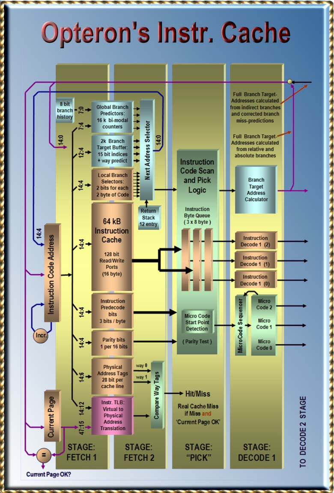

# 第4章 Opteronの命令キャッシュとデコーディング

- 4.1 命令キャッシュ: 1つ以上の命令を格納する
- 4.2 一般的な命令フォーマット
- 4.3 プリデコードビット
- 4.4 高並列プリデコーディング
- 4.5 高負荷の分岐予測
- 4.6 向上した分岐予測
- 4.7 分岐セレクタ
- 4.8 分岐ターゲットバッファ
- 4.9 グローバルヒストリ2モードカウンタ
- 4.10 1ライン当たり3分岐のローカル&グローバル分岐予測
- 4.11 分岐ターゲットアドレス計算、分岐ターゲットバッファのバックアップ
- 4.12 命令キャッシュヒット/ミスの決定。現在のページとBTAC
- 4.13 命令キャッシュスヌーピング

## 4.1 命令キャッシュ: 1つ以上の命令を格納する

命令キャッシュへのアクセスは128ビット幅である。
1サイクルで16バイト分の命令がキャッシュにロードされる。
命令のバイト列は、76ビットの付加情報を持っている。
この拡張ビットにより、キャッシュポートからロードされる命令の全体ビット幅は204ビットとなる。
しかしまだ私達はフル命令キャッシュをカバーするだけのビットしか数えていない。
つまり、1024個のキャッシュラインは、それぞれ付加ビットを持っている。
これらは1024エントリよりも少ない、さらに多くのフィールドを持っており、キャッシュラインの一部でのみ有効となる。

|                        | Instruction only | Total Size |
|------------------------|------------------|------------|
| Instruction Cache size | 64 kByte         | 102 kByte  |
| Cache Line size        | 64 Byte          | 102 Byte   |
| One Read Port          | 128 bit          | 204 bit    |
| One Write Port         | 128 bit          | 204 bit    |

良く知られているのは、各バイトに付加されているプリデコードビットと呼ばれる3ビットのデータである。
これらのビットは、複雑なx86可変長命令の先頭と最後尾にマークされ、いくつかの機能的な情報を提供する。
残りの2ビットフィールドはパリティビットであり、1つは16ビットデータ毎に付加され、一般に分岐セレクタと呼ばれる
(16バイトラインの命令コードにつき、2ビットのパリティビットが8つ分付加される)。

Opteronの分岐セレクタは他のAthlon(32)とは異なり、全ての命令キャッシュ中の1024キャッシュライン全てをカバーすることができる。
分岐セレクタには、プリデコード情報として探索することができない、ローカル分岐予測情報が含まれている。
いくつかのコードは分岐セレクタが有効な意味を持つまでに複数回実行される。

キャッシュラインが破棄されたとしても、分岐セレクタビットが統合された2次キャッシュの命令データに保存されているのはこのような理由である。
分岐セレクタは各バイトに余分な1ビットとして付加される。
レベル2キャッシュはこのビットをECC(Error Coding and Correction)情報のために保持している。
ECCはデータキャッシュラインでしか利用されず、命令キャッシュラインでは利用されない。
後者ではECCは必要ないので、キャッシュライン中のいくつかのパリティビットを格納するのには十分である。
命令キャッシュラインにおいて衝突したものは、常に外部DRAMメモリから取得される。

|                  | Ram Size  | Bus Size | Comments                                                        |
|------------------|-----------|----------|-----------------------------------------------------------------|
| Instruction Code | 64 kByte  | 128 bit  | 16 bytes instruction code                                       |
| Parity bits      | 4 kByte   | 8 bit    | One parity bit for each 16 bit                                  |
| Pre-decode       | 26 kByte  | 52 bit   | 3 bits per byte (start, end, function) + 4 bit per 16 byte line |
| Branch Selectors | 8 kByte   | 16 bit   | 2 bits for each 2 bytes of instruction code                     |
| TOTAL            | 102 kByte | 204 bit  |                                                                 |

## 4.2 一般的な命令フォーマット

64ビット命令の簡単な概要である。

連続したプリフィックスを、実際の命令の前に付加することができる。
最初は、レガシーなプリフィックスが付加される。
最も重要なレガシープリフィックスはオペランドサイズをオーバライドするプリフィックス(hex 66)と、アドレスサイズのオーバライドプリフィックス(hex 67)である。
これらのプリフィックスは、ディスプレースメントと即値フィールドの長さを、1,2,4バイトの長さに変更することができるため、全体の命令長を決定する。

REXプリフィックス(hex 4X)は、64ビットの新しいプリフィックスで、64ビット処理を可能にする。
Xの値は汎用レジスタとSSEレジスタの数を8から16に拡張する際に使用する。
x86は、データやアドレスを指定するために1命令あたり最大で3つのレジスタを指定するため、これらのビットはその目的に利用される。
4番目のビットはオペランドのサイズをオーバライドするために使用される(デフォルトサイズか、64ビットに拡張される)。

Escapeプリフィックス(hex 0F)はSSE命令を特定するために利用される。
オペコードは実際にはプリフィックスの後から始まる。
1から2バイトのオプショナルなMODRMバイトとSIBバイトを付加することができる。
オプションのディスプレースメントと即値フィールドは、アドレスおよびデータの計算のために定数を格納することができ、1,2,4バイトのうちどれかを取ることができる。
命令全体の長さは、15バイトまでに制限される。

## 4.3 プリデコードビット

命令キャッシュ中の各バイトには、プリデコーダによって生成されたそれぞれ3ビットのプリデコードビットが付属している。
これらのビットは、可変長命令のデコードを高速化する。
各命令バイトには、可変長ビット命令の先頭を示すスタートビットと、最後を示すストップビットが追加されている。
1倍と命令には、どちらのビットも有効化されている。
3番目のビット、機能ビットにより、別の情報が格納されている。
まずデコーダは、可変長命令における最後のバイトに格納されている機能ビットを参照する。
もし機能ビットが0ならば、この命令は、いわゆる直接パス命令であり、機能ユニットは直接処理される。
そうでなければ、つまり可変長命令における最後のバイトの機能ビットが1であるならば、いわゆるベクトルパス命令である。
マイクロコードプログラムによる処理が必要な、より複雑な命令であることを示す。

プリデコードビットの定義

| START bit  | 命令の最初のバイトであることを示す                                                                                                                                                                                                                                                                                                                                 |
|------------|--------------------------------------------------------------------------------------------------------------------------------------------------------------------------------------------------------------------------------------------------------------------------------------------------------------------------------------------------------------------|
| END bit    | 命令の最後のバイトであることを示す                                                                                                                                                                                                                                                                                                                                 |
| 機能ビット | rule 1:,Direct Path instruction, if 0 on the last byte,Vector Path instruction if 1 on the last byte,rule 2:,1 indicates Prefix byte of Direct Path,(except last byte),0 indicates Prefix byte of Vector Path,(except last byte),rule 3:,For vector-path instructions only:,if the function bit of the MODRM byte is set then,the instruction contains a SIB byte. |

2番目に、機能ビットはプリフィックスバイトを識別する。
機能ビットが1である場合、ダイレクトパス命令のプリフィックスバイトであり、0であるならば、ベクトルパス命令のプリフィックスバイトである。
最後に、ベクトルパス命令である場合に限り、BODRMバイト機能ビットがセットされているならば、SIBバイトが命令に含まれていることを示す。

## 4.4 高並列プリデコーディング

私たちは、非常に大きな、4つの対称性を持つ論理ブロックを発見した。
これは16バイトのデータブロックが命令キャッシュから読み書きされる場所である。
この領域について、候補として挙げられるのはUS Patent 6,260,134でゲートレベルの詳細が記述されているプリデコーダではないかと予想する。
この部分について議論してみる。

4倍バージョンでは、特許により記述されている説明によれば、このユニットは16バイトのライン全体を、高並列プリデコーディングと呼ばれる機構により2サイクルでプリデコードできる。
命令の境界バイトの判定は、可変長命令に基本的な問題である。一般的に：

1つ目の命令の長さが決定されないと、2番目の命令のデコードを開始で駅内。
2番目の命令の位置は、1番目の命令の命令長に依存する。

高並列プリデコーダは、最初に16個の可能性のある命令を同時にプリデコードすることによりこの問題を解決する。
各命令は16バイトのラインの中で、16個の位置のすべてで開始される。
次に、実際の命令の場所を、次の命令の開始バイトのプログラムカウンタ値、つまり次に16バイトラインのどこへ飛ぶかに依存してフィルタリングする。

1サイクルあたり16バイトの命令が命令キャッシュからフェッチされ、デコーダに渡される。
このラインはプリデコードされていないか、誤ってプリデコードされている可能性がある。
(プリデコーダは命令間のデータバイトの解釈を間違える可能性がある)。

分岐命令が、プリデコードスタートビットを設定しないアドレスを生成した場合、何かが間違っている可能性がある。
この場合命令パイプラインはプリデコーディングハードウェアを起動し、たった2サイクルでプリデコーディングビットの初期化と訂正を行う。

高並列パラレルプリデコーダは4つのブロックを利用する。
これらのブロックは早期のプリデコーダに適合される。
単一のブロックで、4つの可能性のあるプリデコードを並列に実行する。
後続の4バイト毎の位置のうち、どこか一つで各命令が開始される。
古い単一のブロックは4サイクルで4バイトをステップしていく。
高並列プリデコーダはこれらの4つのブロックを組み合わせ、2番目のステージでこれらの4つのブロック間の関係を構築する： start/endの修正とソーティングである。

## 4.5 高負荷の分岐予測

分岐予測はパイプラインプロセッサを設計するための技法である。
分岐命令の結果は、一般て駅にはパイプラインの最後の方にしかわからないが、その情報はパイプラインの先頭で必要になる。
分岐結果は、次の命令をロードするために必要である。

命令ラインをロードするためには2サイクル必要である。
もしこのロードサイクルを失いたくなければ、16バイトの命令ラインが命令キャッシュからフェッチされてきた段階で新しい命令ポインタを決定しなければならない。

これはつまり、命令バイトの内容を確認する時間も、条件分岐命令を識別する時間も無いということを意味し、このため分岐予測を生成するために、これらの分岐の履歴を参照する。
この分岐予測を実行するためには、数サイクルを消費してしまう。

## 4.6 向上した分岐予測

分岐予測ハードウェアは、フェッチした命令バイトのすべてについてあらゆる試行をする訳ではない。
その代わりに、新しいアドレスを選択するためにいくつかのデータ構造を利用する。
2048エントリの分岐ターゲットバッファと12エントリのリターンスタックを利用し、新しいプログラムカウンタのアドレスを生成する。
さらに、2つの分岐ヒストリ構造を利用し、1つはローカル履歴、もう一つはグローバル履歴である。
プロセッサはこれらの分岐履歴を使い、分岐の結果を予測する。
これは一般的に分岐セレクタと呼ばれ、ローカル履歴のために使われる。
一方で、グローバル履歴はグローバル履歴カウンタのために利用される。

## 4.7 分岐セレクタ

分岐セレクタはローカル履歴に統合されている。
「ローカル」の意味は、分岐予測は分岐の結果自身の身に基づいているということである。
同じ方向に常にジャンプしている条件分岐は、分岐セレクタにより予測することができる。
無条件分岐命令も同様に分岐セレクタにより予測することができる。
分岐予測は、実際のコードを参照する時間が無いことを思い出してほしい。
分岐セレクタは、分岐の履歴はxxx

しかし、分岐の方向がそこまで確実でない場合はどうするか？
この場合分岐セレクタは予測を行わず、グローバル分岐予測を実行する。
分岐ssレク他派分岐を認識するために分岐が成立するとだけ予測するが、最終的な分岐予測の判断には利用されない。
グローバルフラグがグローバル履歴カウンタにより設定され、最終的な分岐予測の決定が行われる。

命令コードの16バイトラインには、8つの2ビット分岐セレクタが付属している
(いくつかの特許では、9つとも記載されている)。
ライン中の分岐セレクタは、命令フェッチアドレスのbit[3:1]に基づいて選択される。
分岐セレクタは、以下の質問に答える：プロセッサはこの特定のアドレス中の16バイトラインに差し掛かった。では、次のサイクルでは、どの16バイトラインをロードすればよい？
1ラインの中には、複数の分岐命令や関数呼び出し、リターンの命令が存在し、これらは条件付きのものと無条件のものが混在する。
これらすべての分岐の真ん中の、任意の場所にジャンプすることになる。
分岐セレクタは、どのラインに入ったかに依存して、何をすべきかを教えてくれる。

K7は1ライン当たり2つの分岐と1つのリターンを予測することができた。
Opteronの最適化マニュアルによれば、新しい64bitコアでは、1ライン当たり3つの分岐とリターン命令のすべてを予測することができる。(これについては明確記載された資料が存在しないため、上記の表は私たちの推定である)
分岐セレクタは、その命令がキャッシュラインから吐き出されるときに、巨大な1MBのL2キャッシュに命令コードとともに格納される。
最も保存しなければならない有効なデータは命令コードから簡単に捜索することのできないデータ: 分岐履歴である。
実際の分岐ターゲットアドレスや、分岐がリターンであるかであるかどうかの情報は、プロセッサの機能によりほとんどの場合に比較的高速に探索される。

## 4.8 分岐ターゲットバッファ

BTB(Branch Target Buffer: 分岐ターゲットバッファ)は2048個の、分岐セレクタが次に命令をフェッチすべきアドレスを格納している。
Fred WeberのMPF2001 Hammerの発表によれば、各16バイトのラインは最大で4つの分岐ターゲットアドレスを保持することができる(Athlon 32の場合は2つまでである)。
各分岐ターゲットエントリは、8つのライン間で共有されている。
分岐セレクタからは、任意の単一のラインはこれらのうち3つ以上は使用しない。
分岐セレクタが、例えば2番目の分岐を選択しなさい、と知らせると、現在のラインから2番目の分岐が使用可能であることを意味する。

各分岐ターゲットエントリには、命令が属している可能性のある8つのラインのうちどこに存在しているかを示すための3ビットのタグが必要である。
分岐ターゲットエントリを共有することにより、必要な分岐ターゲットアドレスの数を大幅に削減できる。
BTBに48ビットのアドレスが格納されるならば、2048エントリのBTBは12kByteの容量が必要である。
これは比較的大きなメモリであり、Opteronのダイからは発見できない。
ここで使われているトリックは、64kByteの命令キャッシュのアクセスに必要な16bit分しかメモリに格納しないということである。
より上位のビットは後で探索する。
これをサポートするために、OpteronはBTAC(Branch Target Address Calculator)と呼ばれる新しいユニットを格納している。

## 4.9 グローバルヒストリ2モードカウンタ

Athlon 64は16,384個の分岐ヒストリカウンタを持っており、32ビットの過去のプロセッサの4倍である。
カウンタは分岐が成立するかの公算について記述されている。
分岐が成立すると最大で3までカウントアップされ、分岐が非成立ならば最小で0までカウントダウンする。
カウンタの値で3と2は分岐が成立すると予測される。以下の表を参照のこと。

- 2ビット分岐履歴バッファの説明

| カウンタ値 | 分岐予測       |
|------------|----------------|
| カウンタ=3 | 強い分岐成立   |
| カウンタ=2 | 弱い分岐成立   |
| カウンタ=1 | 弱い分岐不成立 |
| カウンタ=0 | 強い分岐不成立 |

BHBCはプログラムカウンタの4ビットと最後の8つの分岐結果(成立or不成立)の情報を利用してアクセスされる。
これは基本的にAthlon 32と同じである。
ここでAthlon 64が4倍のヒストリカウンタを持ったことにより、16バイトの命令ラインで4つの分岐予測を行うことができるようになった。
これはライン当たりに4つの分岐ターゲットアドレスを生成できることを意味する。
Athlon 32では1ライン当たり2つの分岐アドレスを計算できるだけで、分岐予測器を利用するために衝突が起きていたが、それを改善できることになった。

他の改善点としては、グローバルビットがセットされている分岐のみがグローバル分岐予測にかかわることができる点である。
この分岐命令の抑制により、グローバル分岐予測器の履歴が他の関係ない分岐命令により汚されることを防いでいる(US Patent 6,502,188がAthlon 32の再検討という形で取られている)。
グローバルビット派は分岐が予測できない結果を生成してきても設定される。
GHBCテーブルはプロセッサが分岐予測のパターンを最大で8つの分岐で予測することを可能にする。

## 4.10 1ライン当たり3分岐のローカル&グローバル分岐予測

16バイトラインに最大で3つの条件分岐が登場する、複雑な状態を考える。
もし最初の分岐予測が非成立で、次の分岐命令を予測しなければならないとする。
Opteronはこの複数のステップを処理できるだろうか？もしくは複数の分岐予測を一度に処理できるだろうか？

1ラインにつき、ローカル分岐とグローバル分岐予測では以下の条件が存在する。

| IF                        | AND                                                                                                                                 | THEN         |
|---------------------------|-------------------------------------------------------------------------------------------------------------------------------------|--------------|
| 分岐セレクタが分岐1を選択 | 分岐1のローカル、グローバル分岐予測が成立                                                                                           | 分岐0が成立  |
| 分岐セレクタが分岐1を選択 |  分岐1のローカル、グローバル分岐予測が不成立  分岐2のローカル、グローバル分岐予測が成立                                             | 分岐1が成立  |
| 分岐セレクタが分岐1を選択 | 分岐1のローカル、グローバル分岐予測が不成立 分岐2のローカル、グローバル分岐予測が不成立 分岐3のローカル、グローバル分岐予測が成立   | 分岐2が成立  |
| 分岐セレクタが分岐1を選択 | 分岐1のローカル、グローバル分岐予測が不成立 分岐2のローカル、グローバル分岐予測が不成立 分岐3のローカル、グローバル分岐予測が不成立 | 次のラインへ |
| 分岐セレクタが分岐2を選択 | 分岐2のローカル、グローバル分岐予測が成立                                                                                           | 分岐0が成立  |
| 分岐セレクタが分岐2を選択 | 分岐2のローカル、グローバル分岐予測が不成立 分岐3のローカル、グローバル分岐予測が成立                                               | 分岐1が成立  |
| 分岐セレクタが分岐2を選択 | 分岐2のローカル、グローバル分岐予測が不成立 分岐3のローカル、グローバル分岐予測が不成立                                             | 次のラインへ |
| 分岐セレクタが分岐3を選択 | 分岐3のローカル、グローバル分岐予測が成立                                                                                           | 分岐1が成立  |
| 分岐セレクタが分岐3を選択 | 分岐3のローカル、グローバル分岐予測が不成立                                                                                         | 次のラインへ |

Fred WeberのMPF2001の発表を参考にすると、一度に上記の分岐の処理が行われていると予想する。
(このプレゼンテーションでは、1つのGHBCの予測が1サイクルで実行できるとしている)。
確かに、潜在的なボトルネックはGHBCの部分となるだろう。
2番目と3番目の分岐では、異なる「8ビットの分岐の結果」のインデックスをテーブルのために必要になる。
8ビットの値は2番目と3番目の分岐のために、0で1ー2ビットシフトする必要があり、このルールの通りに処理するために「予測しない」ということを示す必要がある。

## 4.11 分岐ターゲットアドレス計算、分岐ターゲットバッファのバックアップ

もう一つの新規機能はBTACである。BTACはBranch Target Address Generatorの意味であり、さまざま目的で非常に有用である。
このユニットは16バイトラインの命令コードをキャッシュからロードした2サイクル後にフルアドレス(48ビット)の分岐アドレスを生成できる。
このユニットは、一般的な命令、プログラムカウンタからの8ビットから32ビットのディスプレースメントを持つjump, call命令にて動作する。
BTACはおそらくリターン命令でも同様に利用できる。

BTACのタスクの一つは、BTB(Branch Target Buffer)のバックアップである。
BTBは8ラインで分岐アドレスを共有している。
分岐セレクタは分岐履歴を持っているものの、分岐ターゲットの情報は別の分岐命令によって上書きされてしまっている状況が存在する。
分岐セレクタは、命令キャッシュ64kByteのすべてのキャッシュラインで管理されている。
分岐セレクタの情報は、L1から、容量の大きな1MBのL2に吐き出されても、一緒に保存されている。
分岐セレクタの情報はL2からL1へ再度ロードされても、分岐ターゲットアドレスの情報をBTBから探さなければならない状況が存在する。
逆に言えば、BTBエントリはキャッシュラインがL1からL2へ吐き出された時点でクリアされるべきである。

L2からL1へ再ロードされてきたキャッシュラインでは、プリデコードしたビットをすぐさまリストアすることができる(高並列プリデコーダにより2サイクルで実行できる)。
ここで、BTBエントリもリストアする必要があるが、これにはより時間がかかる。
Athlon 32は分岐がリタイアしてリオーダバッファから命令アドレスでBTBを埋める。
この方法は16バイトラインで分岐が成立するたびに繰り返し実行される。
Athlon 64では引き続きこの方法が使われている。
BTACは、BTBエントリがリストアされるまで、この機能をBTBが引き継ぐことができる。

BTACは最も低い命令フェッチアドレスビットを利用して、16バイトラインのどこに入ったかを認識する。
その位置から最初の分岐命令をスキャンし、8もしくは32ビットのディスプレースメントをコードから検出し、48ビットのフルアドレスを計算する。
今、私たちはキャッシュのインデックスに利用できる値を計算した。
これはまだ予想したアドレスである。実際のアドレスは分岐命令がリタイアするまではわからない。
BTACは例えば誤った分岐を実行する可能性もある。

BTACはフル48ビットのアドレスを計算すると信じている。
したがって、フル48ビットを管理することでさまざまな利点が出てくる。
BTBは48ビットよりも小さなアドレスしか格納しないため、BTBを利用すると48ビットの情報は失われる。
BTACはBTBは分岐の含まれる16バイトラインの中から位置を特定するため、BTACは48ビットアドレスを管理することができる。
BTACは正しい分岐を探し、48bitのアドレスを保ってディスプレースメントを計算する。

48bitアドレスを使う2つの重要な機能が存在する。
一つ目は、分岐ミス予測のテストハードウェアは、フル48ビットの「予想」アドレスを、分岐命令により計算された実際の48ビットアドレスと比較する。
2番目に、キャッシュのヒット・ミステストハードウェアは48ビットの「予想」(仮想)アドレスが必要であり、これを物理アドレスに変換し、キャッシュラインに格納されているアドレスタグと比較する。

BTACを使わず、反転したTLB探索により、物理キャッシュタグを使ってフル48ビット「予想」(仮想)アドレスを復元し、分岐ミス予測テストに利用する特許も取得されている。
しかしこのようなアドレスはキャッシュミスヒットテストには利用できない(常にヒットする！)

## 4.12 命令キャッシュヒット/ミスの決定。現在のページとBTAC

命令キャッシュのヒットミス決定のための基本的なコンポーネントはデータキャッシュと同一である。
3.3節「データキャッシュヒット/ミス検出: キャッシュタグとprimairy TLB」を参考のこと。
1ポートの命令キャッシュは、1つのTagRAMと1つのTLBが必要である。
命令キャッシュも、レベル2TLBを持っており(3.4節を参照)、スヌープTagRAM(3.19章を参照)。
すべての構造はダイフォトで認識できる程度にシンプルである。

現在のページレジスタは「予想した」命令フェッチアドレスのうち、アドレスビット[47:15]を保持している。
BTBは命令フェッチアドレスビットの下位の15ビット分しか保持しない。
フェッチの論理は次の16倍と命令ラインを、同一の32kBのページ内であり、上位の[47:15]ビットは現在のものと同一であるとして投機的にフェッチする。
ジャンプ命令とコール命令は32kB境界を超えることがあり、その場合は予測ミスとなる。
フェッチアドレスのより高いビット[47:12]は、キャッシュのヒット・ミス判定に必要である。
仮想ページアドレス[47:12]は物理ページアドレス[39:12]に変換される。
このページアドレスは、2つのセットアソシアティブ命令キャッシュから読みだされた2つの物理アドレスタグと比較され、どちらかのウェイトヒットしたかどうかを判定する。

The new BTAC ( Branch Target Address Calculator) can recover the full 48 bit address from the displacement field in the instruction code two cycles after the code is fetched from the cache. This address can then be compared with the current page register to check if the assumption that the branch would not cross the 32 kB bounder was right. The cache hit/miss logic in the mean time has translated and compared the guessed address with the two instruction cache tags and produced the hit/miss result.

新しいBTAC(Branch Target Addres Calculator)は、キャッシュから命令をフェッチした2サイクル後に、ディスプレースメントフィールドを使って、48ビットフルビットアドレスを計算することができる。
このアドレスは現在のページレジスタと比較され、分岐アドレスが32kBの境界を超えるかをチェックされる。
その間に、キャッシュヒット/ミス論理は、アドレスを変換し、予測アドレスを2つの命令キャッシュアドレスと比較し、ヒットミス判定を行う。

キャッシュヒット/ミスおよび現在のページテスト

| キャッシュ | 現在のページ | |
|------------------|----------------|------------------------------------------------------------------|
| キャッシュヒット | 現在のページOK | 命令ラインを継続、命令キャッシュからフェッチ                     |
| キャッシュヒット | 現在のページNG | 正しい現在ページから、キャッシュ/TLBを再度アクセス               |
| キャッシュミス   | 現在のページOK | 真のキャッシュミス、L2もしくはメモリからキャッシュラインリロード |
| キャッシュミス   | 現在のページNG | 正しい現在のページから、キャッシュ/TLBを再度アクセス             |

キャッシュにヒットし、32kB境界をまたがないならば、プロセッサは16バイトの命令ラインを継続してフェッチする。
32kBの境界をクロスすると、フェッチ論理はキャッシュに再度アクセスし、ヒットミスの結果を無視する。
32kB境界をまたがずに、TLBが正しいフェッチアドレスに変換し、キャッシュミスが発生すると、このきゃしゅみすは真のキャッシュミスであると判定し、L2もしくはメモリからラインを再ロードする必要がある。
BTACは関節ジャンプについてはサポートしない。
リタイアした分岐命令から、正しいアドレスが手に入るまで待たなければならない。

## 4.13 命令キャッシュスヌーピング

命令キャッシュのスヌープインタフェースは、マルチプロセッサの環境において、自己書き換えコードのキャッシュコヒーレンシを制御するために利用される。
他のプロセッサとキャッシュライン中の命令キャッシュを共有するプロセッサでは、共有キャッシュラインへ書き込みが行われると、システム全体にスヌープInvalidateが発行される。
スヌープインタフェースは、スヌープInvalidateを受信し、命令キャッシュ中のキャッシュラインがヒットするかどうかをチェックし、ヒットすればそのラインを無効化する。
スヌープインタフェースは、3.19節で説明したように、物理アドレスで動作する。

命令キャッシュは、キャッシュラインを他のプロセッサと共有することができる。しかし自分自身のデータキャッシュとは共有することができない。
なぜならばプロセッサは事故書き換えプログラムを正しく処理しなければならないからだ。
命令とデータキャッシュは互いに排他的であり、L2キャッシュにて統合される。
スヌープインタフェースは、もしキャッシュラインがデータキャッシュにロードされるのを検出すれば、命令キャッシュをチェックしヒットすればラインを無効化する。

命令キャッシュは他のプロセッサのデータキャッシュとキャッシュラインを共有することがある。
これはクロス自己書き換えコードと呼ばれ、あまり厳しくない状態である。
他のプロセッサが命令コードを書き換えた時の厳密な動作は不定である。
他のプロセッサに書き換えられた共有キャッシュラインの唯一の影響は、その変更が後になって反映されるということである。これは、プロセッサ間の通信が遅いことに起因する。

興味深いことに、新しいASN(Address Space Number)は命令キャッシュとデータキャッシュが、利用するプロセスが異なり、異なるASNが割り当てられていれば、共有することができる。
これは上記のクロス自己書き換えコードと似たような状況である。
しかしASNはキャッシュラインに保存されないため、ハードウェアは自己書き換えをサポートしない。
しかし性能の観点を考えると問題が起きても多少は許されるレベルである。
