AMDの64ビットコア詳細アーキテクチャの理解
=========================================

マルチプロセッサ環境において、ワールドクラスの投機アウトオブオーダ64ビットプロセッサを構築するために何が起きているのかを真に知りたい人のために

原文 : http://chip-architect.com/news/2003_09_21_Detailed_Architecture_of_AMDs_64bit_Core.html

翻訳 : @msyksphinz

# 第1章: 整数コア: 整数スーパーハイウェイ

- 1.1 整数スーパーハイウェイ
- 1.2 3-wayスーパースカラCISCアーキテクチャ
- 1.3 命令の3種の階層: ダブルディスパッチ操作
- 1.4 128bit SSE(2)命令はDoublesに分解される
- 1.5 128bit SSE(2)命令にDoubleを使うことにより25%のレイテンシペナルティの発生を避けることができる
- 1.6 Doublesはいくつかの整数命令とx87命令を同時に利用する
- 1.7 Doubleは128bitのメモリアクセスを処理できる
- 1.8 スケジューリング前のアドレス加算
- 1.9 レジスタリネーミングとアウトオブオーダ処理
- 1.10 整数レジスタのリネーミング
- 1.11 IFFRF: 整数フューチャーファイルとレジスタファイル
- 1.12 IFFRFの"フューチャーファイル"セクション
- 1.13 例外および分岐予測ミス: リタイア値で投機実行結果を上書きする
- 1.14 リオーダバッファ
- 1.15 リタイア処理と例外処理
- 1.16 例外処理は、リタイア処理まで常に遅延される
- 1.17 ベクトルパスとダブルディスパッチ命令のリタイア処理
- 1.18 アウトオブオーダ処理: 命令ディスパッチ
- 1.19 スケジューラ / リザベーションステーション
- 1.20 各x86命令はALUとAGU操作を起動することができる
- 1.21 ALU操作のスケジューリング
- 1.22 メモリアクセスのためのAGU操作のスケジューリング
- 1.23 Opteronの整数コアのマイクロアーキテクチャの利点

# 第1章: 整数コア: 整数スーパーハイウェイ

## 1.1 整数スーパーハイウェイ

整数コアのダイ写真を見ると、殆どの領域が64bitのデータバスであることが分かる。
データバスは北から南にかけて張られている。
いくつかの領域では、最大で20種類のバスが集積されている。
バスは、整数ユニットで利用される全てのソースオペランドと出力オペランドを転送している。
バスのレイアウトは*ビットインタリーブ*の形式で設計されており、各ビットはビットインデックスでグループ化されている。
全てのバスのビット0は集められ、隣同士に配置されている。
一方で、ビット63はもう片方の領域にまとめられている。
各バイトで分割されているのは、レイアウトからも分かりやすく確認できる。

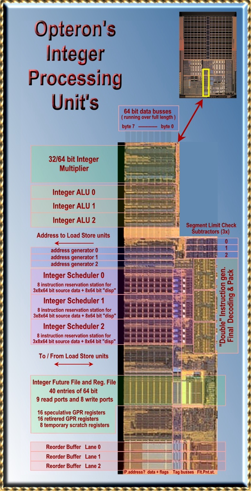

## 1.2 3-wayスーパースカラCISCアーキテクチャ

Opteronは3-wayスーパースカラプロセッサである。
このプロセッサは1サイクルあたり3つのx86命令をデコード、実行、リタイアすることができる。
これらの実行される命令は非常に複雑な命令(CISC)であり、複数(2以上)のソースオペランドを持っている。
Pentium 4はサイクルあたり3つのuOpsと呼ばれる操作を実行することができる。
単一のx86命令を実行するためには、複数のuOpsを実行する必要がある。
私達の調査により、Prescottではサイクルあたり最大で4つのuOpsを実行することができることが分かっている。

一般的に、x86命令は F(reg, reg)、F(reg, mem)、F(mem, reg)として表現される。
最初のオペランドは、ソースと出力の両方を取ることができる。
最初の2つの形式は整数命令、MMX、SSE(2)において標準的な形式である。
最後の形式は基本的に整数命令において見られる。
1つのソースオペランドがメモリから読み込まれ、結果は同じ領域に書き戻される。
整数パイプラインは、浮動小数点命令とマルチメディア命令を含む、全ての処理においてロードとストア処理を実行するのに利用される。

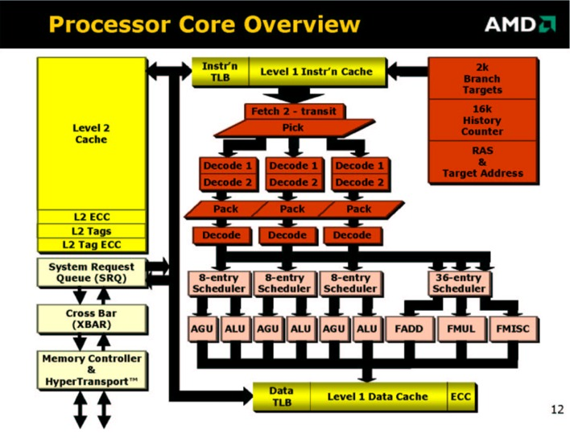

## 1.3 命令の3種の階層: ダブルディスパッチ操作

オリジナルのAthlon(Athlon 32とも呼ばれている)は命令をDirectPathとVectorPathに分類していた。
最初のクラスの命令は、複雑度の低い命令で、ハードウェアで単一の操作で実行できるような命令である。
より複雑な命令(VectorPath)では複数のマイクロシーケンサが起動され、マイクロコードプログラムが実行される。
命令はマイクロコードROMから読み込まれ、3-wayパイプラインに挿入される。

Opteronは3番目の命令クラスを導入した。
Double Dispatch命令、もしくは単に"Doubles"と呼ばれる。
Doublesはデコーディングパイプラインの最後の段で生成される。
DirectPathもしくはMicroCodeシーケンサにより生成された直後の命令は、2つの独立した命令に分割される。
従って3-wayパイプラインは、1サイクルあたり6つの命令を生成することになる。
これらの命令はPACKステージにより「再パッキング」され、3つの命令に戻される。
この追加されたパイプラインステージは、投機実行のために追加されたものであり、Opteronが2001年にMicro Processor Forumで紹介されたときからのものである。
6つの対照的な形をした"doubling stage"は、上記のダイ写真からもはっきりと確認できる。

## 1.4 128bit SSE(2)命令はDoublesに分解される

Opteronの最適化ガイドでは、全ての命令のどのクラスに分類されるかが記述されている。
ほとんどの128bitのSSE、SSE2命令はDouble Dispatch命令として実装されている。
独立した64bitの命令に分割することのできない命令のみ、VectorPath(マイクロコード)命令として処理される。
これらのSSE2命令で、128bitレジスタの半分しか使わない命令はSingle(Direct Path)命令として実装される。

Double Dispatch命令には、性能面においてトレードオフが存在する。
欠点は、128bit SSE2命令のデコード率がサイクルあたり1.5に制限される点である。
しかし一般的には、最大スループットは128bitSSE Single命令においてFPユニットとリタイアのハードウェアに制限されるため、デコード率により性能の制約になることはない。
より重要なのはサイクルレイテンシが余分に必要な問題であり、Pentium4スタイルの実装により生じるレイテンシの問題を避けることができる。

## 1.5 128bit SSE(2)命令にDoubleを使うことで25%のレイテンシペナルティ削減

Pentium 4では、SSE2命令は浮動小数点ユニットの後ろのステージで分割される。
浮動小数点ユニットは128ビットのソースデータを、最初のステージで受け入れることができる。
このデータを2つの操作に分割し、2つの結果をつなげて最後に128ビットの1つのデータとする。
この構成により、全体のレイテンシは効率的に1サイクルほど増加する。
例えば、x87のFADDとFMUL命令はそれぞれ5サイクルと7サイクルで実行されるが、128ビットのSSE命令では、それぞれ6サイクルと8サイクル必要である。

Opteronは、Athlon 32と似通っている。
OpteronはFADDとFMUL命令を4サイクルで実行する。
SSE2の命令は同一の4サイクルのレイテンシで実行される。
1サイクルの増加は、25％のレイテンシの増加につながり、重要な性能低下につながるため、
高度にパイプライン化されたFPユニットの動作を考えるならばこの選択は正しい。
そうでないと、パイプライン中に多くのバブルが挿入され、命令効率が低下するからだ。
他の命令の結果を待つ命令は、その命令が終了するのを待たなければならない。
レイテンシは、バンド幅にとって重要な問題なのだ。

次期Pentiumプロセッサ、コードネームPrescottでは、さらに浮動小数乗算器と、浮動小数点加算器を追加することでこの問題を解消しようとしている。
この追加されたFPユニットはシングルポートだが、128ビットの演算ができるものと予想する。
これによりSSE2のレイテンシは元に戻り、加算と乗算は5サイクルと7サイクルで実行できるようになるだろう。
単一スレッドのプログラムでは性能が改善する可能性がある。
さらに、浮動小数点のバンド幅は、ハイパースレッディングの性能により倍増すると予想される。

## 1.6 整数命令とx87命令にも利用されるDoubles

Double Dispatch命令はSSEとSSE2命令でのみ使われるわけではない。
Opteronの最適化ガイドのAppendix Cでは、POPやPUSH、いくつかの整数乗算及びLEAVE命令などのクラシックなx86命令もリストアップされている。
Athlon 32では、すべての命令はマイクロコードとして実行されるため、低速であった。
いくつかのx87命令は、現在はDouble命令として処理されている。
例えば、FP命令のうちでソースオペランドの一つが整数であるため、最初に浮動小数点に変換する必要がある命令である。

## 1.7 128-bitメモリアクセス命令もDoublesとして処理される

SSEとSSE2で利用される128bitメモリアクセスを2つの独立した64ビットアクセスに分割し、整数コアで処理する。
データキャッシュから出力されるロードデータバス上の結果は浮動小数点コアにより取り込まれる。
整数レジスタを32bitから64bitに拡張し、128bitのSSE(2)命令を2つの64bitの結果に分割することは、すべての64bitマイクロアーキテクチャにおいてエレガントな解決法である。

L1データキャッシュにおいて、128bitのロード、ストアを2つの独立した64bitのロード、ストアとして扱うことには、重大な利点がある。
2つの異なるアドレスからの64bitロードし、2つの移動処理により1つの128bitSSE2レジスタに格納するのは、1つの128bitデータをロードすることと同じくらいの速度である。
Appleは4つの32ビットの浮動小数点データを128bitデータタイプとしてロードすことに対する適切な主張を行っている。
非常に鮮明なARGBカラーイメージデータを使う場合などである。
(消費者が使う場合に、)2つの64bit浮動小数点数を1つの128bitのワードに格納するような、実用的な商用アプリケーションは存在しないように思える。
異なる64bitのロードとストアを1サイクルあたりに2つ出せたほうが、コンパイラは関係ない64bitの演算命令を128bitのメモリアクセスの中に挿入することができ、より最適化を図れるようになる。


## 1.8 スケジューリング前のアドレス加算

一つのx86命令において、ソースオペランドにメモリアクセスが必要な場合は

`addres = base + index < scale + displacement + segment`

アドレスを計算するために最大で4つの引数が必要になる(ハードコーディングされた2ビットのscale-fieldは無視する)。
これにより、典型的なx86命令のフォーマットF(reg, mem)では、少なくとも5つの入力オペランドが必要になることが分かる！
そのうち命令自身によって与えられるパラメータはdisplacementである。
他のパラメータ(セグメント)は「準定数(semi-constant)」であり、セグメント化されていない、フラットなメモリ空間で利用される。
現在のコードでは、典型的に0である。

Athlon 32では、3つのAGU(Address Generator Unit)のうち一つが、線形アドレスを計算した後に必要であれば、セグメントをアドレスに加算する。
これには、データキャッシュアクセスが生じ、ロードレイテンシに余分なキャッシュサイクルが必要になる。
Opteronは、異なる実装を行っている。
displacementとsegmentは実際のアドレス計算が行われる前に加算が実行されるのである。

segmentの値はでコード中はdisplacementと同じく定数と考えることができる。
コード・ディスパッチの間に加算が行われ、加算結果は、命令bitの残りの領域(命令の新しいdisplacement field)と共に次のステージに渡される。

segmentの値が変わった場合はいつでも例外が生成される。
例外が発生した場合、命令が生成した結果はキャンセルされ、パイプラインは正しい場所から再スタートされる。

"Decode-Time"アドレス加算器は他のアドレス加算にも同様に使用される。
(64bitモードでは、ほとんどのセグメンテーションが除去される)

例えば、新しい相対アドレスモードにおいて、命令から64bitの命令ポインタ(RIP)と32ビットのdisplacementを加算するのに使用される。
入力パラメータを可能な限り削減することにより、最終的なデコード時の最大入力パラメータが
分かるようになる。入力パラメータのうち3つはレジスタ値であり、4つ目は定数である。

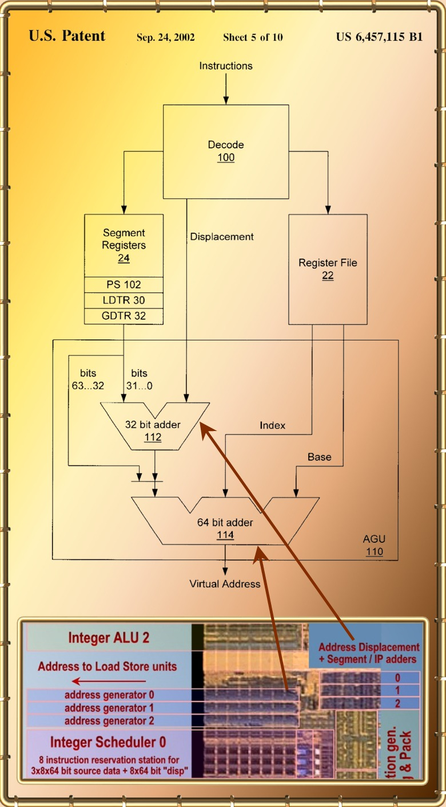

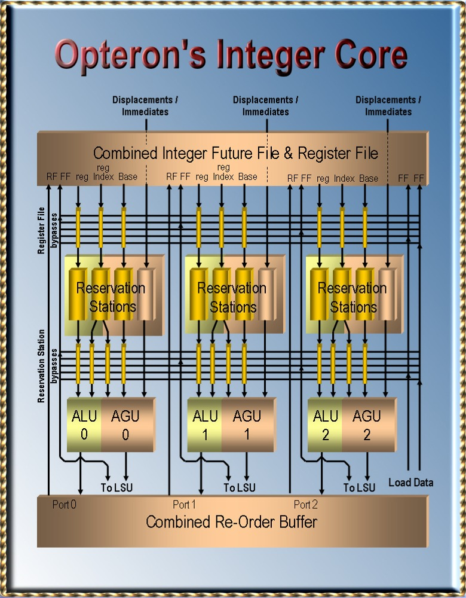

## 1.9 レジスタリネーミングとアウトオブオーダ処理

Athlon(とOpteron)は、レジスタリネーミングとアウトオブオーダ処理を処理するために賢い処理を追加しており、25%の整数パイプラインを削減している。
これにより、キャッシュミスによるミススケジューリングを処理するための特殊なハードウェアが不要になり、デザインがよりシンプルで高速になる。

レジスタリネーミングは「負の依存関係」を除去するために使用させる。
この負の依存関係により、1サイクルあたりの命令数(Instruction Per Cycle: IPC)が制限される。
負の依存関係は、利用できるレジスタ数の制限によるものである。
すぐに利用できる結果を保持しているレジスタは、他の命令が利用したいときはすぐに利用できるようにする必要がある。
この値は上書きされ、使用できなくなる。
上書きをする命令は、過去の命令を利用するすべての命令が実行されるのを待つ必要がある。

これにより命令の実行が制限され、IPCが低下する。
x86のようなレジスタ数の少ないアーキテクチャにおいて、この現象は特に問題である。
以下の例では、レジスタリネーミングがこの問題をどのように解決するかを示している：
レジスタ`rC`は3番目の命令により上書きされるため、3番目の命令は2番目の命令を待つ必要がある。
これが負の依存関係である。
レジスタリネーミングによりアーキテクチャの持つレジスタ数よりも大きな量のレジスタ数を使えるようになる。これにより、`rC`を再利用する必要はなくなる。
他のレジスタを利用すればよいため、今回は`r7`を利用している。
基本的なルールは、「実行中の」すべての命令は異なる書き込みレジスタを保持している、ということである(単一割り当て)。

- リネームしない場合 :   `rC=rA+rB; rF=rC&rD; rC=rA-rB;`
- リネームする場合 : `r3=r1+r2; r6=r3&r4; r7=r1-r2;`

## 1.10 整数レジスタのリネーミング

Opteronは16個の64bitアーキテクチャ整数レジスタを持っている。
複雑なx86命令を処理するために、さらに8つの64bitスクラッチレジスタ持っており、マイクロコードルーチンが使用する即値を格納するために利用している。
このスクラッチレジスタはプログラマから見えることはない。
Athlonファミリのプロセッサはレジスタリネーミングを最も単純な手法で実現している。
この手法は、どのようにして簡単な方法でレジスタリネーミングを実現するかを明らかにするのに、賢明な考えを多く含んでおり、称賛されるべきものである。
これを考え付く人はそうはいないだろう。。。

これまでに述べたように、実行中の各命令は異なる戻り値レジスタを持っている。
リネーミングされたレジスタの合計数はすべての「<span style="color:red">インフライトの命令</span>」の合計と「<span style="color:red">アーキテクチャレジスタ</span>」の合計である。
最大で実行できる命令数は72であり、「リネーミングされたレジスタ」の合計値は96になる。
これらのレジスタを管理するために、2つの異なる構造が使われている。
実行中の命令の結果は72エントリのリオーダバッファ(Re-Order Buffer:ROB)により管理されており、アーキテクチャレジスタは
「整数フューチャーファイルおよびレジスタファイル(Integer フューチャーファイル and Register File: IFFRF)」により管理されている。

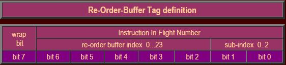

この構成により、非常に単純でレイテンシが0サイクルとなるリネーミング処理を実現できる。
各命令は3つのデコードレーンの1つよりディスパッチされ、「<span style="color:red">リオーダバッファタグ</span>」もしくは「<span style="color:red">インフライト命令タグ</span>」を取得する。

1. sub-index 0,1,2はどのレーンからディスパッチされた命令かを示している。
2. 0..23の値はディスパッチされた命令の「サイクル」を示している。「サイクルカウンタ」は0から23まででラップされている。
3. wrap bit。2つの命令が異なるwrap bitを持っていたならば、サイクルカウンタは2つのディスパッチの間でラップされる。

## 1.11 IFFRF: 整数フューチャーファイルおよびレジスタファイル

レジスタファイルは、16個のアーキテクチャレジスタと8つの一時スクラッチレジスタを管理するために利用されている。
レジスタファイルは2つのエントリを持っており、それぞれ16個のアーキテクチャレジスタを管理するために利用される。
2つのエントリのうち1つは、プログラマから見える実際のレジスタとしてみることができる。
このレジスタは、命令が「リタイア」したときの値を格納している。
命令が完了し、例外及び分岐予測ミスが発生しないことが分かり、その命令よりも前の命令がすべてリタイアしている場合にリタイアされる。
レジスタの値は「非投機的」である。

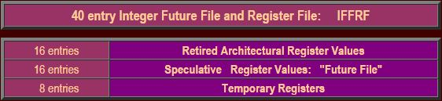

実行中の命令は、その命令がリタイアされるまでその結果はキャンセルされるか破棄される可能性がある。
キャンセルは、その命令より前の命令が例外を発生させたり、分岐予測ミスが発生した場合に起きる。
実行中の命令は基本的に投機的である。
命令の実行結果は、その命令が完了するまでは投機的な結果である。
その結果はリタイアされると初めて非投機的になり、リタイアの論理は、その命令が例外を発生させないことを決定するものである。

## 1.12 IFFRFの"フューチャーファイル"セクション

アーキテクチャレジスタの2つ目のエントリには「未来の」値が格納されている。
これらのレジスタのうち16個はまとめて<span style="color:red">フューチャーファイル(Future File)</span>と呼ばれている。
これらのエントリには、任意の命令により特定のアーキテクチャレジスタの最新の値が格納されている。
フューチャーファイルには、リタイアされた結果も、リタイア前の結果も含まれている。
フューチャーファイルの値はリタイアされていない命令も含んだ投機的なものである。
命令が正しく終了しリタイアすると、その値は非投機的になる。

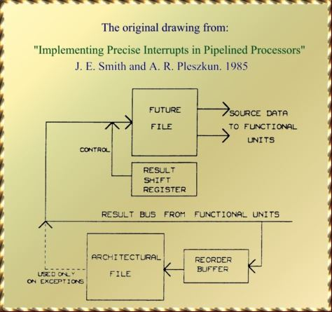

実行中の命令の計算結果が生成されると、その値はすぐにフューチャーファイルに格納される。
しかしフューチャーファイルは特定のレジスタにおいて最新の値でないと受け入れない。
もし後続の命令が前の命令よりも前に結果を生成しフューチャーファイルに書き込んだならば、前の命令が完了してもその値はフューチャーファイルには書き込まれない。
終了した命令は、フューチャーファイルと命令コードのレジスタ番号(0から15のアーキテクチャレジスタ番号)との対応をとる。
結果が上書きされるかどうかは、「リオーダバッファタグ」を利用して決定される。
各フューチャーファイルのエントリは該当するタグに相当する。
ある命令はタグがマッチし、エントリを保持しているならば書き込みを行う。

## 1.13 例外および分岐予測ミス: リタイア値で投機実行結果を上書きする

投機実行結果をキャンセルしたいとき、IFFRF内のフューチャーファイルの値をリタイアした値で書き戻す。

ある命令の前に存在する命令で例外を検出すると、どのような理由であってもすべての投機実行結果はキャンセルされる。
例外にはさまざまな種類があり、メモリアクセスでのページミスであったり、アクセス許可のない領域へのアクセスがあげられる。
0除算も例外の一つとして有名である。
(浮動小数点における演算はこれには該当しない。なぜならば+/-無限大はIEEE浮動小数点の値として完全に定義されているものだからである)。

私たちが「<span style="color:red">投機実行結果</span>」と呼ぶものは、「<span style="color:red">制御フローの投機的実行</span>」と呼ばれるエラーによりキャンセルする必要が生じる可能性があるからである。
制御フローのエラーにより、プログラムは予期した方向とは異なる方向に進んでいく。ここで、

- 分岐予測ミスは基本的に他の例外と同様に処理される、ただし...
- すべての例外は分岐予測ミスと同様に処理される。

例外の発生により、条件分岐のようにプログラムのフローが切り替わる。
従って例外を発生しうるすべての命令は条件分岐フローを持つ命令ということができる。
ただし、例外についてはすべて発生しないという予測のもとで、分岐予測ハードウェアからは無視される。

## 1.14 リオーダバッファ

これまでに、リタイア処理について何度も述べてきた。
リタイア処理はリオーダバッファの支援により実現される。
このユニットは、その名前が示している通り、命令をリオーダリングする。
オリジナルのプログラムのフローに命令の順番を並び替えるのである。
スケジューラはアウトオブオーダで実行する責任を持ち、とある命令のすべてのオペランドが揃っており、実行ユニットが空いていればすぐに命令を発行する。
リオーダバッファは、その命令を再び元の順番に戻す役割を持っている。

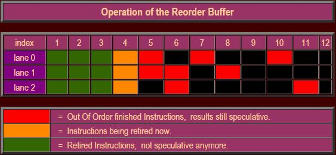

リオーダバッファ自身は、3つのレーンに分かれており、各レーンは24個のエントリを持っている。
このレーンとエントリがリオーダバッファに相当している。
各命令はタグが割り当てられる。
終了した命令は、タグをアドレスとしてその結果をリオーダバッファに書き込む。
そのほかにも、命令実行中に発生したイベントについての情報を書き込み、場合によっては例外を発生させる。
特に、条件分岐命令は、計算した分岐アドレスが、予測したものと同一であったかどうかについて通知する。

リオーダバッファには、命令の更なる情報も登録される。
例えば、命令の種類や、書き込み先のアーキテクチャレジスタアドレス(0..15)など、さらに命令の配置されているアドレス情報などである。
いくつかの情報は、その命令がリオーダバッファタグを受け取る前にはすでに消失されている。

リオーダバッファは、浮動小数点命令、SSE(2)、MMXなどのすべての命令で共有されている。
しかしこれらの命令は演算結果自身をリオーダバッファに書き込んだりはしない。
これらの命令は120エントリの浮動小数点用リネームレジスタに結果を書き込む。
しかしリオーダバッファを使わないわけではなく、命令コードやアドレス、例外フラグ、Ready状態情報、リタイア情報などを記録するために使用される。
すべての命令はリオーダバッファの支援によりリタイア処理が行われる。

## 1.15 リタイア処理と例外処理

上記の画像は、ある命令が、それより前の命令がすべて完了した段階でどのようにリタイアするかを示している。
1サイクルあたり3つの命令が同時にリタイアすることができる。
命令制御ユニット(ICU)がリオーダバッファの3つの命令にアクセスする。
例外フラグが設定されていなければ、その命令はリタイアする。
演算結果はIFFRFのリオーダエントリに書き込まれる。
後者は基本的には書き込みだけの処理である。
これらの値は例外時に利用され、フューチャーファイル上にある投機実行中の値を上書きするために利用される。

ICUは分岐予測ミスを検出すると、新しい命令フェッチアドレスを命令フェッチユニットに転送し、パイプラインを再開する。
分岐命令は再度実行され、新しい分岐先が予測される。
他の例外では例外ルーチンの呼び出しが行われる。
例えばICUはいくつかの関連するデータをIFFRFの一時的なレジスタに書き込み、例外を呼び出すか、マイクロコードを実行する。

## 1.16 例外処理は、リタイア処理まで常に遅延される

ある命令で例外が発生した場合、例外処理はその命令の投機状態が終了するまで開始されない。
例えば、ある領域から外れた場所へのメモリアクセスした場合の例外である。
プログラムはインデックスが領域外になっているかをテストする。
分岐予測ハードウェアは、領域外になっているかを予測するが、その予想は領域内と予想するであろう。
なぜならば、メモリアクセスの大半が領域内だからである。
プロセッサは、したがって領域外へのアクセスを投機的に実行し、残念ながらメモリアクセス例外を起こしてしまう。
例外処理は、当該命令がリタイアするまで遅延されるが、その命令は分岐予測ミスにより例外フラグと一緒に破棄される。

メモリストア処理も同様の理由で、命令がリタイアするまでLSU(Load Store Unit)により保持される。

## 1.17 ベクトルパスとダブルディスパッチ命令のリタイア処理

一つのベクトルパス命令は、複数の命令を生成する。
マイクロシーケンサは、生成した命令を1サイクルに3命令ずつ3-wayパイプラインに挿入する。
デコード中とリタイア処理中は、ダイレクトパス命令と混在されることはない。
実際のリタイア処理は、最後の3命令が終了すると開始される。
リタイアハードウェアは最初の3つのマイクロコードから、最後の3つのマイクロコードまでをスキャンしており、すべての発生しうる例外を蓄積している。
例外が発生しない場合、リタイア処理が開始される。
そうでなければ、適切な例外処理コールが生成される。

Doubleにより生成された命令は、デコード中とリタイア処理中に他の(ダイレクトパス)命令と混在することができる。
Doubleにより2つの命令が生成されるが、これらの命令は同時にリタイアする必要がある。
PUSH命令を想像してほしい。メモリストア処理がリタイアしても、スタックの更新がリタイアしない場合、Doubleにより生成された2つの命令は、リタイア中は同一ライン内の3命令に入っていなければならないという制約が発生する。

## 1.18 アウトオブオーダ処理 : 命令ディスパッチ

ここまでで、アウトオブオーダ実行がどのようにして処理が行われるのかについて詳細に説明する準備が整った。命令ディスパッチステージまで戻ろう。命令ディスパッチとは、命令がスケジューラに送られる操作のことを言い、まだ演算器まで送られているわけではない。演算器まで送られる間に、命令はレジスタファイルにアクセスする。3つの命令は、IFFRFから1サイクルに最大で9つのオペランドにアクセスすることができる。フューチャーファイルエントリにもアクセスが発生する。フューチャーファイルには、16個のアーキテクチャレジスタについて最新の値が格納されている。3つの命令は、これらのレジスタ値を各々のスケジューラに格納する。

ここで、これらの命令の前に実行された命令が完了しておらず、レジスタの値が最新ではない場合が頻発する。ディスパッチされた命令は変更が発生するであろうレジスタのValidフラグをクリアする。しかしタグは保持している。後続の命令はフューチャーファイルのエントリがValidでないため最新の値がフューチャーファイルに格納されていないことを知るが、必要なデータがどこに存在するか、そのタグ情報は入手することができる。このタグ情報を使用して、リザルトバスから必要なデータを直接ピックアップするのである。レジスタの情報を無効化した命令は、演算が完了するとその結果をフューチャーファイルに書き出す(ただしまだフューチャーファイルの<span style="color:red">権限を保持している</span>場合に限る)。そしてValidフラグを再び有効にする。

タグがマッチすると、そのタグを持っている命令はフューチャーファイルを「<span style="color:red">所有している</span>」と言うことになる。命令がディスパッチされると、書き込みレジスタアドレスに相当するフューチャーファイルのエントリの所有権を獲得するが、同じ書き込みレジスタアドレスを更新する後続の命令がディスパッチされる場合、所有権は後続の命令に移される。所有権を保持している場合のみ、命令はフューチャーファイルにデータを書き込むことができる。後続の命令は、フューチャーファイルから最新のデータを読み込む。もし所有権を持っていない命令が演算を終了しても、フューチャーファイルのエントリは更新されない。そのデータが必要な後続の命令は、既にディスパッチされているはずであり、リザルトバスから直接データを受け取っているはずである。

## 1.19 スケジューラ / リザベーションステーション

同時にディスパッチされる命令は最大で3命令だが、これらの命令はスケジューラ内でリザベーションステーションに割り当てられる。
各スケジューラは8つのリザベーションステーションを持っており、初期のAthlonの5つ、Athlon 32の6つよりも増強されている。
リザベーションステーションは、命令を発行するために必要な残りのすべてのデータを集めるためのユニットである。
リザベーションステーションはバスの流れるデータのタグを監視し、そのタグのデータが必要であれば、当該命令にそのデータを渡す(レジスタファイルバイパス)。

タグは、バスがデータを流れる1サイクル前にバスに現れる。
リザベーションステーションはバスのすべてを監視する必要はない。
タグのサブインデックスにより、3つのALUのうち、どれが結果を生成するかをチェックすることができる。
また、タグによりデータが2つのキャッシュリードポートのどちらから現れるかを知ることができる。
これにより、すべてのタグをチェックする必要なく、タグバスを選択することができる。

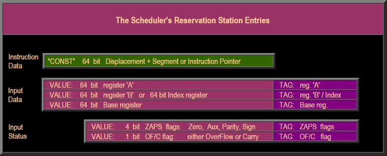

ここまで、私たちはx86の状態フラグのことを考えずに来た。
多くのx86命令はx86の6つの状態フラグのうち1つ以上のもの入力値として利用する。
x86命令例には、フラグを更新する命令とそうでないものが存在する。
また命令によっては複数の、あるいはすべての状態フラグを変更するものもある。
つまり、異なるフラグが異なる命令により生成される可能性があるということである。
幸運なことに、スケジューラの構造を簡単化するために、2つのルールが存在する。

ルール1: 任意のZAPSフラグ(Zero, Aux, Parity, Sign)は、別々に更新されることは無い。
つまり、これらのフラグはリザベーションステーション内で単一の4ビットのエントリとして考えることができる。
ルール2: オーバフローフラグを扱う命令(符号付整数用)はキャリーフラグを使用しない(符号なし整数用)。
これらのフラグも、リザベーションステーション内では単一のビットとして扱うことができる。

## 1.20 各x86命令はALUとAGU操作を起動することができる

あるスケジューラ内リザベーションステーションで待機中のx86命令は、命令1つにつき最大で2つの演算を起動することができる。
1つはその命令に関する整数演算で、これはALUで実行される。もう一つはメモリ操作で、これはAGU(Address Generator Unit)で生成される。
もっとも単純な整数命令のタイプF(reg,reg)ではメモリアクセスは発生しないのでALU演算のみである。
整数命令のF(reg,mem)タイプはメモリロード処理とそれに続いてALU命令が実行される。

整数命令のタイプF(mem,reg)は同様の方法で実装される。ロード処理は、そのままLoad/Store操作である。
Load/Store処理がLSU(Load Store Unit)を保持している。
ALUの演算を待ち合わせており、その結果をメモリにストアする。
浮動小数点演算や、MMX命令のような、メモリアクセスを生じるが非整数演算命令の場合は、AGUの命令を起動するだけである。
浮動小数点/MMX命令自身は浮動小数点ユニット自身で処理される。

各スケジューラは、ALUとAGUを1サイクルで1つずつ起動することができる。
ALU演算はx86命令から来ているが、AGU命令はそれ以外から来るものである。

## 1.21 ALU操作のスケジューリング

ALUでの演算には、通常2つのレジスタオペランドとオプションでいくつかの状態ビットを必要とする。
x86でメモリアクセスが必要な命令は、メモリアクセスの結果がレジスタ'B'に格納されるものとする。
命令はすべての必要な入力オペランド(データおよび状態ビット)が揃うまでリザベーションステーション内で待ち合せる。
スケジューラは全ての8つのリザベーションステーションを監視しており、最も古い命令で実行可能になったものを取り出して起動する。
スケジューラは全てのオペランドと命令情報を関連するALUに転送する。

<div align="center">
    図. ALUの演算で必要な典型的なリザベーションステーションのエントリ
</div>

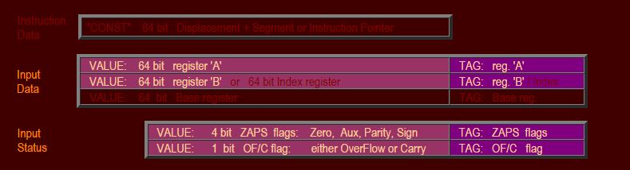

リザベーションステーション自身は、実際には最新のオペランドを受け取る必要はなく、バイパスすることができる。
ALUはオペランド自身の代わりに「バス番号」を受け取り、バスを監視して最新の値を取得する。
ダイ写真を見ると、全ての3つのALUがそれぞれ隣り合わせに配置されており、自分自身のスケジューラからしか演算を受け取らないようになっている。
バイパス構造によりデータを直接交換し、スケジューラに再フォワードする必要性を無くしている。

## 1.22 メモリアクセスのためのAGU操作のスケジューリング

あるx86命令がメモリアドレスの計算のために4つの引数が必要な場合について見ていく(命令にハードコードされた2ビットのスケールフィールドについては無視する)。
この引数には2つのレジスタ値(baseとindex)が含まれている。
命令デコーディングの中に、displacementとsegmentも含まれていることを見た。
Segmentは準定数と考え、その値が変化したときにはリストアすることのできる構造も用意されている。

<div align="center">
    図. AGU操作命令のために必要なリザベーションステーションのエントリ
    (address = base + index << scale + displacement + segment)
</div>

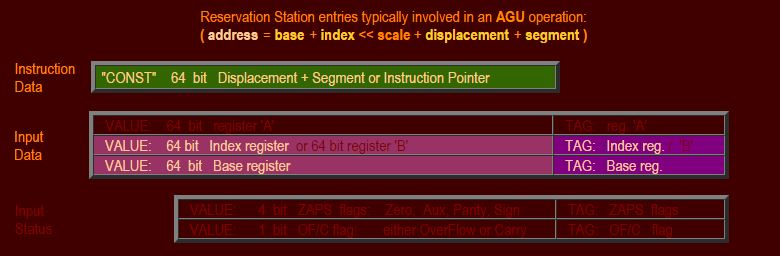

リザベーションステーションは全ての入力オペランドが揃うまで待つ。
スケジューラは全ての8つのリザベーションステーションを監視し、最も古い実行可能になったAGU演算を実行する。
スケジューラは全てのオペランドと、命令情報を関連するAGUに転送する。
リザベーションステーションは同様に、AGUの演算をバイパスすることができる。
AGUはバス番号を取得し、演算結果のオペランドそのものをバスから取得することができる。

## 1.23 Opteronの整数コアのマイクロアーキテクチャの利点

- 非常に高速なスケジュール - 実行のループによりキャッシュのヒット/ミスの投機ハードウェアを削減することができる

Opteron整数コアの最もエレガントな機能の一つに、他のアーキテクチャと比較して極度に高速なスケジュールー実行ループが上げられる。
このループにより、命令は1サイクルでスケジュールと実行をこなすことができ、非常に高周波数で動作することができる。
この効率的な動作により、L1データキャッシュミスの修正に必要な、無駄な論理の必要性を除去することができる。

スケジューラは、結果バスのタグをチェックすることにより、データがL1データキャッシュがら到着する1サイクル前にデータの到着を知ることができる。
これの情報はそのロードデータを使う命令のスケジューリングに利用される。
スケジュールサイクルの最後の方で、ヒット/ミスの信号を受信する。
ミスが発生すると、命令は次のサイクルでスケジューラから除去される。
実行ユニット(ALUとAGU)に発行された命令は、ミスフラグにより無効化される。
他の命令はスケジューラを通常通り通過し、メモリ階層のどこかで待ち合わせているデータを取得することになる。

対照的に、Pentium 4はロードミスが発生すると、全ての依存する命令を再実行するのに、最大7サイクル必要である。
依存しない命令は再実行する必要はない。
大量のDoubleポンプのALUの能力は、全ての再実行される命令を受け取るために利用されている。
Alpha Ev6はロードミスが発生すると、非常に低速な動作周波数の短い7ステージパイプラインを利用しているにも関わらず、2サイクルで全ての命令を「後退」させ、インバリデートする。

後者の2つのアーキテクチャはOpteronでは使用していない、他の投機データのメカニズムを利用している:
投機的ロード/ストアのリオーダリングである。
しかしこれらのメカニズムはOpteronの後続のアーキテクチャでサポートされるであろうし、これらがサポートされるようになれば、スケジュール-実行の極めて短いループの影響で、予測ミスのペナルティも最小化できるであろう。

- スケジューラと実行ユニットの間の巨大なマルチポートのレジスタを避ける

スケジュール-実行の短いループを実現するためのマイクロアーキテクチャとして、古典的な、大きなリネームレジスタファイルを機能的に2つのサブ構造に分割したことが上げられる。
1つは小さくて、低レイテンシなIFFRFである。
これは非常に小さく、アウトオブオーダ実行に必要なものである。
もう一つのサブセットは72エントリのリオーダバッファである。
これは例外や分岐予測ミスに対処するためのインオーダリタイアに必要な機能である。

IFFRFは小さく、レイテンシは1サイクルである。
このレジスタファイルは広いスーパースカラ実行を実現するために、多くの読み出し、書き込みポートを持っている(9読み込み、8書き込み)。
72エントリのリオーダバッファは大きいが、より単純な構造をしている。
リオーダバッファは3つの単純で独立した24エントリのサブアレイに分割されている。
各アレイは基本的に1つの読み込みポートと1つの書き込みポートしか必要ない。
4つ(1+3)により、単一の大きなリネームレジスタよりも単純な構造になり、IFFRFよりも小さくなる。
このような大きなリネームレジスタファイルは、おそらくスケジュール-実行ループを回すのに2サイクルは余分な時間が必要になるであろう。

# 第2章 Opteronの浮動小数点ユニット

- 2.1 浮動小数点のリネームレジスタファイル
- 2.2 浮動小数点リネームステージ1 : x87のスタックから絶対FPレジスタファイルへのマッピング
- 2.3 浮動小数点リネームステージ2 : 通常のレジスタリネーミング
- 2.4 浮動小数点命令スケジューラ
- 2.5 5ポート読み込みと5ポート書き込みの浮動小数点リネームレジスタファイル
- 2.6 浮動小数点演算ユニット
- 2.7 変換と分類ユニット
- 2.8 x87状態処理 : FCOMI/FCMOV と FCOM/FSTSWペア

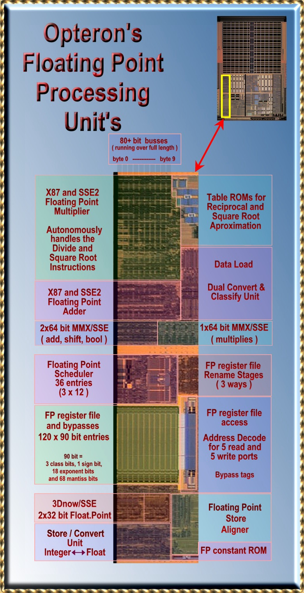

## 2.1 浮動小数点のリネームレジスタファイル

Opteronの浮動小数点リネームレジスタファイルは、88から120エントリに増加している。
このリネームレジスタファイルは言葉通りの意味のレジスタファイルである。
単一のエンティティを持っており、すべてのアーキテクチャ的な(非投機的な)値と、命令セットにより定義されたレジスタの投機的な値を保持している。

Opteronは投機的な命令を72個実行できるようになった。
AthlonXPコアにより、投機的な命令のサポートは72命令から56命令に削減された。
AthlonXPではSSEのための128個のXMMレジスタファイルも含まれているが、88個のリネームレジスタファイルの数が増えることはなかった。

128bitのXMMレジスタはリネームレジスタファイル内の2つのエントリを使用する。
したがってOpteronは16個のXMMアーキテクチャ(リタイアした)レジスタを保持するために32エントリを利用する。
これにより、88+32エントリで120エントリとなる。

120エントリのうち40エントリはアーキテクチャの(非投機的な)レジスタの状態を保持するために使用される。
32エントリは16個のXMMレジスタ用である。残りの8つは8つのx87/MMXレジスタ用である。

さらに8つのレジスタエントリを、マイクロコードのスクラッチレジスタとして使用する。
これはしばしばマイクロアーキテクチャレジスタと呼ばれる。
これらのレジスタは命令セットとしては定義されておらず、プログラマからは直接見ることはできない。
これらのレジスタはマイクロコードが、三角関数や対数関数などの複雑な計算を行うために利用される。

48(40+8)エントリにより定義されるプロセッサのアーキテクチャ状態は「<span style="color:red">アーキテクチャタグアレイ(Architectural Tag Array)</span>」として定義されている。
一方で48個のアーキテクチャレジスタエントリの最新の「<span style="color:red">投機的な</span>」値を保持しているレジスタは「<span style="color:red">フューチャーファイルタグアレイ(Future File Tag Array)</span>」と呼ばれる。

プロセッサの投機的な状態は、分岐予測や例外の発生により解放されることがある。
これはフューチャーファイルの48個エントリをアーキテクチャタグアレイで上書きすることで実現される。

リネームレジスタファイルは90bit幅である。
浮動小数点のデータは全体で90bitまで拡張される(68bitと仮数部、18ビットの指数部、1ビットの符号ビット、3ビットの分類ビットである)。
3つの分類ビットは、浮動小数点数の情報が付加される。
この分類ビットは、非浮動小数点数(整数)など、リネームレジスタファイルに書き込む際に拡張する必要のない値を識別するときなどに利用される。

|      | The 120 registers                  |
| ---- | ---------------------------------- |
|      | 非投機的なレジスタ群               |
| 8    | FP/MMX registers(arch.)            |
| 32   | SSE/SSE2 registers(arch.)          |
| 8    | Micro Code Scratch Registers(arch) |
|      | 投機的なレジスタ群                 |
| 8    | FP/MMX registers(latest)           |
| 32   | SSE/SSE2 registers(lates)          |
| 8    | Micro Code Scratch reg.(latest)    |
| 24   | Renaming speculative               |

|      | 90ビットレジスタ       |
| ---- | ---------------------- |
|      | 90ビットレジスタの内訳 |
| 68   | 仮数部ビット           |
| 18   | 指数部ビット           |
| 1    | 符号部ビット           |
| 3    | 分類コードビット       |

|      | ビットの分類コードの定義        |
| ---- | ------------------------------- |
| 0    | Zero                            |
| 1    | Inifinity                       |
| 2    | Quit NAN (Not A Number)         |
| 3    | Signaling NAN (Not A Number)    |
| 4    | Denormal (very small FP number) |
| 5    | MMX/MMX (non FP contents)       |
| 7    | Unsupported                     |

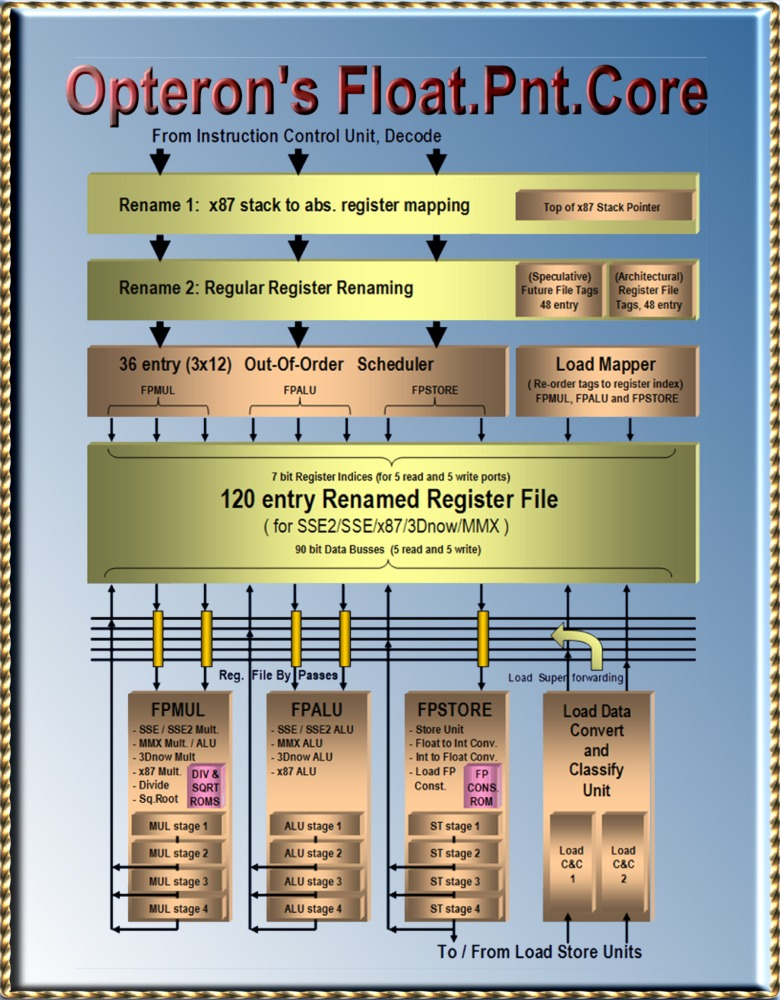

## 2.2 浮動小数点リネームステージ1 : x87のスタックからFPレジスタファイルへの絶対アドレスのマッピング

レガシーなx87命令の「スタック機能」は、浮動小数点パイプラインのステージ1では機能していない。
x87命令は8つの80ビットのアーキテクチャレジスタに対して、3ビットのTop of Stack(TOS)ポインタ経由でアクセスする。
命令セットは、TOSをソースオペランドにも、書き込みオペランドにも利用する。
2番目の引数は、TOSレジスタからの相対値とするか、メモリオペランドとするかを選択できる。
3ビットのTOSポインタは16bitのx87 FP状態レジスタによって管理されている。

x87 TOSレジスタへの相対アクセスは、演算にもとづくx87レジスタの絶対アドレスに変換される。
TOSレジスタの投機的バージョンは、この変換のために利用されている。
3ビットのポインタは、1サイクルあたり最大で3命令分アップデートすることができる。
命令は投機的に実行されるが、まだこのステージではインオーダである。
これらの命令はまだ浮動小数点のアウトオブオーダースケジューラでスケジューリングはされていない。

もし例外や分岐予測ミスが発生すると、投機的なTOSポインタは、非投機的なリタイアしたTOSポインタに書き戻される。
これはリオーダバッファから書き戻されることになる。
リタイアした値はTOSに関連する値が、例外を発生させた命令の一つ前の命令に基づいて生成された値であるという前提の下で構成されている。

## 2.3 浮動小数点リネームステージ2 : 通常のレジスタリネーミング

実際のレジスタリネーミングはこのステージで実行される。
このステージで、書き込み先レジスタが必要な命令は、リネームされたレジスタ割り当てを取得する。
書き込みレジスタは実行中の他のどのような命令とも違っていなければならない。
どの命令も同一のレジスタに書き込むことは無い。
フリーリストからは、最大で3つのレジスタエントリを取得することができる。
全体では120個のレジスタが使用可能である。
フリーリストは、最大で72個のフリーエントリを保持することができ、最大で同時に実行中にすることができる命令の数に等しい。

リネーミングしている48エントリは、アーキテクチャ的な(非投機的な)レジスタの値を保持している:8つのx87/MMXレジスタ、8つのスクラッチレジスタ(マイクロコードでのみアクセス可能)とSSEとSSE２で利用される128bitのXMMレジスタは、それぞれ2エントリ使用する。
これらのレジスタは場所が固定されているわけではないが、120エントリのうちどこかを利用することになる。
これにより、フリーリストが必要になる訳である。
48エントリは、上記に述べたように、48個の「<span style="color:red">アーキテクチャタグアレイ</span>」によって識別するためのアーキテクチャレジスタによって利用される。
アーキテクチャタグアレイは、120個のリネームレジスタから、各アーキテクチャレジスタがどのエントリにマッピングされているかを示すためのアレイである。

1サイクルあたり最大で3命令をリネーミングすることができる。
データ依存は、「<span style="color:red">フューチャーファイルタグアレイ</span>」という他の機構を用いて処理される。
このアレイは、投機的なあた値を保持している48個のリネームレジスタへのポインタを保持している。
命令はリネーミングされたレジスタアクセスを行うために、このアレイにアクセスすることによりソースオペランドを取得することができる。
命令はフューチャータグアレイに、リネームされた情報を配置し、これにより後続の命令はその命令の結果が格納される場所を知ることができる。

例: ある命令がアーキテクチャレジスタの3と5を入力オペランドとして利用し、レジスタ3を書き込み先として使用する。
最初にエントリ3と5を読み、レジスタ3とレジスタ5の投機的な値が格納されているリネームレジスタのポインタを取得する。
このリネームレジスタの場所を93と12であるとする。
この命令は入力オペランドの場所を取得したので、フューチャータグアレイのレジスタ番号3の位置に結果が格納されるリネームレジスタのエントリ番号を書き込む。
これを例えば97とする。
後続の命令で、レジスタエントリ3が必要な命令は、リネームレジスタ97を利用してアクセスすることになる。

例外や分岐予測ミスが発生したときは、フューチャータグアレイの48エントリを、アーキテクチャタグアレイの48エントリで上書きする。
これですべての投機的に実行された命令は破棄される。
アーキテクチャタグアレイのポインタはリタイア処理の論理によって書き込まれる。
リタイア処理は1サイクルあたり3つの値を書き込むことができる。
これらの値はリオーダバッファから供給される。
リオーダバッファはすべての命令が共有している。

浮動小数点命令は、命令が終了したときに例外情報のようないくつかの情報を保持しており、TOSなどが、リオーダバッファに格納する。
この情報には、この命令が変更した書き込み先のレジスタ情報などが含まれている。
リオーダバッファにはアーキテクチャレジスタの番号とリネームレジスタの番号が含まれている。
これらのうち2つが、リタイア処理の際にアーキテクチャタグアレイの更新に利用される。
1つはデータであり、もう一つはアーキテクチャタグアレイのエントリ番号である。

## 2.4 浮動小数点命令スケジューラ

浮動小数点命令のスケジューラは{FPMUL,FPADD, FPMISC}に関連する命令が実行パイプラインにディスパッチされるときに、以下の要因を使用する。

1. 命令のソースレジスタとメモリオペランド
2. どの命令パイプラインに命令が割り当てられるか
3. 命令が完了するクロックサイクルで入手可能になるリザルトバス

3つのパイプラインで、スケジューラの仕事は、準備の整った命令の中で最も古いものをディスパッチすることである。
例えば、現在のサイクルから<span style="color:red">2サイクル後にオペランドが入手可能である。</span>
この場合、命令が実行されるのは<span style="color:red">2サイクル</span>後である。1サイクル後にスケジュールを行い、もう1サイクルで120エントリのリネームレジスタファイルの読み込みを行う。
命令はソースレジスタが入手可能かチェックを行い、スケジューラに配置する。
スケジューラに到達した後もタグバスを監視し続け、すべてのソースデータが入手できるまで待つ。

タグバスは、リザルトバスにデータが載る<span style="color:red">2サイクル前</span>に出力される。
したがってスケジューラは結果のデータが入手できる2サイクル前にタグを入手する。
発行された命令は2サイクルで選択したリザルトバスからリザルトデータを入手する。
実行パイプアインは4ステージの深さである。
2か3サイクルで結果が出力される命令レイテンシの短い、パイプラインから早く出てくる命令も存在するが、最短でも2サイクルを必要とする。

メモリからのロードデータが必要な命令については、データがL1キャッシュもしくはメモリ階層のいずれかから入手されるまで待っている。
スケジューラはデータが到着するまで2サイクル必要であることを知っており、これは整数ロードよりも1サイクル多い。残りの1サイクルは「<span style="color:red">データの変換と分類ユニット</span>」で消費され、浮動小数点の値を変換するのに利用される。

ロードミスが発生しても、ロードデータが必要な命令がスケジューラから消えてしまうのを防がなければならない。スケジューラ内のロード命令は、ロードデータがロードヒットとして帰ってこない限り消えることはない。ロード処理に依存する命令でミスもしくはインバリデートが発生したものはレジスタファイルに書き込まれることはない。

## 2.5 5ポート読み込みと5ポート書き込みの浮動小数点リネームレジスタファイル

リネームレジスタファイルは、命令がスケジューラからアウトオブオーダでディスパッチされた後に、直接アクセスされる。
最大で3命令までが同時にアクセス可能である。
3つの機能ユニットから、1命令ずつである。
FPMULとFPADD命令は3つのソースオペランドをとるが、FPMISC命令は1オペランドである。

浮動小数点ユニットからレジスタファイルに書き戻しをするとの書き込みポートは3つ用意されている。
書き込みアドレス事前に流れており、リザルトデータがその後に到着する。
書き込みアドレスは、書き込みが行われる前に、デコード処理に利用される。
3ユニットは、メモリデータをソースオペランドとして利用することができる。
リオーダバッファはメモリからロードされるデータをタグ付けし、ロードまっぱーによりリネームレジスタのアドレスに変換する。
1サイクルで2つの64bitロードを処理することができる。

新しい120エントリのレジスタは、バイパス論理を両サイドに持っている。
バイパス論理は、ロードデータを後続の依存する命令に渡すために利用される。
したがって、ロードデータがレジスタファイルに書き込まれ、その値を読むための余分なサイクルを削減することができる。

## 2.6 浮動小数点演算ユニット

FPMUL, FPADD, FPMISCレジスタファイルポートには様々な演算ユニットが接続される。
これらのポートが3つの浮動小数点パイプラインのうちどの演算器に接続されるかを決定する。

<span style="color:red">x87とSSE2浮動小数点乗算器</span>は64bitと80bitの拡張されたビット長の演算を処理する。
64bitと80bitの浮動小数点演算と64bitの整数乗算のためのWallace Treeはそれぞれ独立した演算器に分割することができ、SSEと3Dnowのための2つの32ビットSIMD乗算器として利用することができる(US Patent 6,490,607)。
このユニットは浮動小数点除算と平方根も自動的に扱うことができる。
これらの命令はマイクロコードとしては実装されておらず、演算ユニット全体で単一のパスとして実装されている。
このため、このユニットには2つのテーブルが含まれている(US Patent 6,256,653)。
これらのテーブルには逆数と平方根の逆数を計算するためのベースと差分の値が含まれており、除算命令と平方根の命令において最初に利用される。
このユニットはレジスタファイルのFPMULポートに接続されている。

<span style="color:red">x87とSSE浮動小数点加算器</span>は64bitおよび拡張された加算と減算を処理する。
これらの演算器はレジスタファイルのFPADD用ポートに接続されている。

<span style="color:red">3Dnow!とSSE2デュアル32ビット浮動小数点演算ユニット</span>は、AMDの3DNow!で導入された単精度長のSIMD浮動小数点命令とIntelのSSE(後者はAthlon XPでは3DNow! Professionalと呼ばれている)を処理することができる。
このユニットはFPMULポートとFPADDポートに接続されており、1サイクルあたり1グループで64bit(2x32)の命令を実行することができる。
したがって、1サイクルあたり1つのMUL系の演算と1つのADD系の演算を実行することができる。
各演算系の128bit命令では、2サイクルに1命令のスループットを持つ。

<span style="color:red">2x64bitのMMX/SSE ALUユニット</span>は、1サイクルあたりに128bitパックド整数を処理することができる。
このユニットはFPMULとFPADDポートに接続されている。
FPMULポートは命令が乗算系の時だけでなく、加算、減算、論理演算の際にも利用される。
これは、オペランドのサイズを倍増させてレジスタファイルから128bitを読めるようにするという考え方である。
それでも128bitのSSE命令は2つの64bit演算として処理される。
スループットは、FPMULとFPADDパイプラインにより実行されるため、1サイクルあたり1増える。

<span style="color:red">1x64bitのMMX/SSE乗算ユニット</span>はMMXとSSEの整数乗算を処理する。
このユニットはレジスタファイルのFPMULポートに接続されている。
このユニットは1サイクルあたりに単一64bitの乗算か、128bitのSSE命令を2サイクルで処理することができ、スループットは1サイクルあたり64bitである。

<span style="color:red">FPストアユニット</span>、現在では<span style="color:red">FP Miscellaneous Unit</span>はストア命令を処理するだけでなく、現在では整数から浮動小数点、浮動小数点から整数への変換など1オペランド命令に使用されている。
このユニットはマイクロコードによって生成されるx87演算を処理するためのVector Pathで使用される昨日も提供する。
また、このユニットは浮動小数点定数ROMを持っており、piやlog2などの浮動小数点の定数を格納している。

## 2.7 変換と分類ユニット

L1キャッシュもしくはそれより遠い場所のメモリからロードされたデータは、まず「<span style="color:red">変換と分類ユニット</span>」に転送される。
ここでロードデータは必要に応じて内部87bit浮動小数点フォーマット(符号ビット1ビット、指数部18ビット、仮数部68bit)に変換される。
また浮動小数点値は3つのコードに分類される。
87+3=90bit分のデータが、90bitのレジスタファイルに格納されことになる。
分類コードは浮動小数点処理を高速化するために利用される。
例えば、1つのクラスでのみ、数値が仮数部と指数部の86bitを検査する代わりに、ビットが0であることを検査する必要が生じる。

以前浮動小数点スケジューラは、実際の実行ユニットに転送される2サイクル前に実行されることについて述べた。
これは整数スケジューラよりも1サイクル多い。
タグバスをチェックして、2サイクル速く結果が到着することを検知し、リザルトバスにタイミングを合わせる。
タグバスはどのデータがメモリからやってくるか事前に示している。
しかし、メモリアクセスがヒットしたかミスしたかについては後で転送されてくるため、キャッシュミスによりデータエラーになる可能性もある。
少なくとも、変換と分類ユニットは余分なサイクルを追加することによってスケジューラがヒットとミスを考慮する時間を与えている。

SSEとSSE2の最適化についてのマニュアルの付録Eには、SSEレジスタのデータについて分類を行うための最適化ガイドが付属している。
別々のデータ型の演算を組み合わせるような命令は避けるべきである。
リビジョンC はこのような最適化は必要なくなっている。
リビジョンCでは、例外が発生した後にマイクロコードを使用することなく、直接フォーマットの変換を行うことができるようになっている。

## 2.8 x87状態処理 : FCOMI/FCMOV と FCOM/FSTSWペア

AMDは多くのx87のレガシーなオーバヘッドの問題を解決すべく努力し、いくつかの重要かつ解決の難しい問題について、速度改善を達成した。
より具体的には、x87の状態レジスタについてである。
初期のAthlonでは、16bitの浮動小数点状態レジスタを管理するために多くの面積を消費していた。
これらは過去のものになり、Athlon XPではそのいくつかが残っている。

x87における浮動小数点条件テストのプログラムコードは、アウトオブオーダの効力を無効化してしまう。
なぜならば、整数の分岐命令用パイプラインで利用するために浮動小数点状態レジスタのコードをシリアライズして渡すことになるからである。
Opteronはこのシリアル化の処理を回避するための特殊なハードウェアを用意しており、これによりアウトオブオーダ処理を継続することができる。

<div align="center">
    図. 浮動小数点ステータスレジスタ
</div>

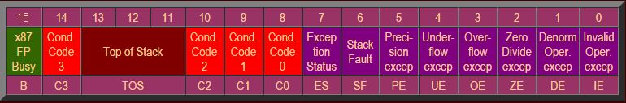

x87の浮動小数点状態レジスタのビットは、それぞれ別の方法によって管理される。
このレジスタはいくつかの意味の異なる内容を含んでいる情報の集まりであり、例えば3ビットのTOSはx87の現在のスタックのトップの場所を示したものである。
最初のリネームステージによってTOSポインタの投機的な値が保持される。
これはTOSの相対的なレジスタアドレスをx87の絶対的なアドレスに変換するために利用される。
すべての終了した命令はリオーダバッファにそのコピーが保持されている。
これらのコピーは、命令がリオーダバッファからリタイアしたときに、非投機的なTOSのポインタとなる。

リタイア処理の論理は分岐ミスや例外の発生を検知することができる。
その場合にはリネームステージに存在しているTOSの投機的なデータを除去し、最新のリタイアしたTOSの値、非投機的な値を上書きする。
投機的なTOSの3ビットの値は命令がアウトオブオーダでスケジューリングされているときのみ利用される。
この値が後で利用される理由は、再びインオーダとなるリタイア処理のためである。
これはつまり、TOSのための特殊なアウトオブオーダハードウェアが必要になり、これは除去される。

浮動小数点命令の実行中は例外が発生する可能性がある。
x87のほとんどの状態レジスタは例外を検出するために利用されるレジスタである。
リオーダ時には、例外はインオーダで処理される。
これはつまり、このレジスタのために特殊なアウトオブオーダハードウェアが必要になり、これは除去される。

CCビット(Condition Code)のためのトリッキーな部分は、これらのビットにはほとんどの時間に例外データが入っているが、ときどき浮動小数点の比較結果などの情報が格納されている。
これらの情報は完全なアウトオブオーダの形式で処理されなければならない。
Opteronは特殊な新しいハードウェアを利用している。
このハードウェアは、特殊な処理が必要な命令の組を検出する。

<div align="center">
    図. x87浮動小数点比較命令実行後のコードビット
</div>

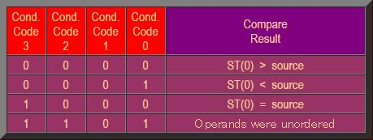

最初の命令の組み合わせは、FCOMIとFCMOVである。
最初の命令は、値を比較し結果に従ってCCビットを設定する。
つぎに比較した結果を整数レジスタに移動する。
FCMOV命令は整数状態レジスタの値に従って浮動小数点レジスタの値を移動する命令である。
OpteronのハードウェアはFCMOVが実際の整数状態フラグの結果を待たなくても良いように、アウトオブオーダのバイパス回路を利用して実行している。

2番目の組み合わせはFCOMとFSTSWのペアである。
最初の命令はFCOMI命令と比較して例外の処理とCCビットを整数レジスタにコピーしない点が異なる。
FSTSW(Floating Point Store Status Word)命令は16bitの浮動小数点状態ビットをAEXレジスタか、メモリに格納し後続の条件分岐処理に活用することのできる命令である。
すべての浮動小数点は、16個の状態フラグの値が決定してから完了する必要があるため、命令はシリアル化される。
Opteronは特殊なハードウェアを持っており、アウトオブオーダの最大処理能力を、シリアル化される欠点を除去することで達成している。
また、同様の機構により(たまに発生する)予測ミスを回復する機能を持っている。

AMDのx87の最適化の結果は、x87命令を処理するときは文字通りPentium 4の周りをぐるぐる回るようなものであった。
特殊で巨大な回路によって、状態処理レジスタの問題は解消されされ、上記の問題を解消するための小さないくつかの新しい回路が設計された。
SSE2浮動小数点への移行が続いていくだろうが、速度向上のためには上記のテクニックで除去した回路面積のオーバヘッドがきっと役に立つことであろう。

# 第3章 Opteronのデータキャッシュとロードストアユニット

- 3.1 データキャッシュ: 64kBのデータ容量、データロードに3サイクルレイテンシ
- 3.2 1サイクルあたり2つの読み込みまたは書き込み発行: 8-wayバンクインターリーブ、2-wayセットアソシアティブ
- 3.3 データキャッシュヒット/ミス検出: キャッシュタグとprimairy TLB
- 3.4 512エントリのセカンドレベルTLB
- 3.5 エラーコードと訂正
- 3.6 ロードストアユニット: LS1とLS2
- 3.7 「プリキャッシュド」ロードストアユニット: LS1
- 3.8 LS2へのロード: キャッシュプローブレスポンス
- 3.9 「ポストキャッシュド」ロードストアユニット: LS2
- 3.10 ロードーストアユニット内での命令リタイアと例外処理
- 3.11 ストアフォワーディングとロードフォワーディング、依存リンクファイル
- 3.12 自己変更コードチェック: L1 DcacheとL1 Icacheの相互排他処理
- 3.13 マルチプロセッサにおけるデッドロックの処理: Exponential back-off
- 3.14 マルチプロセッシングとマルチスレッドにおける改善
- 3.15 アドレススペースナンバ(ASN)とグローバルフラグ
- 3.16 TLBフラッシュフィルタ: CAM
- 3.17 データキャッシュスヌープインタフェース
- 3.18 キャッシュコヒーレンシのためのデータキャッシュ: MOESIプロトコル
- 3.19 キャッシュコヒーレンシのためのデータキャッシュ: スヌープタグRAM
- 3.20 L1データキャッシュのスヌーピングとLS2のアウトスタンディングストア
- 3.21 共有メモリにおける厳密なメモリオーダリングのためのLS2スヌーピング
- 3.22 TLBフラッシュフィルタCAMでのスヌーピング

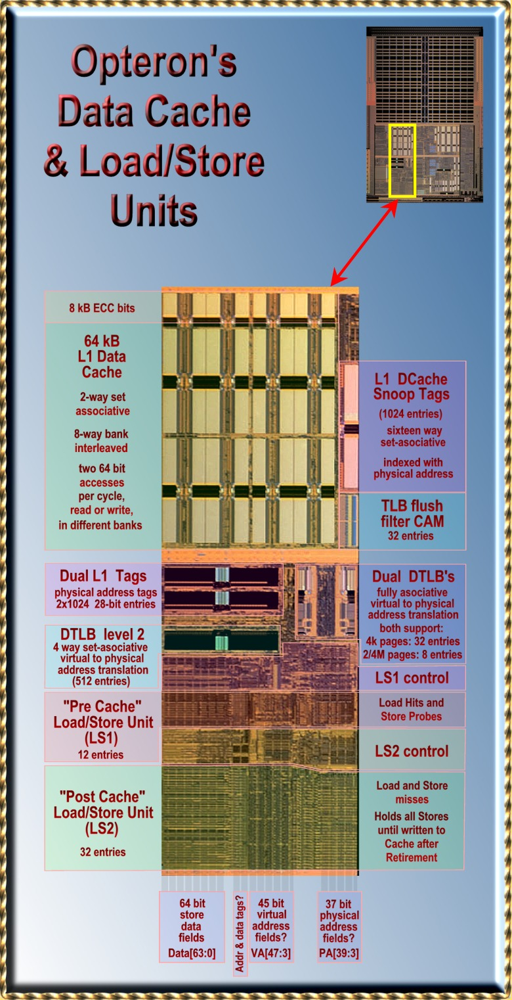

## 3.1 データキャッシュ: 64kBのデータ容量、3サイクルレイテンシのデータロード

Opteronは比較的大きめのL1データキャッシュサイズを持っており、<span style="color:red">ロードユースレイテンシ</span>は3クロックサイクルである。
実際には、キャッシュメモリ自体にアクセスするのには2～3サイクルしか必要ない。
最初のサイクルはx86メモリアドレスを計算するために、3つのAGUのうち一つを利用してアドレス計算が行われる。
AGUにより計算されたアドレスは2サイクル目でメモリアレイに転送され<span style="color:red">デコード</span>される。
これにより2サイクル目の最後にデータが存在する場所の<span style="color:red">ワードライン</span>が検出される。

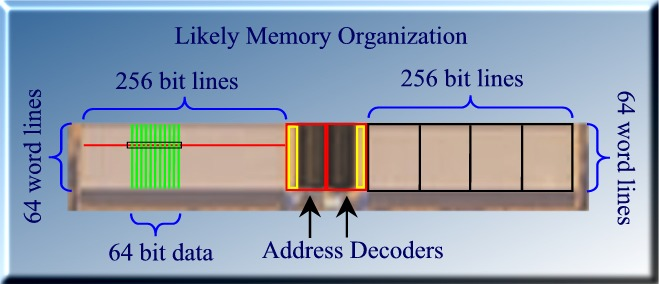

3サイクル目に、正しいワードが有効化される。
メモリアレイ中でメモリアクセスが発生し、整数パイプライン化浮動小数点パイプラインにデータが転送される。
以下は典型的な整数x86命令であるF(reg,mem)におけるタイミングの詳細である。
このタイプの命令は最初にデータをメモリからロードし、そのデータを利用して演算を行う。

命令がスケジューラに対してディスパッチされるときに「プリキャッシュドロードストアユニット(LS1)」に対してもディスパッチされる。
このユニットに命令が挿入されると、LS2と争ってキャッシュアクセスを行う。
LS1中の命令は有効なメモリアドレスが得られるまで待つ必要があるため、AGUのリザルトバスを監視する。
LS1中の命令は、どのAGUがアドレスを供給するかを知っている。
命令は1サイクル前に供給されるリオーダバッファタグをチェックする。
一般的に、LS1中の命令はアドレスをフェッチし、キャッシュがプローブされるのを待つ。

<div align="center">
    図. F(reg, mem)形式のx86命令の典型的なタイミング
</div>
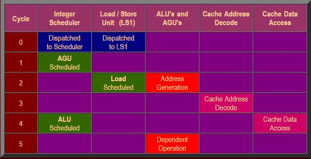

命令は、他の命令がメモリアクセスを待っていない限り、アドレスを計算するとその値をすぐにキャッシュ転送する。
上記の例には、2つのケースが存在する。
どのようなケースにおいても、各命令は以降のアクションに備えてアドレスを保持する。
アドレスはAGUのリザルトバスからデータキャッシュのアドレスデコーダに直接転送される。
データはメモリから1サイクルで返され整数パイプラインに渡される。
LS1はデータキャッシュのリザルトタグバスを、データが到着する1サイクル前にリオーダバッファに置く。
したがって、整数ALUスケジューラはロードデータに依存する任意の命令をスケジューリングできるようになる。

## 3.2 1サイクルあたり2つの読み書き: 8-wayバンクインターリーブ、2-wayセットアソシアティブ

Opteronのキャッシュは64bitのポートを2つもっているため、1サイクルで2つのアクセスを発行できる。
どのような読み込みと書き込みのペアも実行可能だ。
デュアルポートの機構は、バンク機構を利用して実装されている: キャッシュは8つの独立したバンクを持っており、それぞれ単一のポート持っている。
2つのメモリアクセスは異なるバンクであれば同時に処理可能である。

<div align="center">
    図. L1データキャッシュのアクセスに必要な仮想アドレスビット
</div>


64バイトのキャッシュラインは、8つの独立した64bitのバンクに分割される。
2つのアドレスが異なるバンクフィールドを示していれば、異なるバンクに対して発行される。
このバンクフィールドは3ビット目から5ビット目である。
<span style="color:red">データ局所性</span>の原理により、この構成で問題なく動作するようになっている。

64kByteのキャッシュは<span style="color:red">2-wayセットアソシアティブ</span>の構成である。
キャッシュは2つの32kByteのウェイに分割されており、これらは<span style="color:red">仮想アドレスビット[14: 0]</span>により選択される。
<span style="color:red">物理アドレスタグ[39:12]</span>が2つのウェイのうちどちらかにヒットしたかを検出する。
キャッシュラインに付属しているビット[39:12]の領域は物理アドレスの[39:12]と同一である。
仮想アドレスから物理アドレスの変換はTLB(Translation Look aside Buffers)の力を借りて行われる。
2-wayでのポートアクセスおよび2つのタグの比較は変換したアドレスを使って行われる。
各ポートはアドレス変換を行うための個々のTLBを持っている。

メモリ階層においてキャッシュラインの交換時には2つの64bitポートが利用される。
つまり統合L2キャッシュからL1データキャッシュへのメモリバスは128bit幅である。
新しいキャッシュラインが必要な時は、まず最初の4サイクルを利用してキャッシュラインの掃き出しが行われ、さらに4サイクルで新しいキャッシュラインがロードされてくる。

## 3.3 データキャッシュヒット/ミス検出: キャッシュタグとprimairy TLB

L1データキャッシュは、40ビットの物理アドレス空間、つまり17,179,869,184キャッシュラインのうち、1024キャッシュラインを格納するだけの能力を持つ。
キャッシュはアクセスしたい場所が、キャッシュライン中に存在しているかどうかを確認する必要がある。
このために物理アドレスの上位側を保持するための、各キャッシュラインに付属するTagRAMを使う。
2つの同時アクセスを実現するため、TagRAMは同じものを2つ保持している。

TagRAMは仮想アドレスの[14:6]ビットフィールドを用いてアクセスされる。
各TagRAMは2-wayセットアソシアティブキャッシュのうち、ヒットしたwayの番号を返す。
欲しいキャッシュラインはそのどちらかに入っている。
TagRAMは物理アドレスを保持している。
物理アドレスは、全体の分散システムメモリの中でユニークなメモリの場所を指定するのに利用される。

しかしプログラムはキャッシュに対して仮想アドレスを用いてアクセスが発生する。
仮想アドレスはプロセスのコンテキスト内でしか意味を持たない。
つまり、物理アドレスのタグをチェックするためには、「仮想アドレスから物理アドレスへの変換」が必要になる。
この変換は4つのメモリ中に存在する4つのテーブルを探索する処理が必要になる。
仮想アドレスフィールド[47:12]は4つの同じ長さのフィールドに分割され、各フィールドは4つのテーブルのインデックスとなる。
各テーブルは、次のテーブルへのポインタを保持している。
最後のテーブルがページテーブルであり、最終的な変換アドレスを保持している。

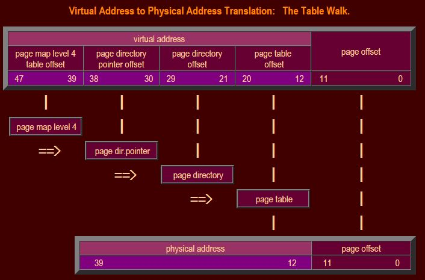

通称テーブルウォークと呼ばれるこの処理は非常に長い時間を必要とする。
したがってOpteronはTranslation Look aside Buffers(TLB)を利用して、最近変換した40個の変換記録を保持している。
このうち32エントリが上記の機構を利用した「4kページ」の変換である。
残りの8つは、「2M/4Mページ」の変換のために利用され、最後のテーブル参照をスキップすることで2MBの大きなページを参照するために利用される。
(4MBページは過去のプロセッサと互換性を持つために利用される)。

仮想アドレス[47:12]はTLBの40エントリのすべてと比較され、これには3クロックサイクル必要である。
2サイクル目の最後には、すべてのエントリのうちどれか一つでマッチしたかどうかが分かる。
各エントリは仮想アドレスに結び付く物理アドレス[39:12]を保持している。
キャッシュヒットしたならば、これらのアドレスを3サイクル目で取得し、物理タグと比較する。

## 3.4 512エントリのセカンドレベルTLB

プライマリTLBの40エントリのうちどのラインにもヒットしなかった場合、レベル‐2 TLBにヒットする可能性がある。このレベル-2 TLBは2つのポートで共有されている。
テーブルには512個のアドレス変換を格納することができる。
この大きなテーブルはプライマリTLBをわずかな時間でアップデートすることができる。
このテーブルは異なる方法で構成されている。
512エントリの4-wayセットアソシアティブである。

これはつまり、4つの変換を128個保持していることと同じである。
仮想アドレスビット[18:12]は128セットのうちどのエントリを参照するかを決定する。
1つのエントリから4つの変換候補を取得することになる。
各変換には仮想アドレスの残りの領域である[47:19]が含まれる。
このアドレスとテーブル中のアドレスを比較して該当する変換が存在するかチェックする。
マッチングしたならば、所望する物理アドレスフィールド[39:12]が得られる。

## 3.5 エラーコードと訂正

L1データキャッシュはECC(Error Coding and Correction)により保護されている。
64bit枚に8ビットの訂正コードが付属しており、1ビットエラーであれば修正することができ、2ビットエラーならば発見することができる。
これには64bitのハミングSED/DED(Single Error Detection/Double Error Detection)の構成を利用している。
エラービットの位置を特定するためには、6ビットのパリティビットが必要である。

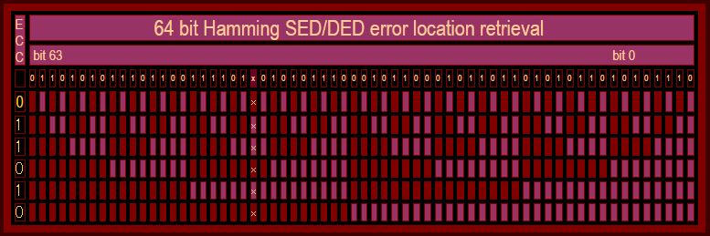

6ビットのパリティビットは上図の左側に示されている。1はエラーが検出されたことを示している。6ビットは32個の紫のビットのパリティを示している。パリティエラーはエラー箇所を示す6ビットのインデックスとなっている。さらに、パリティビットは2ビットエラーの訂正と、パリティビット自身のエラー訂正も行うことができる。

## 3.6 ロードストアユニット: LS1とLS2

ロードストアユニットはデータキャッシュへのアクセスを管理する。
このタイプのユニット内のアウトオブオーダプロセッサにおいて重要な役割を持つようになっている。
この領域は、新しいアーキテクチャになるにつれて、より複雑な機能を持ち、面積も急激に増加していくと予想される。
Opteronのロードストアユニットを調査するのには、もう一つの理由がある。
LS1とLS2ユニットは、しばしばLS1はL1データキャッシュであり、LS2はL2キャッシュであると説明されることが多い。
しかし、これは正確ではないどころか、実際には誤りである。
これらのユニットについてより詳細に見ていく。


## 3.7 「プリキャッシュド」ロードストアユニット: LS1

プリキャッシュドなロードストアユニット(LS1)はAGU(Address Generator Unit)により生成されたアドレスを待つために発行された命令によりアクセスされる。LS1は12エントリを持ち、メモリアクセスは整数スケジューラからディスパッチされるが、LS1のエントリにもディスパッチされる。AGUに所属しているリオーダタグバスは必要なアドレスがAGUバスの次のサイクルで入手可能であることを示すためのものである。

ある命令のアドレスがすでに入手しているのであれば、キャッシュを探索してそのデータを探す。LS1には2つのアクセスポートが存在する。LS1に対する最も古い2つのアクセスから先にキャッシュを検査することが許可される。ロードとストア命令のどちらもキャッシュを調査する。ロードは実際にはロードデータを取得するためにキャッシュにアクセスする。

ストアはアドレスを取得できても、その時点ではLS1に書き込みを起こさない。ストア命令はストアするデータを取得し、その命令がリタイアしてから初めて書き込みを実施する。ストア命令は、ストア命令自身が投機的であり、のちに破棄される可能性を考慮して、まず最初にリタイアする必要がある。例えば、Microsoftがバッファオーバフローの弱点を修正するためにバッファオーバフローのテストをするパッチを当てたとしよう。このテストはオーバフローが発生したときにバッファへの書き込みを防ぐための条件分岐が入っているはずだ。オーバフローは基本的に発生しないので、分岐予測期は分岐しない方向へ常に予測する。これはオーバフローが発生したときにも同じ状況である。バッファへの書き込みは投機的に実行されるのである。

したがって、実際のキャッシュへの書き込みは、ストア命令がリタイアし、分岐予測が正しく、そのストア命令が正しく実行されることが分かってから実行される。しかしこれらの遅延したストア処理は、実際の遅延を発生させない。キャッシュへアクセスする‐ロード命令はLS1とLS2をチェックし、ロードしたいアドレスへの書き込みがペンディングされているかどうかをチェックする。もしペンディングを発見したならば、ロード命令はLS1かLS2から直接データを読み込み、ロードの遅延が発生するのを防ぐ。

LS1へのストアには、実際にはキャッシュのヒット・ミスの検出論理が必要になる。キャッシュラインが存在しないことが分かれば、すぐにL2キャッシュもしくはシステムメモリからデータをロードする。これは、後続のロードが同一のキャッシュラインを要求することが多いことから、重要なチャンスである。ストアはメモリに書き込みたいデータを受信し、LS1はデータが到着するまで待つ。そうでなければ、LS2に移動しデータを受信する。

## 3.8 LS2へのロード: キャッシュプローブレスポンス

LS1内でキャッシュのチェックをしたすべてのアクセスは、ポストキャッシュロードストアユニット(Post-Cache Load/Store Unit(LS2))に移動する。

すべてのメモリアクセスは、ロード、ストア、ロードストア(最初にロードし、同じ場所に結果をストアする)のいずれかである。LS1から到着したすべてのアクセスは、まずキャッシュチェックの結果を待つ。これはヒットかミスのどちらかである。キャッシュのパリティエラーが発生する可能性もある。次にTLBにより仮想アドレスから返還した物理アドレスが得られる。物理アドレスには、ページをキャッシング可能かどうかを示すページの属性の情報も付加されてくる。

キャッシュミスが発生すると、命令は次のサイクルでMABタグ(Missed Address Buffer Tag)と呼ばれるタグを受け取る。このタグは後にL2もしくはシステムメモリからミスしたキャッシュラインが到着したときに利用される。MABタグは一般的に使用されるリオーダバッファタグの代わりに利用される。複数のロードとストアが同一のキャッシュラインに依存していると、同一のMABタグとなる。すべてのこのようなアクセスはミス判定となり、同一のMABタグを受け取ることになる。

バスインタフェースユニット(Bus Interface Unit: BUI)はL2キャッシュもしくはシステムメモリからミスしたキャッシュラインをロードし、データキャッシュを埋める。この時、FillタグというタグがLS2から渡される。Fillタグはすべてのミス判定されたメモリアクセスのMABタグと比較される。FillタグとマッチしたMABタグは、ミス判定からヒット判定へと変更される。

## 3.9 「ポストキャッシュド」ロードストアユニット: LS2

LS2はいわゆる「ポストキャッシュロードストアユニット」と呼ばれ、32エントリを持っている。
このユニットはシフトレジスタで構成され、最古のアウトスタンディングアクセスはエントリ0に到達して消去される。各32エントリはいくつかのフィールドを持っている。これらのフィールドの多くは、特定の条件にマッチするかをチェックするための比較器と他の論理が付属している。すべてのアクセスはリタイアするまでLS2に滞在する。キャッシュミスが発生した場合にはそのアクセスはLS2上でキャッシュラインがメモリ階層から到着するの待つ。LS2で待っているすべてのストアアクセスは、リタイア処理を待っており、リタイアが完了するとメモリに書き込みを行う。

<div align="center">
    図. LS2バッファエントリのフィールド一覧
</div>
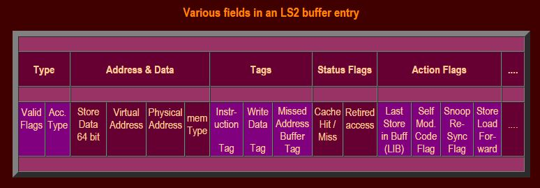

LS2上のストア命令がリタイアすると、ヒット・ミスフラグがヒットにセットされ、LS1のストアの調査と「同時」にキャッシュポートが使用される。
LS2のリタイアしたストア処理はデータキャッシュ自身に書き込まれるが、ヒット・ミス論理は使用しない。
LS1からのストアの調査ではヒット・ミス論理を使用するだけだがデータキャッシュ自身にはアクセスしない。
この共用により重要な性能向上が達成できる。こうしなければ、1つのストアによりキャッシュのポートを2つ使用することになるからである。
一つ目はLS1によるチェックであり、2つ目はLS2によるリタイア後の書き込みである。
これによりL1データキャッシュのバンド幅が半分に抑えられてしまう。

## 3.10 ロードーストアユニット内での命令リタイアと例外処理

すべてのメモリアクセス命令、ロードとストア命令は、その命令がリタイアするまでLS2に滞在する。
ロード命令はリタイアすると、新しい命令のためにすぐにLS2から除去される。
ストア命令はデータがメモリに書き込まれるまで滞在しておく必要がある。
ストア命令はその命令が例外を発生しないか、分岐予測ミスが発生しないことが分かるまではリタイアしない。
メモリにデータがコミットされたのちに、ストア命令はLS2から除去される。

LS2はリオーダバッファとのリタイア処理用のインタフェースを持っている。
リオーダバッファはLS2からリタイアされる命令のタグを含むラインを保持している。
ライン中に存在する3つの命令のうちタグは一つしか必要ない。
なぜならば、タグはレーン0,1,2を識別するサブインデックス以外は同一のタグを利用してるからである。
LS2は全てのリタイア用タグと、命令タグを比較し一致したものに対して<span style="color:red">リタイアフラグ</span>を立てる。
リタイアしたロード命令はすぐさまLS2から削除される。

リオーダバッファ中のリタイア処理回路が分岐予測ミスもしくは例外を検出すると、
該当するリタイアタグを持つ命令と、後続の命令がLS2から除去される。
この時にLS2の中で除去されないのは、データがメモリにコミットされるのを待っている命令のみである。

## 3.11 ストアフォワーディングとロードフォワーディング、依存リンクファイル

データキャッシュ中のロードプロービングでは、ロードストアユニットも調査を行い、アウトスタンディングストアバッファ中に同一アドレスのストアが存在していないかをチェックする。
そのようなストア処理を発見した場合には(さらに、プログラムの順序としてストアよりもロードの方が後であれば)、ここでは2つの可能性がある。
もしストア処理の書き込みデータがリザルトバスからすでに入手されて入れば、ロードに直接フォワーディングすることができる。
一方で、ストア処理が書き込みデータをリザルトバスから取得していなければ、ロードミスとなりLS2に移動する。

<span style="color:red">依存関係リンクファイル</span>と呼ばれるユニットにエントリが作成される。
このユニットは書き込みデータのタグ(次のサイクルで書き込まれるストアデータのタグと、次のロード命令の次にロードした値を使用するタグ)を格納する。
依存関係リンクファイルは書き込みデータのタグを監視し続け、そのタグを発見するとキャッシュロードタグバスにロード命令のタグを流す。

これは実際のデータが1サイクルでロードされることに等しい。
下記の例では、命令1のリザルトデータは、それを消費する命令４に直接転送されることになる。
この場合、ストア命令とロード命令はバイパスされる。

```
1)   F( regA,regD );      // レジスタAはレジスタAとレジスタDの関数である。
2)   store ( mem, regA ); // レジスタAの値をメモリにストアする。
3)   load  ( regB, mem ); // 同じメモリアドレスからレジスタBにデータをロードする。
4)   F( regD, regB );     // レジスタBとレジスタDを、新しいレジスタDの計算に使用する。
```

ストアとロードのミスマッチ：ロードデータの一部のみ変更するストアはサポートされない。
ロードはストアがリタイアし、メモリにストアされるまで待たなければならない。
ロード命令はその後キャッシュにアクセスし、ストアデータとキャッシュのオリジナルデータが組み合わされた、実際のデータをロードする。
これは深刻な性能ペナルティを発生させるため、最適化マニュアルでは、すべての可能性のあるミスマッチのケースを説明している。

同一アドレスへの複数のストア処理は一般的にはLIBフラグ(Last In Buffer)として処理される。
このフラグは特定のアドレスに対する最も最近のストアを識別する。
同一のワードに対する複数の部分的なストアによる、ワードの一部分を更新する処理はLIBではサポートされない。
これははロードストアバッファとマージされる。
これらはキャッシュ中で、すべてのストア処理がリタイアされ、書き込まれた後にマージされる。

## 3.12 自己変更コードチェック: L1データキャッシュとL1 命令キャッシュの相互排他処理

自己書き換えコード(Self Modifying Code: SMC)チェックは、実際の書き込みが発生する前にチェックしなければならない。
もしストア処理は命令キャッシュ中のデータを書き換えない、もしくは後続の実行中の任意のステージに存在しているインフライトの命令に該当する部分を書き換えないことをチェックしなければならない。
このときに、L1データキャッシュとL1命令キャッシュを<span style="color:red">排他的に</span>存在させるというのは重要な簡単化の方法である。
キャッシュラインはL1のどちらかにのみ存在する。
キャッシュラインがL1データキャッシュに読み込まれたときには、L1データキャッシュから同じキャッシュラインは除去される。

この方法の1つ目の利点は、命令キャッシュがSMCのテストをする必要がなくなることである。
2番目の利点は、SMCのチェックがデータキャッシュミス時にのみ限定される。
アンキャッシュなメモリ領域へのストア処理のみSMCを考慮することになる(これらは常にミスとなる)。
ストアの書き込みアドレスはLS2から転送され、命令キャッシュの近くに存在するSMCテストユニットへ送られる。
このユニットはインフライト中のすべての命令のキャッシュラインのアドレスを保持している。
もし衝突が発生すると、ストア処理に衝突が発生するマークが付けられる。
このストア命令がリタイアすると、リオーダバッファ中のすべての後続の命令を破棄する。

## 3.13 マルチプロセッサにおけるデッドロックの処理: Exponential back-off

複数のプロセッサが同一のキャッシュラインを取得しようとしている場合、デッドロックが発生する可能性がある。
例えば、2つのプロセッサが同一のラインに書き込んだとする。
キャッシュラインは通常キャッシュミスが発生するとすぐにロードされる。
するとストア処理の場合にどちらかのプロセッサのキャッシュラインが無効化される。
2つのプロセッサは、ストアが完了する前に互いのキャッシュライン無効化しようとし続けると、デッドロックが発生する。

2つのプロセッサが、アンアラインなアドレスに向けてストアしようとする。
つまりストアするデータの一部がキャッシュラインA1に書き込まれ、別の一部分がキャッシュラインA2に書き込まれたとする。
アンアラインなストアは、一般的にハードウェアにより2つのストアに分割される。
<span style="color:red">Exponential Back-off</span>の機構によりこのようなデッドロックの状態を解決することができる。
<span style="color:red">Back-off</span>時間はメモリアクセスに失敗し、再度キャッシュラインを再取得するまでの時間である。
この時間が、1つのプロセッサが最終的に成功するまで<span style="color:red">指数関数的</span>に増加するという構造である。

## 3.14 マルチプロセッシングとマルチスレッドにおける改善

Opteronマイクロアーキテクチャはマルチプロセッシングとマルチスレッディングについて、非常に多くの改善がなされている。
これらの改善は、デスクトップマーケットにおいて非常に重要である。
オンチップマルチプロセッサのソリューションはハイパースレッディングにおいて角を曲がったところであり、近い将来IntelのPrescottにより本格的に重要なものになるであろう。

マルチプロセッシング及びマルチスレッドアプリケーションは、効率的に性能を向上できる。
コンテキストスイッチングなどプロセスとスレッドの最初と最後に切り替えるように、プロセス間通信とスレッド間通信は伝統的に大きなオーバヘッドであった。
これらのオーバヘッドを最小化することで、大きな性能向上が図られている。

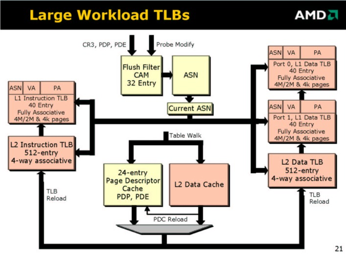

## 3.15 アドレススペースナンバ(ASN)とグローバルフラグ

異なるプロセスには異なるコンテキストが存在する。
つまり、プロセスごとに仮想アドレスから物理アドレスへの変換方法は異なる。
プロセスのスイッチは、Translation Look Aside Bufferの無効化(フラッシュ)が発生する。
大きなTLBの場合、頻繁にTLBのフラッシュが発生すると性能の低下の要因となる。
OpteronはTLBのフラッシュを防ぐための新しいメカニズムを導入している。
これは<span style="color:red">Address Space Number(ASN)</span>レジスタを、Enableビットに追加する(ASNE)ことである。

Address Space Numberはプロセスをユニークに識別するために利用される。
TLBの各エントリには、プロセスのASNが含まれる。
メモリアクセスのアドレスが仮想アドレスに一致し<span style="color:red">かつ</span>TLB中のASNがTLB中のASNレジスタにマッチするとアドレス変換は成功する。
ASNフィールドは仮想アドレスの「拡張」領域としてみることができる。
これにより、異なるプロセスの異なる変換を、1つのTLBでエコなうことができ、コンテキストスイッチのたびにTLBをフラッシュする必要性を排除することができる。

オペレーティングシステムに関連する、データとコードの<span style="color:red">Global Flag</span>はプリフェッチ的にアクセス可能である。
グローバル変換はASNフィールドがマッチする必要はない。
これはいかなるプロセスでもTLBのエントリを共有することができるグローバルデータであることを意味する。
ASNとグローバルフラグの他の利点は、TLBの無効化が必要な時に、フラッシュするエントリを減らすことができることである。
特定のASNもしくはグローバルビットがセットされているエントリのみフラッシュすればよい。

## 3.16 TLBフラッシュフィルタ: CAM

TLBは、メモリ中のアドレス変換ラベルを格納したアドレス変換情報用のキャッシュと考えることができる。
実際の変換には、メインメモリ中をいくつか渡り歩き、いくつかのレベルの変換が必要になる。
これを一般的に「テーブルウォーク」と呼ぶ。
単一のTLBエントリのために、数百サイクルかけてテーブルウォークするのは非常に時間を消費する。
Opteronは24エントリのPage Descriptor Cacheを用いることにより、テーブルウォークを高速化する試みを行っている。

それでも、マルチタスク、マルチスレッド環境でのテーブルウォークを避けることは相変わらず重要になる。
いくつかのタスクにより、TLBのエントリが書き換えられてテーブルウォークの情報がメモリ中に存在していない場合に、テーブルウォークは必要になる。

今までのところ、TLBを保証するための方法は1つしか存在しない:TLB中でエントリがメモリ中に存在するエントリと同一で無くなったならば、TLBをフラッシュする。
x86アーキテクチャで定義される多くの動作によって、しばしば不要なTLBのフラッシュが自動的に実行される。
Opteronの新しい機能として、多くのイベント時においてTLBフラッシュフィルタを避けることができる。

TLBフラッシュフィルタは32エントリのContent Addressable Memroy(CAM)で実装される。
各エントリは、TLBがロードされたときのメモリ中の領域アドレスを保持している。
したがってこれらの領域はPage Translation Tablesに保持されている。
フィルタはすべてのメモリアクセスを監視しており、任意の同一領域へのアクセスを監視している。
もし同一領域へのアクセスが発生していなければ、コヒーレントを保証するためにTLB当該エントリをフラッシュする。

## 3.17 データキャッシュスヌープインタフェース

スヌープインタフェースは非常に多くの目的で利用される。
この機能はマルチプロセッサシステムにおけるキャッシュコヒーレンシを管理するために利用される。
また、共有メモリにおいて厳密なメモリオーダリングを保護する目的や、Self Modifying Code検出、TLBコヒーレンシなどの目的で利用される。
スヌープインタフェースは、命令キャッシュの代わりにデータのための多くのメモリやバッファを監視するための発行されたメモリアクセスと同様に、他のプロセッサアクセスのためにも物理アドレスを使用する。

## 3.18 キャッシュコヒーレンシのためのデータキャッシュ: MOESIプロトコル

Opteronはシステム中で8プロセッサのキャッシュコヒーレントを制御することができる。
この制御のために<span style="color:red">MOESI</span>と呼ばれるプロトコルを使用している。
スヌープインタフェースはこのプロトコルの目的を達成するための中心的な役割を演ずるものである。

キャッシュラインが(8つのプロセッサに接続されている)システムメモリから読み込まれたとき、すべてのプロセッサからリード操作が監視されている。
スヌープアクセスは64バイトのキャッシュラインをリードしないので、通常のメモリアクセスよりもずっと小さい。
多くのスヌープ機能は、分散メモリシステムのスループットに負荷をかけずに使用することができる。
スヌープが、他のプロセッサのキャッシュラインに存在するメモリ領域へのアクセスを検出する。

プロセッサが、自分の持っているキャッシュラインを他のプロセッサがロードしたことを検出しなければ、そのキャッシュラインは<span style="color:red">排他(Exclusive)</span>状態としてマークされる。
現在、このキャッシュラインに何かしらの値を書き込むと、そのキャッシュラインは<span style="color:red">変更済み(Modified)</span>のマークが設定される。
一般的に、変更されたキャッシュラインはすぐさまメモリに書き戻されるわけではない。
メモリページ属性に特殊な情報が保持されている場合(ライトスルーなど)は、書き戻しを行う。
キャッシュラインは、同一キャッシュライン上に他のキャッシュラインがロードされて来た時に撤去される。

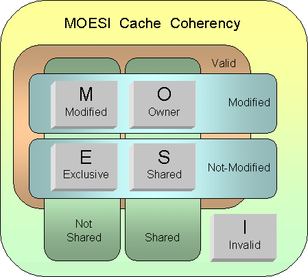

もしプロセッサがメモリからデータをロードする必要があり、他のキャッシュラインにそのデータが載っていたことを検知すると、そのキャッシュラインは<span style="color:red">共有(Shared)</span>状態となる。
もしキャッシュラインが、他のプロセッサのキャッシュにおいて<span style="color:red">変更済み(Modified)</span>状態となっているラインをロードしたとすると、当該データはメモリからロードするのではなく、そのラインを保持しているプロセッサから直接ロードされる。
キャッシュからキャッシュへのデータ転送は、通常メモリアクセスよりも高速である。

この場合、受け渡し元のキャッシュラインが<span style="color:red">変更済み(Modified)</span>から<span style="color:red">所有者(Owned)</span>に変更となる。
キャッシュラインはまだメモリには書き戻さない。任意の(3番目)のプロセッサがメモリから、<span style="color:red">共有(Shared)</span>状態と<span style="color:red">所有者(Owned)</span>状態になっているメモリ領域をロードすると、メモリから直接読むのではなく、<span style="color:red">所有者(Owned)</span>となっているキャッシュラインから直接データを読み込む。所有者となっているキャッシュラインは最新のデータを保持しており、システムメモリに最終的に書き戻す責任を持っている。

キャッシュラインは、任意のプロセッサがキャッシュラインに再度書き戻しをするまではキャッシュ中に存在する。
もし任意のプロセッサが当該キャッシュラインに書き込みを行い、それを他のプロセッサに通知する必要がある場合、
当該プロセッサは他のプロセッサに対して「Invalidate Probe」を通知する。
キャッシュライン中のデータの状態は<span style="color:red">変更済み(Modified)</span>から<span style="color:red">無効(Invalidate)</span>へと変更される。
キャッシュラインは共有状態ではなくなっているため、もし同じキャッシュラインへの書き込みがさらに続いてもInvalidate Probeは通知されない。
当該キャッシュラインをシステムメモリに書き戻すことは当該プロセッサの責任となる。

## 3.19 キャッシュコヒーレンシのためのデータキャッシュ: スヌープタグRAM

システムメモリにアクセスする他のプロセッサは、データキャシュを制御するためにMOESIプロトコルを利用してバスをスヌープする必要がある。
ここで、スヌープには2種類あることを見てきた。
ReadスヌープとInvalidateスヌープである。
スヌープの基本的タスクは、データキャッシュ中に当該キャッシュラインが入っているかどうかを判定することである。
ここでは、スヌープインタフェースのための3つ目のTagRAMが存在する。
(他の2つは、通常のデータキャッシュのアクセスのために利用される。)
スヌープ用のTagRAMは1024エントリを持っており、1エントリが1キャッシュラインに相当する。
このRAMは各キャッシュラインの物理アドレスの[39:12]ビットを保持している。

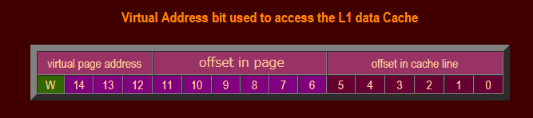

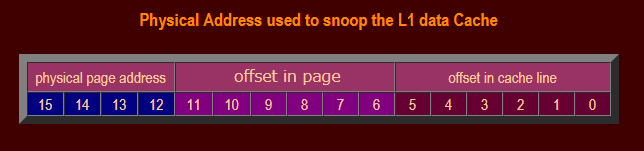

通常のTagRAMは仮想アドレスを通じてアクセスされる。
しかしスヌープTagRAMは物理アドレスを処理しなければならない！
幸運なことに、多くの仮想アドレスビットは物理アドレスビットと同一である。
仮想アドレスと物理アドレスで[15:12]ビットのみが異っており、従ってそこは使えない。
これはつまり、16個の可能性のある全てのキャッシュラインを並列に読み込み、いずれかが該当するかどうかをテストする必要がある。
幸運なことに、これはさほど大きな負荷とはならない。
キャッシュの全体のバス幅(ビット線)は512ビットである。
16個分の28ビットTagは少ないほう(448)であり、従って、各キャッシュラインのための状態情報を格納するための多少の領域が残される。

16個のヒットする可能性のあるキャッシュラインのうち、ヒットしたことが分かれば、残りの仮想アドレスビットはキャッシュとそのウェイ(0 or 1)にアクセスすることで仮想アドレスを入手することができる。
その場所(16個のうちの1つ)は、残りの3つのアドレスビット+ウェイビットを提供する。
これによりキャッシュがRead Snoopヒットの際にキャッシュアクセスできるようになる。

## 3.20 L1データキャッシュのスヌーピングとLS2のアウトスタンディングストア

L1データキャッシュから読み込みを行い、それをLS2でリアイアしたストアのためにチェックし、キャッシュラインに書き込むアクセスは、他のプロセッサのスヌープ読み込みをする必要はない。
このようなストアを発生させる書き込みが、既に書き込みを発生させるプロセッサのメモリの一部であると考えたとしてもである。
他のプロセッサにとってみれば、このような書き込みが後続のステージで発生しても問題ない。
外部に対する唯一の影響は、当該プロセッサがわずかに遅く動作しているように見えるだけである。

外部のプロセッサが共有キャッシュラインに対して書き込みを行う場合には、周囲に対してInvalidateを発行する必要がある。
このようなスヌープInvalidateシグナルを受信するとスヌープインタフェースはキャッシュラインをチェックし、ヒットしたキャッシュラインをInvalidateする。
スヌープインタフェースは、ヒットしたキャッシュラインへ書き込みを行いたいLoad Store Unitのために、全てのストア処理のためにHit/Missフラグを設定する。
しかし後者はスヌープ操作のためではない。
キャッシュラインが除去されるか、Invalidateされたときには常に必要なものである。
これらのストア処理は、最初にヒットしたのだが、ミスに設定し直されており、再度キャッシュセットを行わなければならない処理である。

## 3.21 共有メモリにおける厳密なメモリオーダリングのためのLS2スヌーピング

Opteronには面白い仕掛けが搭載されており、Opteronは共有メモリからアウトオブオーダでロードしながらも、共有メモリマルチプロセッシングに必要な厳密なメモリアクセスの順序を守ることができる機構を搭載している。
ハードウェアは、メモリアクセスの順序違反が発生すると、必要ならばメモリアクセスの順番を入れ替えることができる。
通信プロセッサは、例えば最初に新しいコマンドを他のプロセッサに対してメモリチュウのA1に対して書き込む。
そして値A2を更新して次のコマンドが送信されたことを通知する。
コマンドを処理する予定のプロセッサはA2がインクリメントされていることを検知するが、もしロード処理がアウトオブオーダに処理されていた場合、A1から古いコマンドを読み取る。

ロード処理をアウトオブオーダで処理することにより、処理速度を大幅に改善できる。
最たる例は、最初のロードがキャッシュミスを起こした場合である。
アウトオブオーダプロセッサは、後続のロード処理を発行し、キャッシュヒットした処理については、最初のロードの結果を待たずに処理を完了できる。
これがマルチプロセッシング環境におけるアウトオブオーダロードの利点である。

もう一つの重要な速度向上手段は、投機処理である。
1番目のミスしたロードは、私達の例ではA2のカウンタとして利用されるのであった。
新しいコマンドは、A2がインクリメントされると、フェッチされる。
A2の条件に応じて、ロードが呼ばれるかどうかが決定される。
投機プロセッサは、パイプラインの先頭で分岐の結果を予測する。
一般的にコマンドを実行するのは、新しいコマンドを提供するよりも時間がかかるならば、カウンタが予測する。
つまり、一般的に新しいコマンドは、前のコマンドが完了されるまで待ち続ける。

投機的アウトオブオーダプロセッサは、最初にカウンタA2をロードしようとする。
実際にはこのロードはキャッシュミスを起こすのだが、分岐予測器は、A2の値がインクリメントされ、A1からのコマンドがロードされると予測する。
A1からのロードはキャッシュにヒットする。
実際には、このコマンドが新しいコマンドであるかどうかは分からない。
これを古いコマンドであるとしよう。
カウンタA2はメモリから依然ロードされている。
もしA2がその間にインクリメントされ、これにより、ローカルデータキャッシュにおける、インクリメントされた値を含むキャッシュラインの変更が発生したとする。
プロセッサは、分岐予測は正しく、古いコマンドが誤ってキャリーされたと結論付ける。

Opteronは、ハイパフォーマンスマルチプロセッシングのための、この種類の完全なアウトオブオーダ処理を実行するためのスヌープメカニズムを持っている。
このメカニズムは、メモリ処理の順番が誤っているかどうかを検出し、メモリ順序をリストアすることができる。
この機能の例を図に示す。
最初に、プロセッサが新しいコマンドをA1に書き込むと、他のコアのキャッシュに対して、当該キャッシュラインをInvalidateするスヌープシグナルを送信する。
スヌープのInvalidateは、最終的にロードストアユニットのスヌーピインタフェースに到達する。

スヌープインタフェースは、最初にinvalidateされるキャッシュラインにヒットするかをチェックする。
私達の例では、A1からのロードは「古いコマンド」となる。
最初の探索がヒットすると、全ての古いロード処理を探索し、ミスとマークされているものを探す。
私達の例では、A2カウンタの値のロードが該当する。
該当するロード処理は、全てSnoop Resyncフラグが付加される。
フラグは、全ての後続の命令に影響し、ロード処理がリタイアした場合に、A1を含む後続のキャンセルに影響が出る。
A1からのロードは再度実行され、メモリから新しいコマンドでデータ読み込みが行われる。

## 3.22 TLBフラッシュフィルタCAMでのスヌーピング

スヌーピングは、メモリコヒーレンシを保つために使われる。
TLBフラッシュの機能はTLBの不必要なフラッシュを防ぐことができる。
したがって、メモリ中の、ページテーブル変換情報と呼ばれる、TLBによってキャッシュされる最大で32個の領域をモニタリングしていることになる。
これらのエントリもまた、他のプロセッサからスヌーピングInvalidateされなければならず、他のプロセッサから、ページテーブルに情報が書き込まれる。
任意のスヌープがTLBフィルタエントリにヒットするTLBは無効なエントリを持つことになり、TLBフラッシュフィルタはそれ以上TLBををフラッシュから保護することはできなくなる。

スヌープInvalidateは、プロセッサ型のプロセッサとキャッシュラインを共有していないことが分かれば送信されることはない。
これにより、TLBフラッシュフィルタを通してTLB(自分の権限をキャッシュしていると考える)にMOESIプロトコルを適用する。
メモリページ変換テーブル(PML4, PDP, PDE, PTEエントリ)はキャッシュ可能なメモリとなる。
Opteronでは、オペレーティングシステムが、非キャッシュ可能領域と判定すれば、テーブルに特殊なフラグが付加される。

[第4章: Opteronの命令キャッシュとデコーディング](chapter04.md)
